# Common Secretary Services

**AI-powered backend service for transforming raw media into structured, verifiable knowledge.**

Part of the [Common Knowledge Stack](https://github.com/bcommonslab/common-knowledge-stack) – an open research project for commons-oriented knowledge infrastructures.

---

## 🧩 Overview

Common Secretary Services is a modular Python service that processes unstructured input (audio, video, PDF, images, YouTube videos) and converts it into machine-readable, structured formats such as Markdown and JSON.

Every transformation step remains transparent and can be reviewed by humans.

**Core idea:**

> "Automation that remains under human control — every AI output stays traceable, editable, and referable to its original source."

---

## ⚙️ Features

- **Multi-Modal Processing**: Audio, Video, PDF, Images, YouTube
- **Automated Transcription**: Whisper-based audio/video transcription
- **OCR Capabilities**: Text extraction from images and PDFs
- **LLM Structuring**: GPT-powered content structuring and summarization
- **Template System**: Flexible output formatting with custom templates
- **RESTful API**: Complete API with Swagger UI documentation
- **Web Dashboard**: User-friendly management interface
- **Asynchronous Processing**: Background job handling with MongoDB
- **Caching System**: Intelligent caching for performance optimization
- **Dockerized Deployment**: Ready-to-run containerized environment
- **Privacy-First**: Processes can run entirely offline (except LLM calls)

---

## 🏗️ Architecture

### Processor Overview

The service consists of independent processor modules that work together to transform media into structured knowledge:

```mermaid
graph TD
    subgraph "🔥 Core Processors"
        A["🎥 Video Processor<br/>📥 Video File/URL<br/>📤 Audio + Frames"]
        B["🎵 Audio Processor<br/>📥 Audio File<br/>📤 Transcript"]
        C["📄 PDF Processor<br/>📥 PDF Document<br/>📤 Extracted Text"]
        D["🖼️ ImageOCR Processor<br/>📥 Image File<br/>📤 Recognized Text"]
        E["📊 Metadata Processor<br/>📥 Any Input<br/>📤 Structured Info"]
        F["🔄 Transformer Processor<br/>📥 Text + Template<br/>📤 Final Document"]
    end
    
    subgraph "🔄 Transformation Workflow"
        G["1️⃣ Video → Audio + Frames"]
        H["2️⃣ Audio → Text"]
        I["3️⃣ PDF → Text"]
        J["4️⃣ Image → Text (OCR)"]
        K["5️⃣ Text → Template"]
        L["6️⃣ Extract → Metadata"]
    end
    
    A --> G
    B --> H
    C --> I
    D --> J
    E --> L
    
    G --> H
    H --> K
    I --> K
    J --> K
    K --> L
    E --> L
```



### Processor Modules

The service consists of independent processor modules, each handling a specific media type:

```
Input → Validation → Processing → LLM Structuring → Template Rendering → Output
```

**Available Processors:**

- **Audio Processor** (`/api/audio/process`) - MP3, WAV, M4A transcription
- **Video Processor** (`/api/video/process`) - MP4, MOV, WebM processing
- **PDF Processor** (`/api/pdf/process`) - PDF parsing and text extraction
- **ImageOCR Processor** (`/api/imageocr/process`) - OCR on images (JPG, PNG, WebP)
- **YouTube Processor** (`/api/youtube/process`) - YouTube video download and processing
- **Transformer Processor** (`/api/transformer/template`) - LLM-based text transformation
- **Metadata Processor** (`/api/metadata/process`) - File metadata extraction
- **Session Processor** (`/api/session/process`) - Multi-file session processing
- **Event Processor** (`/api/event/process`) - Event documentation generation
- **Track Processor** (`/api/track/process`) - Track/conference track processing
- **Story Processor** (`/api/story/process`) - Story-based content generation

> **💡 Test all endpoints interactively:** All processors can be tested via the **Swagger UI** at `http://localhost:5001/api/doc` (or your deployment URL). The Swagger interface provides an interactive API explorer where you can test each endpoint with your API key and see request/response examples.

### Processing Pipeline

The following diagram illustrates the complete processing flow from input to structured output:

```mermaid
graph LR
    subgraph "Input Sources"
        A["🎵 Audio Files<br/>MP3, WAV, M4A"]
        B["🎥 YouTube Videos<br/>Any public video"]
        C["📁 Local Videos<br/>MP4, AVI, MOV"]
        D["📄 PDF Documents<br/>PDF files"]
        E["🖼️ Image Files<br/>JPG, PNG, WebP"]
    end
    
    subgraph "Processing Pipeline"
        F["🔍 Input Validation"]
        G["📊 Metadata Extraction"]
        H["🎵 Audio Processing"]
        I["📝 Transcription"]
        J["🌐 Translation"]
        K["🔄 Text Transformation"]
        L["📋 Template Application"]
    end
    
    subgraph "AI Services"
        M["🎤 OpenAI Whisper<br/>Speech-to-Text"]
        N["🧠 OpenAI GPT-4<br/>Text Processing"]
    end
    
    subgraph "Output Formats"
        O["📋 Meeting Protocol"]
        P["📰 Blog Article"]
        Q["🎓 Session Documentation"]
        R["💭 Reflection Notes"]
        S["🔍 Technical Metadata"]
    end
    
    subgraph "Storage & Cache"
        T["💾 Temporary Storage"]
        U["🗄️ MongoDB Cache"]
        V["⚙️ Configuration"]
        W["📝 Templates"]
    end
    
    %% Input flow
    A --> F
    B --> F
    C --> F
    D --> F
    E --> F
    
    %% Processing pipeline
    F --> G
    G --> H
    H --> I
    I --> J
    J --> K
    K --> L
    
    %% AI integration
    I --> M
    J --> N
    K --> N
    
    %% Output generation
    L --> O
    L --> P
    L --> Q
    L --> R
    L --> S
    
    %% Storage interactions
    H --> T
    I --> U
    G --> V
    L --> W
```



### Processor Relationships

Processors can work independently or in combination. Here's how they interact:

```mermaid
flowchart LR
    A["📥 Input<br/>Audio/Video/PDF/Image"]
    
    subgraph main["Main Processing"]
        B["🎥 Video<br/>Processor"]
        C["🎵 Audio<br/>Processor"]
        D["📄 PDF<br/>Processor"]
        E["🖼️ ImageOCR<br/>Processor"]
    end
    
    subgraph support["Support Processing"]
        F["📊 Metadata<br/>Processor"]
        G["🔄 Transformer<br/>Processor"]
    end
    
    H["📤 Output<br/>Structured Data"]
    
    A --> B
    A --> C
    A --> D
    A --> E
    B --> C
    
    C --> F
    C --> G
    D --> G
    E --> G
    F --> G
    
    G --> H
```



### Example: Video Processing Flow

The following sequence diagram shows how processors collaborate when processing a YouTube video:


### Technology Stack

- **Python 3.12+** / **Flask-RESTX** – API layer
- **MongoDB** – caching and job tracking
- **FFmpeg** – audio/video preprocessing
- **OpenAI Whisper / GPT** – transcription and text structuring
- **Tesseract OCR** – image text extraction
- **Docker** – containerized runtime environment

---

## 🚀 Quick Start

### Prerequisites

- **Python 3.12+** (for local development)
- **Docker & Docker Compose** (for containerized deployment)
- **MongoDB** (included in Docker Compose, or external instance)
- **FFmpeg** (included in Docker image, or install locally)

### Option 1: Docker Compose (Recommended for Production)

1. **Clone the repository:**

```bash
git clone https://github.com/bcommonslab/CommonSecretaryServices.git
cd CommonSecretaryServices
```

2. **Create `.env` file** with required environment variables:

```env
# Required: API Keys
OPENAI_API_KEY=sk-proj-your-key-here
MONGODB_URI=mongodb://mongodb:27017/commonsec

# Required: API Authentication
SECRETARY_SERVICE_API_KEY=your-secure-api-key-here

# Optional: Additional LLM Provider
MISTRAL_API_KEY=your-mistral-key-here

# Optional: Security Settings
ALLOW_LOCALHOST_NO_AUTH=false
ALLOW_SWAGGER_WHITELIST=127.0.0.1,localhost
AUTH_LOG_DECISIONS=false

# Optional: SSL/TLS Settings
PYTHONHTTPSVERIFY=1
YTDLP_COOKIES_FILE=/path/to/cookies.txt
```

3. **Start with Docker Compose:**

```bash
docker-compose up -d
```

The service will be available at `http://localhost:5001`

**Docker Compose Configuration:**

The included `docker-compose.yml` sets up:
- Secretary Services container (port 5001)
- MongoDB container (port 27017)
- Volume mounts for logs, cache, and temp files
- Environment variable injection

### Option 2: Docker Image (GitHub Container Registry)

Use the pre-built image from GitHub Container Registry:

```yaml
services:
  commonsecretaryservices:
    image: ghcr.io/bcommonslab/commonsec:latest
    pull_policy: always
    restart: always
    ports:
      - "5001:5001"
    environment:
      - OPENAI_API_KEY=sk-proj-...
      - MISTRAL_API_KEY=6s6...
      - MONGODB_URI=mongodb+srv://apiUser:j...
      - SECRETARY_SERVICE_API_KEY=your-secure-key
      - ALLOW_LOCALHOST_NO_AUTH=false
      - ALLOW_SWAGGER_WHITELIST=127.0.0.1
      - AUTH_LOG_DECISIONS=true
    volumes:
      - ./logs:/app/logs
      - ./cache:/app/cache
      - ./temp-processing:/app/temp-processing
```

### Option 3: Local Development

1. **Clone and setup:**

```bash
git clone https://github.com/bcommonslab/CommonSecretaryServices.git
cd CommonSecretaryServices

# Create virtual environment
python -m venv venv
# Windows
venv\Scripts\activate
# Linux/Mac
source venv/bin/activate

# Install dependencies
pip install -r requirements.txt

# Windows: Install python-magic-bin
pip install python-magic-bin
```

2. **Configure environment:**

Create `.env` file (see Option 1 for variables)

Copy and configure `config/config.yaml`:

```bash
cp config/config.yaml config/config.yaml.local
# Edit config.yaml.local with your settings
```

3. **Set PYTHONPATH and start:**

```bash
# Windows PowerShell
$env:PYTHONPATH = "."
python src/main.py

# Linux/Mac
export PYTHONPATH="."
python src/main.py
```

---

## 🔧 Configuration

### Environment Variables

| Variable | Required | Description | Default |
|----------|----------|-------------|---------|
| `OPENAI_API_KEY` | ✅ Yes | OpenAI API key for GPT/Whisper | - |
| `MONGODB_URI` | ✅ Yes | MongoDB connection string | - |
| `SECRETARY_SERVICE_API_KEY` | ✅ Yes | API authentication token | - |
| `MISTRAL_API_KEY` | ❌ No | Mistral AI key (for PDF OCR) | - |
| `ALLOW_LOCALHOST_NO_AUTH` | ❌ No | Allow localhost without auth | `false` |
| `ALLOW_SWAGGER_WHITELIST` | ❌ No | IP whitelist for Swagger UI | - |
| `AUTH_LOG_DECISIONS` | ❌ No | Log authentication decisions | `false` |
| `PYTHONHTTPSVERIFY` | ❌ No | SSL verification (0/1) | `1` |
| `YTDLP_COOKIES_FILE` | ❌ No | Path to YouTube cookies file | - |

### Configuration File (`config/config.yaml`)

The main configuration file supports processor-specific settings:

- **Cache Configuration**: TTL, MongoDB collections, cleanup intervals
- **Processor Limits**: File sizes, page limits, resolution constraints
- **LLM Settings**: Models, temperature, token limits
- **Worker Configuration**: Concurrent tasks, polling intervals
- **Logging**: Levels, file rotation, backup counts

See `config/config.yaml` for all available options.

**Important:** Sensitive values (API keys) are loaded from environment variables, not from the YAML file.

---

## 🔌 API Usage

### Authentication

All API endpoints require authentication via:

**Header:**
```
Authorization: Bearer your-api-key
```

**Alternative Header:**
```
X-Secretary-Api-Key: your-api-key
```

Set `SECRETARY_SERVICE_API_KEY` in your environment to configure the expected token.

### Example Requests

**Audio Processing:**

```bash
curl -X POST http://localhost:5001/api/audio/process \
  -H "Authorization: Bearer your-api-key" \
  -F "file=@audio.mp3" \
  -F "template=summary_en.json"
```

**PDF Processing:**

```bash
curl -X POST http://localhost:5001/api/pdf/process \
  -H "Authorization: Bearer your-api-key" \
  -F "file=@document.pdf"
```

**YouTube Processing:**

```bash
curl -X POST http://localhost:5001/api/youtube/process \
  -H "Authorization: Bearer your-api-key" \
  -H "Content-Type: application/json" \
  -d '{"url": "https://youtube.com/watch?v=..."}'
```

### API Documentation

- **Swagger UI**: `http://localhost:5001/api/doc`
- **OpenAPI Spec**: `http://localhost:5001/api/doc/swagger.json`

---

## 📚 Documentation

Comprehensive documentation is available in the `docs/` directory:

### For Administrators

- **[Installation Guide](docs/guide/getting-started/installation.md)** - Detailed setup instructions
- **[Deployment Guide](docs/ops/deployment.md)** - Production deployment strategies
- **[Security Guide](docs/ops/security.md)** - Security best practices
- **[Troubleshooting](docs/ops/troubleshooting.md)** - Common issues and solutions

### For Developers

- **[Architecture Overview](docs/explanations/architecture/overview.md)** - System architecture
- **[Processor Documentation](docs/processors/)** - Individual processor guides
- **[API Reference](docs/reference/api/overview.md)** - Complete API documentation
- **[Development Guidelines](docs/guide/getting-started/)** - Coding standards and practices

#### Code Reference

- **[Code Index](docs/reference/code-index.md)** - Complete index of all documented Python files with descriptions and exports
- **[Module Hierarchy](docs/architecture/module-hierarchy.md)** - Module structure and dependency overview

### Processor-Specific Documentation

- [Audio Processor](docs/processors/audio/overview.md)
- [Video Processor](docs/processors/video/overview.md)
- [PDF Processor](docs/processors/pdf/overview.md)
- [ImageOCR Processor](docs/processors/image-ocr/overview.md)
- [Transformer Processor](docs/processors/transformer/overview.md)
- [Session Processor](docs/processors/session/overview.md)
- [Event Processor](docs/processors/event-job/overview.md)

---

## 🧪 Templates

Templates define **what matters** in your context. They control:

- Language and output style
- Key questions or summary logic
- Inclusion or exclusion of metadata
- Custom formatting rules

Templates are stored in the `templates/` directory and can be referenced by name in API requests.

Each transformation uses the chosen template as blueprint, ensuring consistent, human-interpretable results.

---

## 🔒 Privacy & Ethics

The service is designed for **local and transparent AI processing**.

- Data never leaves your environment unless you choose to connect an external API
- Every result includes its provenance reference, ensuring traceability
- All processing steps are logged and can be reviewed
- Caching is configurable and can be disabled for sensitive data

---

## 🧾 License

This project follows a **dual-license** model:

### Source Code
**GNU Affero General Public License v3.0** ([AGPL-3.0](LICENSE))

- You may use, modify, and distribute the code under the same license
- Running it as a web service requires publishing your modifications (AGPL clause)
- See [LICENSE](LICENSE) for full terms

### Documentation & Examples
**Creative Commons BY-NC-SA 4.0** (CC BY-NC-SA 4.0)

- Non-commercial use only
- Attribution and ShareAlike required
- Documentation files in `docs/` and templates in `templates/` are licensed under CC BY-NC-SA 4.0

**Attribution Example:**

> "Common Secretary Services by Peter Aichner (B*commonsLAB), licensed under AGPL v3.0 / CC BY-NC-SA 4.0."

---

## 🚢 Deployment

### Production Deployment

The service is deployed at [commonsecretaryservices.bcommonslab.org](https://commonsecretaryservices.bcommonslab.org/)

**CI/CD Pipeline:**

- **GitHub Actions**: Automated builds on push to `main`
- **Container Registry**: [GitHub Container Registry](https://github.com/bCommonsLAB/CommonSecretaryServices/pkgs/container/commonsec)
- **Deployment**: Automated deployment via Dokploy

### Docker Build

```bash
# Build image
docker build -t commonsec .

# Run container
docker run -p 5001:5001 \
  -e OPENAI_API_KEY=your-key \
  -e MONGODB_URI=your-uri \
  -e SECRETARY_SERVICE_API_KEY=your-key \
  commonsec
```

---

## 🤝 Contributing

This is a commons-oriented research tool. Contributions, feedback, and new processors are welcome — as long as they stay true to the principles of:

- **Openness**: Code and processes remain transparent
- **Transparency**: Every transformation step is traceable
- **Non-commercial collaboration**: Focus on commons-oriented knowledge infrastructures

Please read our [Development Guidelines](docs/guide/getting-started/) before contributing.

---

## 📫 Contact & Support

**Peter Aichner**

- 📧 [peter.aichner@crystal-design.com](mailto:peter.aichner@crystal-design.com)
- 🌐 [bcommonslab.org](https://www.bcommonslab.org)

**Support Channels:**

- **GitHub Issues**: Bug reports and feature requests
- **Documentation**: See `docs/` directory for detailed guides
- **Email**: For direct inquiries

---

## 📊 System Requirements

### Minimum Requirements

- **CPU**: 2+ cores
- **RAM**: 4GB+
- **Storage**: 10GB+ free space
- **Network**: Internet connection for API access

### Recommended for Production

- **CPU**: 4+ cores
- **RAM**: 8GB+
- **Storage**: 50GB+ free space (for cache and temp files)
- **Network**: Stable connection for LLM API calls

---

## 🎯 Status

- ✅ **Production Ready**: Deployed and running
- ✅ **API Stable**: Version 1.0
- ✅ **Documentation**: Comprehensive guides available
- 🔄 **Active Development**: New processors and features added regularly

---

## 📖 Related Projects

- [Common Knowledge Stack](https://github.com/bcommonslab/common-knowledge-stack) - Parent project
- [B*commonsLAB](https://www.bcommonslab.org) - Research organization

---

**Built with ❤️ for the commons-oriented knowledge infrastructure community.**
