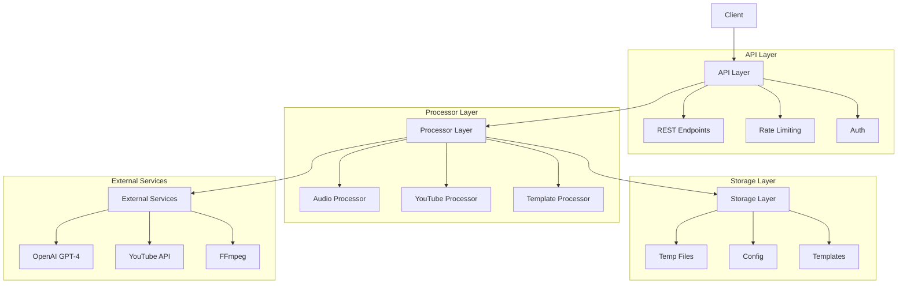
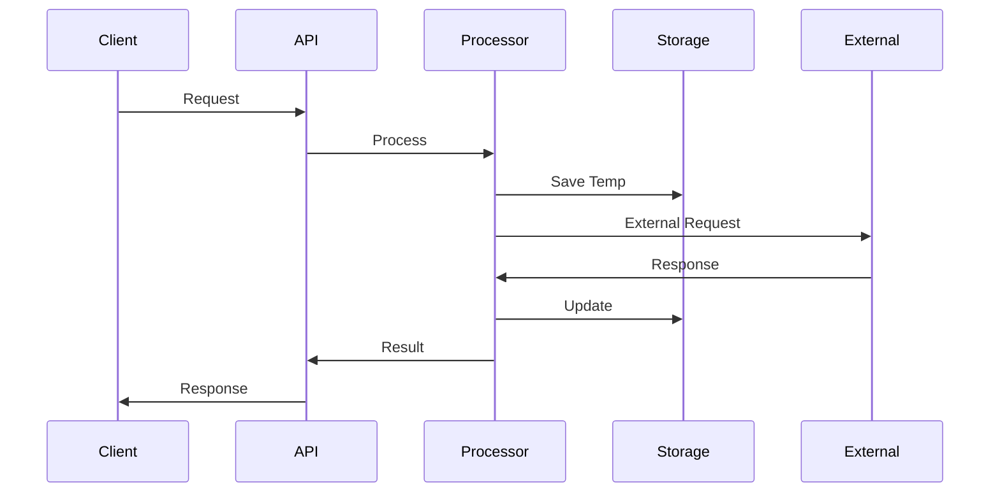
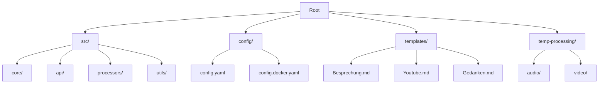

# Systemarchitektur

## Überblick

Das Common Secretary Services System ist eine Python-basierte Anwendung zur automatisierten Verarbeitung von Audio-, Video- und anderen Mediendateien. Der Fokus liegt auf der Transkription und strukturierten Ausgabe unter Verwendung von Templates.

## Kernkomponenten



### Core-Komponenten (`src/core/`)
- Basisklassen für Prozessoren
- Gemeinsame Utilities
- Konfigurationsmanagement
- Fehlerbehandlung

### API Layer (`src/api/`)
- REST-API mit Flask/Flask-RESTX
- Endpunkte für Medienverarbeitung
- Rate-Limiting und Authentifizierung
- Swagger-Dokumentation

### Processors (`src/processors/`)
- Audio-Prozessor für Medienverarbeitung
- YouTube-Integration
- Template-Verarbeitung
- PDF- und Bildverarbeitung

### Utils (`src/utils/`)
- Hilfsfunktionen
- Typdefinitionen
- Logging-Utilities
- Gemeinsam genutzte Funktionen

## Datenfluss



## Externe Dienste

### OpenAI GPT-4
- Transkription von Audio
- Textverarbeitung
- Übersetzung
- Strukturierung

### YouTube API
- Video-Informationen
- Download-Management
- Metadaten-Extraktion

### FFmpeg
- Audio-Konvertierung
- Format-Transformation
- Qualitätsoptimierung

## Speicherstruktur



## Konfigurationsmanagement

### Hauptkonfiguration (`config/config.yaml`)
```yaml
server:
  host: "127.0.0.1"
  port: 5000
  debug: true

processors:
  audio:
    segment_duration: 300
    export_format: mp3
  youtube:
    max_duration: 15000
    max_file_size: 104857600

logging:
  level: DEBUG
  file: logs/dev_detailed.log
```

### Umgebungsvariablen
- `OPENAI_API_KEY`: OpenAI API-Schlüssel
- `YOUTUBE_API_KEY`: YouTube API-Schlüssel
- Weitere API-Schlüssel nach Bedarf

## Sicherheitsaspekte

### Datenschutz
- Temporäre Dateispeicherung
- Automatische Bereinigung
- Keine persistente Speicherung von Mediendaten

### API-Sicherheit
- Rate-Limiting
- API-Key Authentifizierung
- Dateigrößenbeschränkungen

### Monitoring
- Ausführliche Logging
- Performance-Überwachung
- Fehlerbehandlung

## Erweiterbarkeit

### Neue Prozessoren
- Implementierung der Basis-Prozessorklasse
- Registrierung in der Konfiguration
- Integration in die API

### Template-System
- Markdown-basierte Templates
- Variables Substitutionssystem
- Erweiterbare Ausgabeformate

### API-Erweiterungen
- Neue Endpunkte
- Zusätzliche Verarbeitungsoptionen
- Erweiterte Metadaten