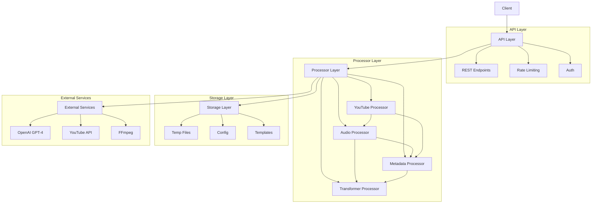
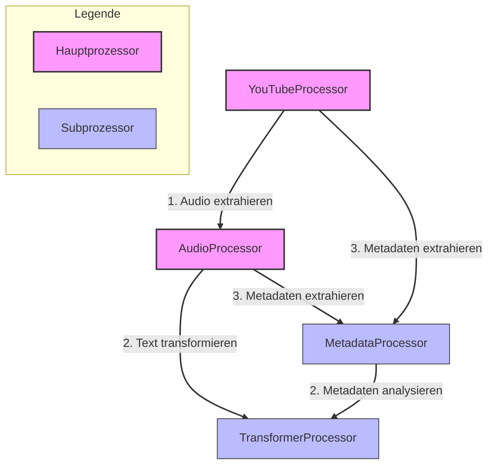
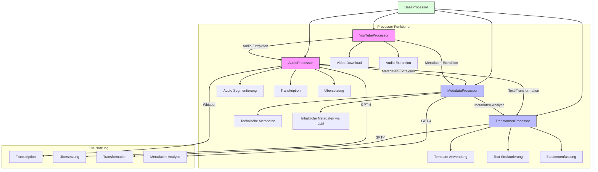
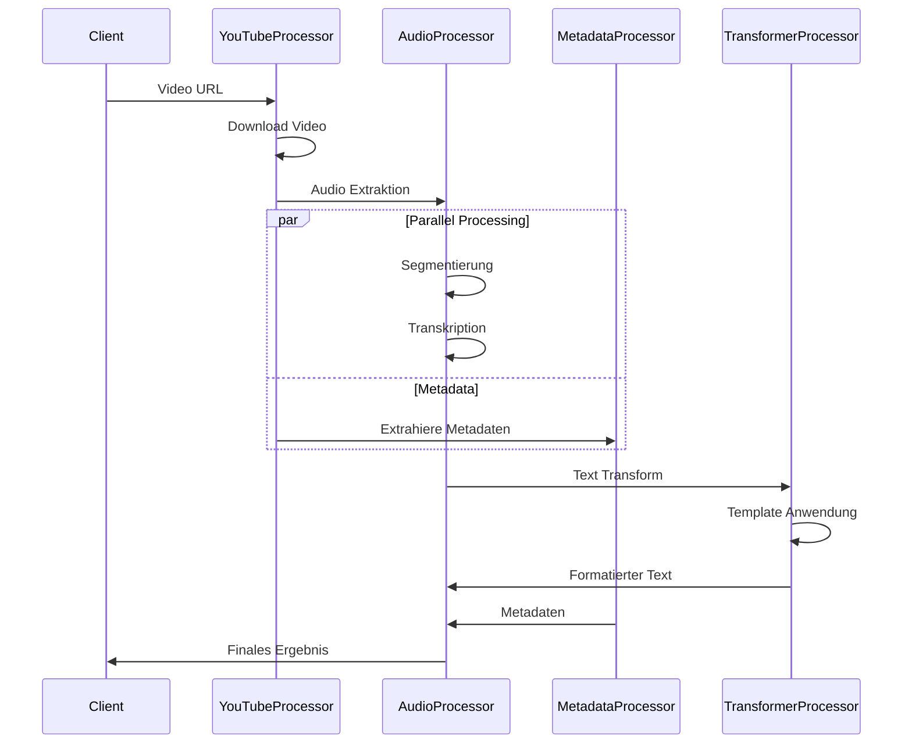
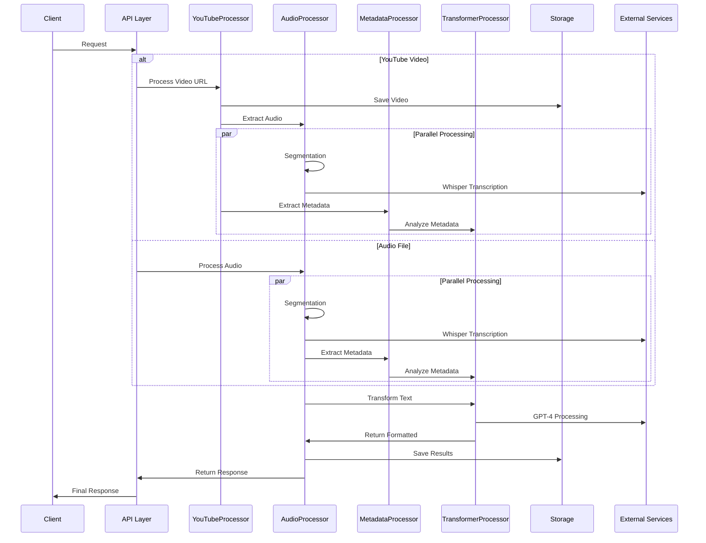
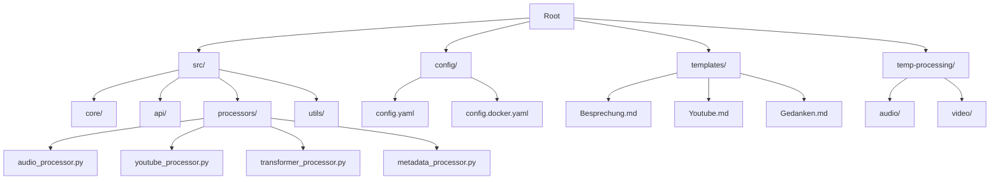

# Systemarchitektur

## Überblick

Das Common Secretary Services System ist eine Python-basierte Anwendung zur automatisierten Verarbeitung von Audio-, Video- und anderen Mediendateien. Der Fokus liegt auf der Transkription und strukturierten Ausgabe unter Verwendung von Templates.

## Kernkomponenten



### Core-Komponenten (`src/core/`)
- BaseProcessor als Grundlage aller Prozessoren:
  - Prozess-ID Management
  - Temporäre Verzeichnisse
  - Performance Tracking
  - LLM-Request Tracking
  - Response-Strukturierung
- Gemeinsame Utilities
- Konfigurationsmanagement
- Fehlerbehandlung

### API Layer (`src/api/`)
- REST-API mit Flask/Flask-RESTX
- Endpunkte für Medienverarbeitung
- Rate-Limiting und Authentifizierung
- Swagger-Dokumentation

### Processors (`src/processors/`)
- AudioProcessor: Hauptprozessor für Audioverarbeitung
  - Transkription und Segmentierung
  - Integration mit TransformerProcessor und MetadataProcessor
- YouTubeProcessor: Video-Download und -Verarbeitung
  - Integration mit AudioProcessor
  - YouTube-Metadaten-Extraktion
- TransformerProcessor: Text-Transformation
  - Template-Anwendung
  - Strukturierung und Zusammenfassung
  - LLM-Integration
- MetadataProcessor: Metadaten-Verarbeitung
  - Technische Metadaten
  - Inhaltliche Analyse via LLM
  - Integration mit TransformerProcessor

### Prozessor-Hierarchie

#### Vereinfachte Prozessor-Beziehungen


#### Detaillierte Prozessor-Struktur mit Funktionen



#### Prozessor-Interaktionen

1. **BaseProcessor**
   - Basisklasse für alle Prozessoren
   - Stellt gemeinsame Funktionalität bereit:
     - Prozess-ID Management
     - Temporäre Verzeichnisse
     - Performance Tracking
     - LLM-Request Tracking
     - Response-Strukturierung

2. **AudioProcessor**
   - Hauptprozessor für Audioverarbeitung
   - Nutzt andere Prozessoren:
     - TransformerProcessor für Text-Transformationen
     - MetadataProcessor für Metadaten-Extraktion
   - Kernfunktionen:
     - Audio-Segmentierung
     - Transkription via Whisper
     - Übersetzung via GPT-4
     - Kapitel-basierte Verarbeitung

3. **TransformerProcessor**
   - Verantwortlich für Text-Transformationen
   - Wird hauptsächlich von AudioProcessor genutzt
   - Funktionen:
     - Template-Anwendung
     - Text-Strukturierung
     - Zusammenfassungen
     - LLM-Integration (GPT-4)

4. **YouTubeProcessor**
   - Nutzt AudioProcessor für Verarbeitung
   - Nutzt MetadataProcessor für Metadaten
   - Funktionen:
     - Video-Download
     - Audio-Extraktion
     - YouTube-Metadaten Integration

5. **MetadataProcessor**
   - Wird von anderen Prozessoren genutzt
   - Extrahiert und strukturiert Metadaten:
     - Technische Informationen
     - Inhaltliche Metadaten
     - LLM-basierte Metadaten-Extraktion

#### Datenfluss zwischen Prozessoren



### Utils (`src/utils/`)
- Hilfsfunktionen
- Typdefinitionen
- Logging-Utilities
- Gemeinsam genutzte Funktionen

## Datenfluss



## Externe Dienste

### OpenAI GPT-4
- Transkription via Whisper
- Text-Transformation und -Analyse:
  - Zusammenfassungen
  - Strukturierung
  - Übersetzung
  - Metadaten-Extraktion

### YouTube API
- Video-Metadaten
- Download-Management
- Playlist-Verarbeitung
- Kanal-Informationen

### FFmpeg
- Audio-Extraktion aus Videos
- Format-Konvertierung
- Audio-Normalisierung
- Qualitätsoptimierung

## Speicherstruktur



## Konfigurationsmanagement

### Hauptkonfiguration (`config/config.yaml`)
```yaml
server:
  host: "127.0.0.1"
  port: 5000
  debug: true

processors:
  audio:
    segment_duration: 300
    export_format: mp3
    whisper_model: "whisper-1"
  youtube:
    max_duration: 15000
    max_file_size: 104857600
  transformer:
    default_model: "gpt-4"
    max_tokens: 4000
  metadata:
    analyze_content: true
    extract_technical: true

logging:
  level: DEBUG
  file: logs/dev_detailed.log
```

### Umgebungsvariablen
- `OPENAI_API_KEY`: OpenAI API-Schlüssel (Whisper & GPT-4)
- `YOUTUBE_API_KEY`: YouTube API-Schlüssel
- `ENVIRONMENT`: Umgebung (development/staging/production)
- `USE_NEW_RESPONSE_FORMAT`: Feature-Flag für neue API-Responses

## Sicherheitsaspekte

### Datenschutz
- Temporäre Dateispeicherung mit automatischer Bereinigung
- Keine persistente Speicherung von Mediendaten
- Verschlüsselte Übertragung (HTTPS)
- Sichere Handhabung von API-Schlüsseln

### API-Sicherheit
- Rate-Limiting pro Endpunkt
- API-Key Authentifizierung
- Dateigrößenbeschränkungen
- Input-Validierung

### Monitoring
- Detailliertes Logging aller Prozessor-Operationen
- Performance-Tracking:
  - Prozessor-Laufzeiten
  - LLM-Nutzung und Kosten
  - Ressourcenverbrauch
- Fehlerüberwachung und -benachrichtigung

## Erweiterbarkeit

### Neue Prozessoren
- Implementierung von BaseProcessor
- Integration in die Prozessor-Hierarchie
- Standardisierte Response-Struktur
- LLM-Integration über BaseProcessor

### Template-System
- Markdown-basierte Templates
- Variables Substitutionssystem
- Mehrsprachige Templates
- Dynamische Template-Auswahl

### API-Erweiterungen
- Standardisierte Response-Struktur
- Versionierte Endpunkte
- Erweiterte Metadaten-Integration
- Batch-Verarbeitung