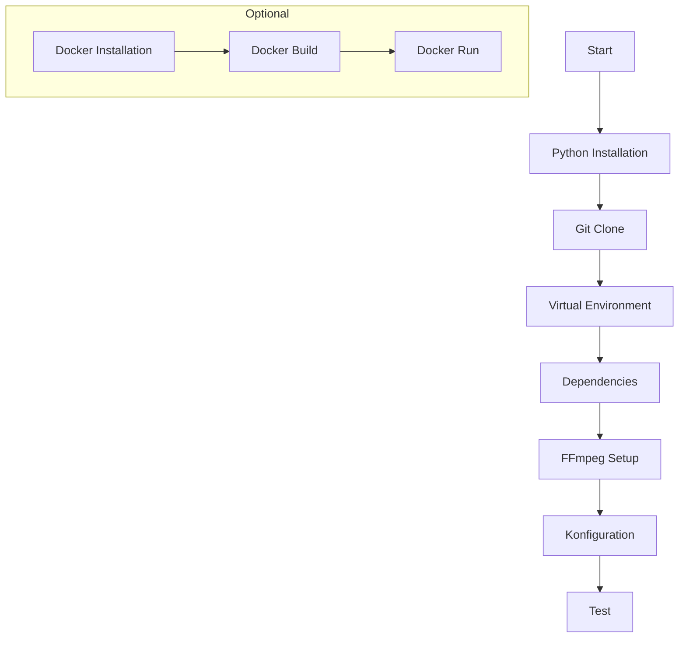
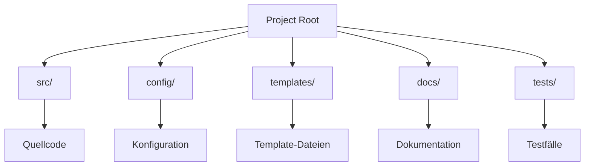
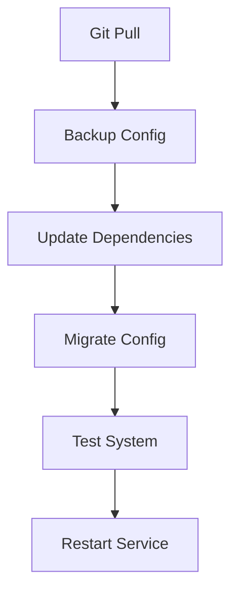

# Installation und Setup

## Systemvoraussetzungen

### Software
- Python 3.8 oder höher
- FFmpeg für Audio/Video-Verarbeitung
- Git für Versionskontrolle
- Docker (optional, für Container-Deployment)

### Hardware
- Mindestens 4GB RAM
- 10GB freier Festplattenspeicher
- Schnelle Internetverbindung für API-Zugriffe

### Externe Dienste
- OpenAI API-Konto
- YouTube Data API-Zugang

## Installationsprozess



### Lokale Installation

1. Repository klonen:
```bash
git clone [repository-url]
cd CommonSecretaryServices
```

2. Virtuelle Umgebung erstellen:
```bash
# Linux/Mac
python -m venv venv
source venv/bin/activate

# Windows
python -m venv venv
.\venv\Scripts\activate
```

3. Abhängigkeiten installieren:
```bash
pip install -r requirements.txt
```

### Docker Installation

1. Docker Image bauen:
```bash
docker build -t secretary-services .
```

2. Container starten:
```bash
docker run -p 5000:5000 secretary-services
```

## Konfiguration

### Umgebungsvariablen
Erstellen Sie eine `.env` Datei:
```env
OPENAI_API_KEY=your-openai-key
YOUTUBE_API_KEY=your-youtube-key
DEBUG=True
```

### Hauptkonfiguration
Passen Sie `config/config.yaml` an:
```yaml
server:
  host: "127.0.0.1"
  port: 5000
  debug: true

processors:
  audio:
    segment_duration: 300
    export_format: mp3
```

## Verzeichnisstruktur



## Deployment

### Entwicklungsumgebung
```bash
# Server starten
python src/main.py

# Tests ausführen
pytest tests/
```

### Produktionsumgebung
```bash
# Mit Docker
docker-compose up -d

# Ohne Docker
gunicorn -w 4 -b 0.0.0.0:5000 src.main:app
```

## Erste Schritte

### Server-Test
```bash
curl http://localhost:5000/health
```

### API-Test
```bash
curl -X POST \
  -H "Content-Type: multipart/form-data" \
  -F "file=@test.mp3" \
  http://localhost:5000/api/v1/audio/process
```

## Fehlerbehandlung

### Häufige Probleme

1. Port bereits belegt:
```bash
# Alternative Port in config.yaml
server:
  port: 5001
```

2. FFmpeg nicht gefunden:
```bash
# Linux
sudo apt-get install ffmpeg

# Windows
choco install ffmpeg
```

3. API-Keys nicht gesetzt:
- Überprüfen Sie die `.env` Datei
- Validieren Sie die API-Keys

## Update-Prozess



## Sicherheitshinweise

### API-Keys
- Sichere Speicherung in `.env`
- Regelmäßige Rotation
- Zugriffsbeschränkungen

### Dateisystem
- Temporäre Dateien in `temp-processing/`
- Regelmäßige Bereinigung
- Zugriffsrechte prüfen

### Netzwerk
- Firewall-Konfiguration
- CORS-Einstellungen
- Rate-Limiting 