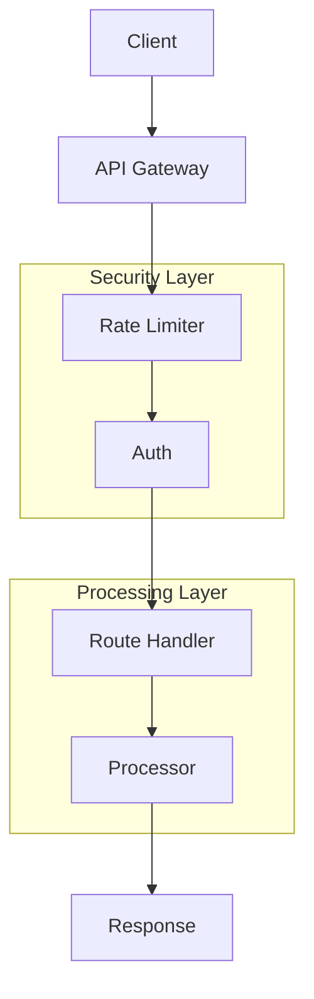
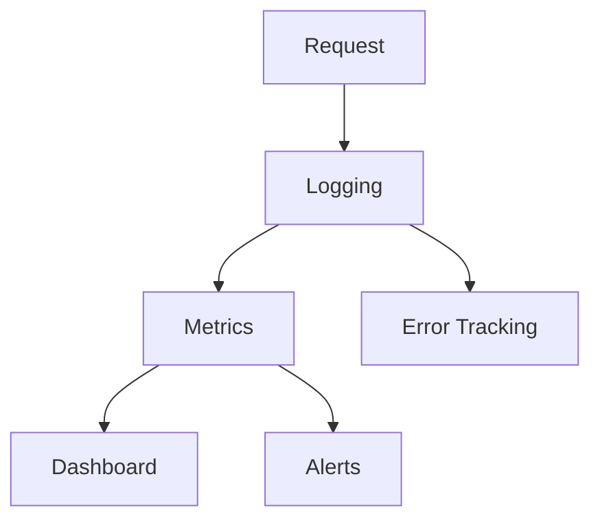

# API und Server

## Überblick

Die API ist als RESTful Service mit Flask und Flask-RESTX implementiert. Sie bietet Endpunkte für die Verarbeitung von Audio-, Video- und anderen Mediendateien.

## API-Architektur



## Endpunkte

### Audio-Verarbeitung
```http
POST /api/v1/audio/process
Content-Type: multipart/form-data

Parameters:
- file: Audio-Datei (required)
- template: Template-Name (optional)
- language: Zielsprache (optional)
```

Beispiel-Response:
```json
{
  "process_id": "a62c1513f83a98f7b50075000964537b",
  "status": "success",
  "result": {
    "text": "Transkribierter Text...",
    "detected_language": "de",
    "duration": 300.5,
    "segments": [
      {
        "text": "Segment 1...",
        "segment_id": 1
      }
    ]
  }
}
```

### YouTube-Verarbeitung
```http
POST /api/v1/youtube/process
Content-Type: application/json

{
  "url": "https://youtube.com/watch?v=...",
  "template": "Youtube",
  "language": "de"
}
```

Beispiel-Response:
```json
{
  "process_id": "7994422446609c0d615bc2010d379e38",
  "status": "success",
  "result": {
    "title": "Video Titel",
    "duration": 600,
    "transcription": {
      "text": "Transkribierter Text...",
      "segments": []
    },
    "metadata": {
      "uploader": "Kanal Name",
      "view_count": 1000
    }
  }
}
```

### Job-Status
```http
GET /api/v1/jobs/{job_id}
```

Beispiel-Response:
```json
{
  "job_id": "a62c1513f83a98f7b50075000964537b",
  "status": "completed",
  "progress": 100,
  "result": {}
}
```

## Authentifizierung

### API-Key
```http
POST /api/v1/audio/process
Authorization: Bearer your-api-key
```

### Rate-Limiting
```yaml
rate_limiting:
  enabled: true
  requests_per_minute: 60
  burst: 5
```

## Fehlerbehandlung

### HTTP-Statuscodes
- 200: Erfolgreiche Anfrage
- 400: Ungültige Anfrage
- 401: Nicht authentifiziert
- 429: Rate-Limit überschritten
- 500: Server-Fehler

### Fehler-Response
```json
{
  "error": {
    "code": "RATE_LIMIT_EXCEEDED",
    "message": "Zu viele Anfragen. Bitte warten Sie.",
    "details": {
      "retry_after": 60
    }
  }
}
```

## Server-Konfiguration

### Basis-Einstellungen
```yaml
server:
  host: "127.0.0.1"
  port: 5000
  debug: true
  workers: 4
```

### CORS-Konfiguration
```yaml
cors:
  allowed_origins: ["http://localhost:3000"]
  allowed_methods: ["GET", "POST"]
  allow_credentials: true
```

## API-Tests

### Curl-Beispiele
```bash
# Gesundheits-Check
curl http://localhost:5000/health

# Audio-Verarbeitung
curl -X POST \
  -H "Authorization: Bearer your-api-key" \
  -F "file=@audio.mp3" \
  http://localhost:5000/api/v1/audio/process

# YouTube-Verarbeitung
curl -X POST \
  -H "Authorization: Bearer your-api-key" \
  -H "Content-Type: application/json" \
  -d '{"url":"https://youtube.com/watch?v=..."}' \
  http://localhost:5000/api/v1/youtube/process
```

### Pytest-Tests
```python
def test_audio_processing():
    response = client.post(
        '/api/v1/audio/process',
        data={'file': (BytesIO(b'audio data'), 'test.mp3')}
    )
    assert response.status_code == 200
    assert 'process_id' in response.json
```

## Swagger UI

Die API-Dokumentation ist unter `/api` verfügbar und bietet:
- Interaktive API-Tests
- Request/Response Beispiele
- Schema-Dokumentation
- Authentifizierungs-Tests

## Performance

### Optimierungen
- Asynchrone Verarbeitung
- Worker-Pool
- Caching
- Komprimierung

### Monitoring


## Sicherheit

### Headers
```http
Strict-Transport-Security: max-age=31536000
X-Content-Type-Options: nosniff
X-Frame-Options: DENY
Content-Security-Policy: default-src 'self'
```

### Validierung
- Dateigrößen-Limits
- MIME-Type-Prüfung
- Input-Sanitization
- SQL-Injection-Schutz 