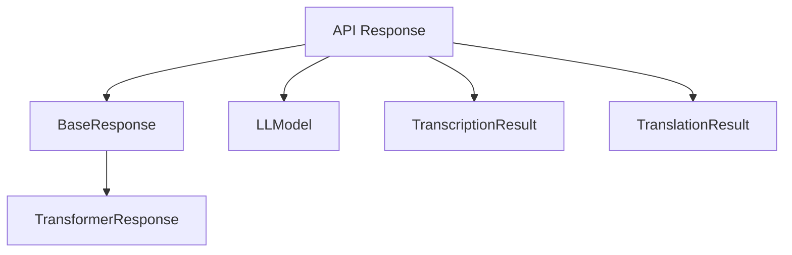
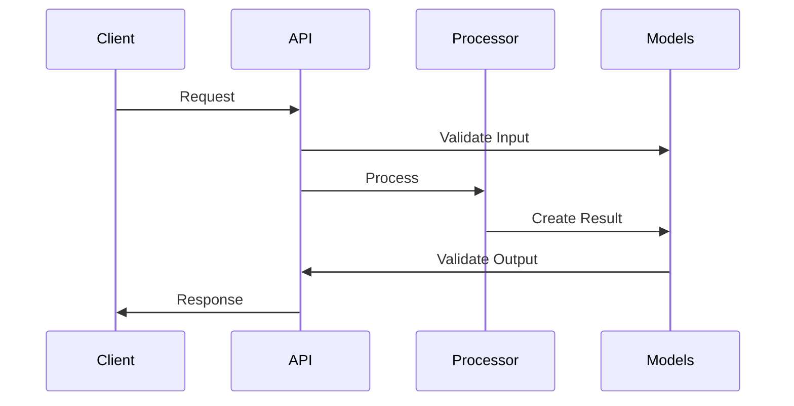

# Typdefinitionen und API-Responses

## Überblick

Das System verwendet Pydantic-Modelle für die Typisierung und Validierung von Daten. Diese Modelle definieren die Struktur der API-Responses und internen Datenverarbeitung.

## Datenmodell-Hierarchie



## Basis-Datenmodelle

### LLMRequest
```python
class LLMRequest(BaseModel):
    """Information über eine LLM-Anfrage."""
    model: str  # Name des verwendeten Modells
    purpose: str  # Zweck der Anfrage (z.B. 'transcription', 'translation')
    tokens: int  # Anzahl der verwendeten Tokens
    duration: float  # Verarbeitungsdauer in Sekunden
    timestamp: str  # Zeitstempel der LLM-Nutzung
```

### Chapter
```python
class Chapter(BaseModel):
    """Ein Kapitel mit Start- und Endzeit."""
    title: str
    start_time: float
    end_time: float
```

### AudioSegmentInfo
```python
class AudioSegmentInfo(BaseModel):
    """Information über ein Audio-Segment."""
    file_path: Path
    title: Optional[str] = None
    binary_data: Optional[bytes] = None
```

### LLModel
```python
class LLModel(BaseModel):
    model: str  # Name des verwendeten Modells
    duration: float  # Verarbeitungsdauer in Sekunden
    tokens: int  # Anzahl der verarbeiteten Tokens
    timestamp: str  # Zeitstempel der LLM-Nutzung
```

### TranscriptionSegment
```python
class TranscriptionSegment(BaseModel):
    """Ein Segment einer Transkription mit Zeitstempeln."""
    text: str
    segment_id: int
    title: Optional[str] = None
```

## Verarbeitungsergebnisse

### TranscriptionResult
```python
class TranscriptionResult(BaseModel):
    text: str  # Der transkribierte Text
    detected_language: Optional[str]  # Erkannte Sprache (ISO 639-1)
    segments: List[TranscriptionSegment]  # Liste der Transkriptionssegmente
    llms: List[LLModel] = []  # Verwendete LLM-Modelle
```

Beispiel-Response:
```json
{
  "text": "Transkribierter Text...",
  "detected_language": "de",
  "segments": [
    {
      "text": "Erster Abschnitt",
      "segment_id": 1
    }
  ],
  "llms": [
    {
      "model": "gpt-4",
      "duration": 5.2,
      "tokens": 150
    }
  ]
}
```

### TranslationResult
```python
class TranslationResult(BaseModel):
    text: str  # Der übersetzte Text
    source_language: str  # Ausgangssprache (ISO 639-1)
    target_language: str  # Zielsprache (ISO 639-1)
    llms: List[LLModel] = []  # Verwendete LLM-Modelle
```

### AudioProcessingResult
```python
class AudioProcessingResult(BaseModel):
    """Ergebnis der Audio-Verarbeitung."""
    transcription: TranscriptionResult
    metadata: AudioMetadata
    process_id: str
```

Beispiel-Response:
```json
{
  "duration": 300.5,
  "detected_language": "de",
  "output_text": "Transkribierter Text...",
  "original_text": "Original Text...",
  "translated_text": null,
  "llm_model": "gpt-4",
  "translation_model": null,
  "token_count": 150,
  "segments": [],
  "process_id": "a62c1513f83a98f7b50075000964537b",
  "process_dir": "temp-processing/audio/a62c1513f83a98f7b50075000964537b",
  "args": {}
}
```

## Metadaten-Modelle

### AudioMetadata
```python
class AudioMetadata(BaseModel):
    """Audio-spezifische Metadaten."""
    duration: float
    process_dir: str
    args: Dict[str, Any] = {}
```

### YoutubeMetadata
```python
class YoutubeMetadata(BaseModel):
    """Metadaten eines YouTube-Videos."""
    title: str
    url: str
    video_id: str
    duration: int
    duration_formatted: str
    file_size: Optional[int]
    process_dir: str
    audio_file: Optional[str]
    
    # Video-spezifische Metadaten
    source_type: str = "youtube"
    availability: Optional[str]
    categories: List[str] = []
    description: Optional[str]
    tags: List[str] = []
    thumbnail: Optional[str]
    upload_date: Optional[str]
    uploader: Optional[str]
    uploader_id: Optional[str]
    chapters: List[Dict[str, Any]] = []
    view_count: Optional[int]
    like_count: Optional[int]
    dislike_count: Optional[int]
    average_rating: Optional[float]
    age_limit: Optional[int]
    webpage_url: Optional[str]
```

## API-Response-Formate

### Audio-Verarbeitung Response
```json
{
  "status": "success",
  "process_id": "a62c1513f83a98f7b50075000964537b",
  "result": {
    "duration": 300.5,
    "detected_language": "de",
    "output_text": "Transkribierter Text...",
    "segments": [
      {
        "text": "Segment 1",
        "segment_id": 1
      }
    ]
  }
}
```

### YouTube-Verarbeitung Response
```json
{
  "status": "success",
  "process_id": "7994422446609c0d615bc2010d379e38",
  "result": {
    "title": "Video Titel",
    "duration": 600,
    "url": "https://youtube.com/watch?v=...",
    "video_id": "video123",
    "transcription": {
      "text": "Transkribierter Text...",
      "detected_language": "de",
      "segments": []
    },
    "youtube_metadata": {
      "upload_date": "20240122",
      "uploader": "Kanal Name",
      "view_count": 1000,
      "like_count": 100,
      "description": "Video Beschreibung",
      "tags": ["tag1", "tag2"],
      "categories": ["Education"]
    }
  }
}
```

## Datenflüsse



## Validierung

### Regeln
- Pflichtfelder müssen vorhanden sein
- Typen müssen korrekt sein
- Wertebereiche müssen eingehalten werden
- Optionale Felder können null sein

### Beispiel-Validierung
```python
# Validierung eines Audio-Segments
segment = AudioSegmentInfo(
    file_path=Path("audio.mp3"),
    title="Test Segment"
)

# Validierung eines Transkriptionsergebnisses
result = TranscriptionResult(
    text="Beispieltext",
    detected_language="de",
    segments=[
        TranscriptionSegment(
            text="Segment 1",
            segment_id=1
        )
    ]
)
```

## Fehlerbehandlung

### Validierungsfehler
```json
{
  "error": {
    "code": "VALIDATION_ERROR",
    "message": "Validierungsfehler",
    "details": {
      "field": "duration",
      "error": "Wert muss größer als 0 sein"
    }
  }
}
```

### Verarbeitungsfehler
```json
{
  "error": {
    "code": "PROCESSING_ERROR",
    "message": "Fehler bei der Verarbeitung",
    "details": {
      "step": "transcription",
      "error": "API nicht erreichbar"
    }
  }
}
``` 