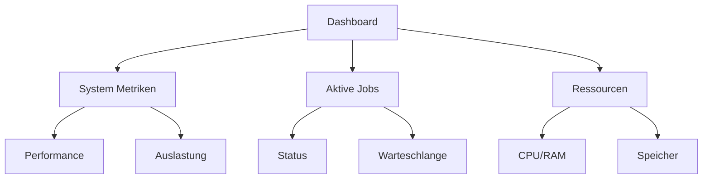
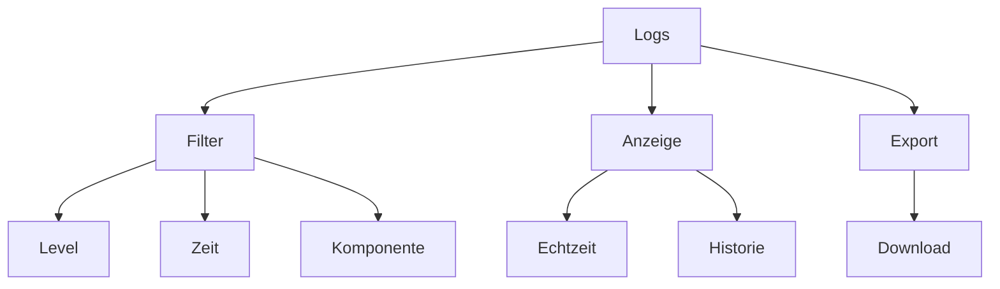
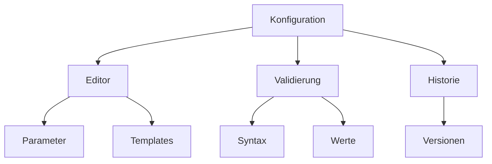
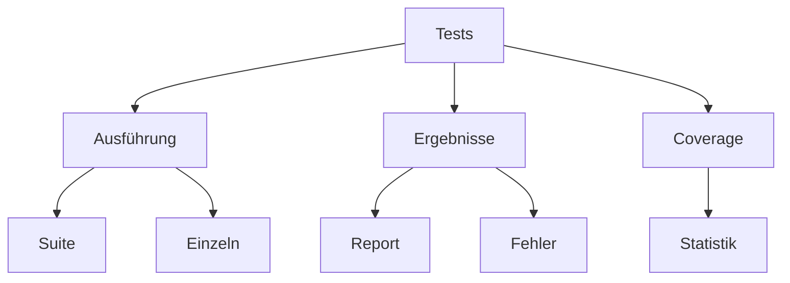
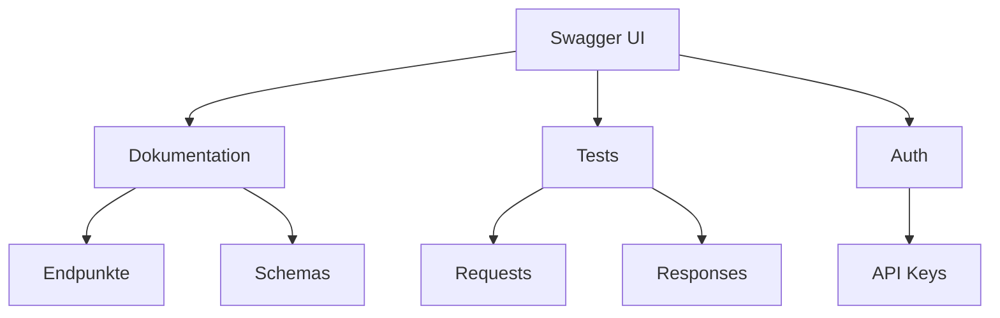
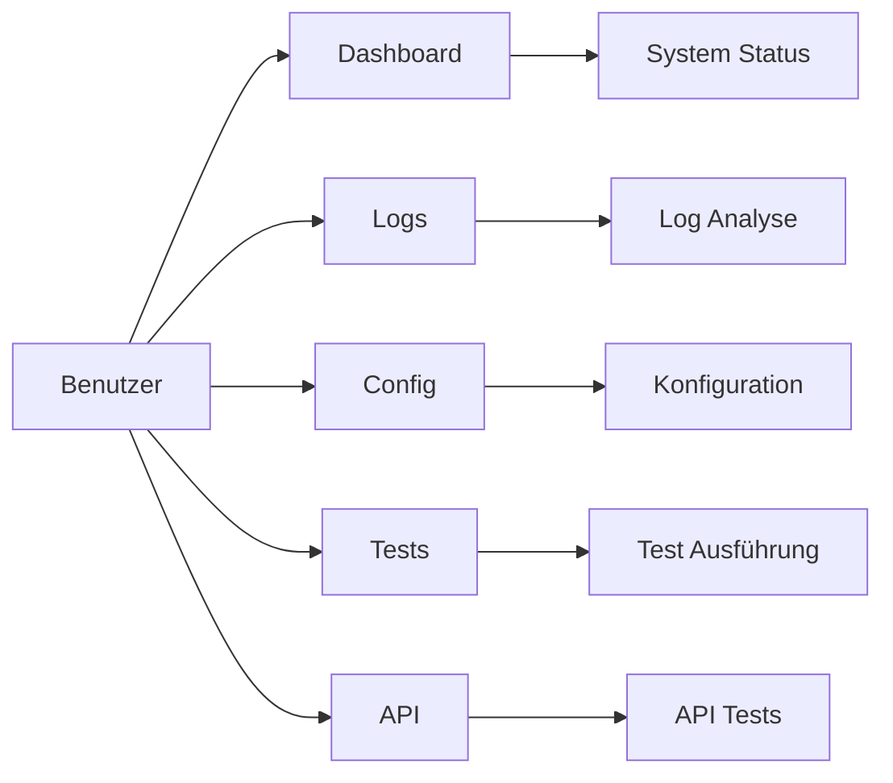

# Web-Interface

## Überblick

Das Web-Interface bietet eine benutzerfreundliche Oberfläche zur Verwaltung, Überwachung und Konfiguration des Systems. Es ist über verschiedene spezialisierte Routen erreichbar.

## Dashboard (/)

Das Dashboard ist die Hauptansicht des Systems und bietet einen schnellen Überblick über alle wichtigen Funktionen und Metriken.

### Funktionen
- Echtzeit-Übersicht der Systemaktivitäten
- Aktuelle Verarbeitungsjobs und deren Status
- Performance-Metriken und Ressourcenauslastung
- Schnellzugriff auf häufig genutzte Funktionen

### Metriken
- CPU- und Speicherauslastung
- Aktive Jobs und Warteschlange
- Erfolgs- und Fehlerrate
- Durchschnittliche Verarbeitungszeiten

## Logs (/logs)

Die Logs-Ansicht ermöglicht die detaillierte Analyse von Systemereignissen und Fehlern.

### Funktionen
- Echtzeit-Log-Streaming
- Filterung nach Log-Level und Zeitraum
- Suchfunktion mit regulären Ausdrücken
- Export von Log-Dateien

### Filter-Optionen
- Log-Level (DEBUG, INFO, WARNING, ERROR, CRITICAL)
- Zeitraum-Auswahl
- Komponenten-Filter
- Volltext-Suche

## Konfiguration (/config)

Die Konfigurations-Ansicht ermöglicht die Verwaltung aller Systemeinstellungen.

### Funktionen
- Übersicht aller Konfigurationsparameter
- Live-Bearbeitung der Einstellungen
- Validierung der Eingaben
- Konfigurationshistorie

### Bereiche
- Server-Einstellungen
- Prozessor-Konfigurationen
- API-Einstellungen
- Logging-Konfiguration

## Tests (/test)

Die Test-Ansicht ermöglicht die Ausführung und Überwachung von Systemtests.

### Funktionen
- Ausführung von Testsuiten
- Einzeltest-Ausführung
- Coverage-Berichte
- Fehleranalyse

### Test-Kategorien
- Unit Tests
- Integrationstests
- API Tests
- Performance Tests

## Swagger API (/api)

Die Swagger UI bietet eine interaktive Dokumentation und Testumgebung für die API.

### Funktionen
- Vollständige API-Dokumentation
- Interaktive API-Tests
- Request/Response Beispiele
- Authentifizierung

### Endpunkte
- Audio-Verarbeitung
- YouTube-Integration
- Job-Management
- System-Status

## Navigation und Interaktion

### Hauptmenü
- Dashboard: Systemübersicht
- Logs: Ereignisprotokollierung
- Config: Systemkonfiguration
- Tests: Testausführung
- API: Swagger-Dokumentation

### Benutzerinteraktion

## Sicherheit

### Zugriffskontrollen
- Rollenbasierte Berechtigungen
- Session-Management
- CSRF-Schutz
- Rate-Limiting

### Audit-Trail
- Benutzeraktionen
- Konfigurationsänderungen
- Systemzugriffe
- Sicherheitsereignisse 