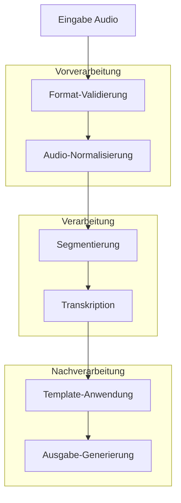
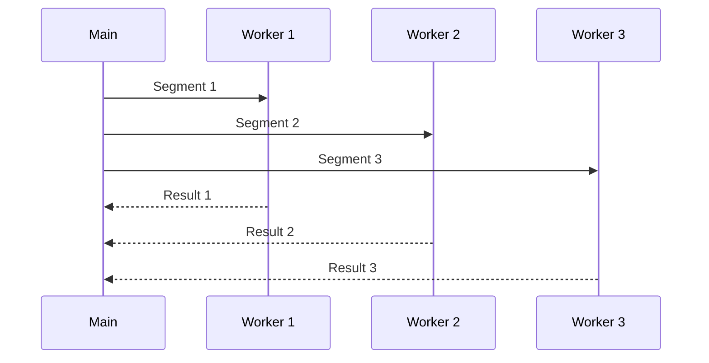

# Audio-Verarbeitung

## Überblick

Das System bietet umfangreiche Funktionen zur Verarbeitung von Audiodateien, implementiert in `src/processors/audio_processor.py`. Die Verarbeitung erfolgt in mehreren Schritten und unterstützt verschiedene Eingabeformate.

## Verarbeitungsprozess



## Unterstützte Formate

### Eingabeformate
- MP3 (*.mp3)
- WAV (*.wav)
- M4A (*.m4a)
- OGG (*.ogg)
- WMA (*.wma)
- AAC (*.aac)

### Ausgabeformat
- MP3 (Standard)
- Konfigurierbar über `export_format` in config.yaml

## Verarbeitungsschritte

### 1. Format-Validierung
```python
def validate_format(file_path: Path) -> bool:
    """Prüft das Audioformat auf Unterstützung."""
    extension = file_path.suffix.lower()
    return extension in SUPPORTED_FORMATS
```

### 2. Audio-Normalisierung
```python
def normalize_audio(audio: AudioSegment) -> AudioSegment:
    """Normalisiert die Audiolautstärke."""
    return audio.normalize(headroom=0.1)
```

### 3. Segmentierung
```python
def segment_audio(audio: AudioSegment, duration: int = 300) -> List[AudioSegment]:
    """Teilt Audio in Segmente auf."""
    return [audio[i:i+duration*1000] for i in range(0, len(audio), duration*1000)]
```

### 4. Transkription
```python
async def transcribe_segment(audio: AudioSegment) -> str:
    """Transkribiert ein Audiosegment mit GPT-4."""
    return await openai.audio.transcribe("gpt-4", audio)
```

## Konfiguration

### Audio-Prozessor
```yaml
processors:
  audio:
    batch_size: 5
    export_format: mp3
    segment_duration: 300
    temp_dir: temp-processing/audio
```

### Qualitätseinstellungen
```yaml
audio_quality:
  sample_rate: 44100
  channels: 1
  bitrate: 128000
```

## Temporäre Dateiverwaltung

### Verzeichnisstruktur
```
temp-processing/
└── audio/
    ├── [hash1]/
    │   ├── segment_1.mp3
    │   ├── segment_2.mp3
    │   └── complete_transcript.txt
    └── [hash2]/
        └── ...
```

### Cleanup-Strategie
```python
def cleanup_temp_files(process_dir: Path, max_age: int = 3600):
    """Bereinigt temporäre Dateien älter als max_age Sekunden."""
    for file in process_dir.glob("**/*"):
        if time.time() - file.stat().st_mtime > max_age:
            file.unlink()
```

## Fehlerbehandlung

### Typische Fehler
1. Nicht unterstütztes Format
```python
class UnsupportedFormatError(Exception):
    """Format wird nicht unterstützt."""
    pass
```

2. Beschädigte Audiodatei
```python
class CorruptedAudioError(Exception):
    """Audiodatei ist beschädigt."""
    pass
```

3. Segmentierungsfehler
```python
class SegmentationError(Exception):
    """Fehler bei der Segmentierung."""
    pass
```

### Wiederherstellung
```python
async def process_with_retry(audio: AudioSegment, max_retries: int = 3):
    """Verarbeitet Audio mit Wiederholungsversuchen."""
    for attempt in range(max_retries):
        try:
            return await process_audio(audio)
        except Exception as e:
            if attempt == max_retries - 1:
                raise
            await asyncio.sleep(1 * 2**attempt)
```

## Performance-Optimierung

### Parallelverarbeitung


### Batch-Verarbeitung
```python
async def process_batch(segments: List[AudioSegment], batch_size: int = 5):
    """Verarbeitet Segmente in Batches."""
    for i in range(0, len(segments), batch_size):
        batch = segments[i:i+batch_size]
        await asyncio.gather(*[process_segment(s) for s in batch])
```

## Monitoring

### Metriken
- Verarbeitungszeit pro Segment
- Transkriptionsgenauigkeit
- Fehlerrate
- Ressourcenverbrauch

### Logging
```python
logger.info(f"Starting audio processing: {file_path}")
logger.debug(f"Segment {i}: duration={duration}s")
logger.error(f"Failed to process segment: {error}")
```

## Integration

### API-Endpunkt
```http
POST /api/v1/audio/process
Content-Type: multipart/form-data

file: audio.mp3
template: Besprechung
language: de
```

### Webhook-Benachrichtigungen
```python
async def notify_completion(result: AudioProcessingResult):
    """Benachrichtigt über Verarbeitungsabschluss."""
    if webhook_url := result.metadata.args.get("webhook_url"):
        await send_webhook(webhook_url, result.to_dict())
``` 