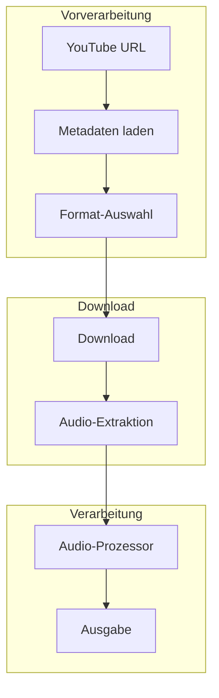
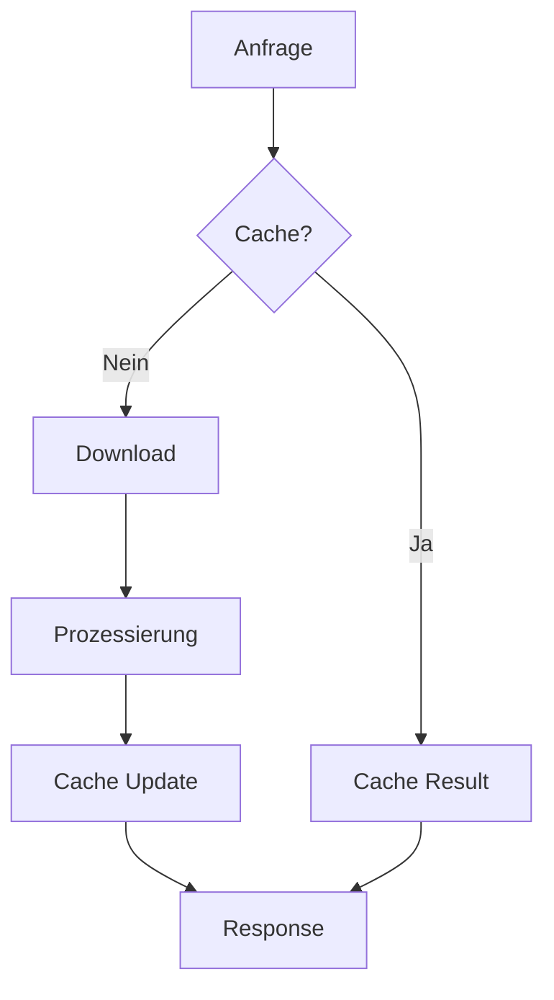

# YouTube-Integration

## Überblick

Die YouTube-Integration, implementiert in `src/processors/youtube_processor.py`, ermöglicht das Herunterladen und Verarbeiten von YouTube-Videos mit Fokus auf die Audioextraktion und Transkription.

## Architektur



## Komponenten

### URL-Verarbeitung
```python
def parse_youtube_url(url: str) -> str:
    """Extrahiert die Video-ID aus der URL."""
    if match := re.search(r"(?:v=|\/)([0-9A-Za-z_-]{11}).*", url):
        return match.group(1)
    raise ValueError("Ungültige YouTube-URL")
```

### Metadaten-Extraktion
```python
async def fetch_metadata(video_id: str) -> YoutubeMetadata:
    """Lädt Metadaten eines Videos."""
    ydl_opts = {
        'format': 'bestaudio/best',
        'extract_flat': True
    }
    with yt_dlp.YoutubeDL(ydl_opts) as ydl:
        info = ydl.extract_info(f"https://youtube.com/watch?v={video_id}", download=False)
        return YoutubeMetadata(**info)
```

## Download-System

### Format-Auswahl
```yaml
ydl_opts:
  format: worstaudio/worst
  postprocessors:
    - key: FFmpegExtractAudio
      preferredcodec: mp3
```

### Download-Einschränkungen
```yaml
youtube:
  max_duration: 15000  # Sekunden
  max_file_size: 104857600  # Bytes
  rate_limit: 60  # Requests pro Minute
```

## Audio-Verarbeitung

### Extraktion
```python
def extract_audio(video_path: Path, output_path: Path):
    """Extrahiert die Audiospur aus dem Video."""
    stream = ffmpeg.input(video_path)
    stream = ffmpeg.output(stream, str(output_path), acodec='libmp3lame')
    ffmpeg.run(stream, overwrite_output=True)
```

### Format-Konvertierung
```python
def convert_audio(input_path: Path, output_path: Path, format: str = 'mp3'):
    """Konvertiert Audio in das Zielformat."""
    audio = AudioSegment.from_file(input_path)
    audio.export(output_path, format=format)
```

## Metadaten-Verarbeitung

### Erfasste Metadaten
```python
class YoutubeMetadata(BaseModel):
    title: str
    url: str
    video_id: str
    duration: int
    duration_formatted: str
    uploader: str
    view_count: int
    description: str
    tags: List[str]
    categories: List[str]
```

### Kapitel-Extraktion
```python
def extract_chapters(description: str) -> List[Chapter]:
    """Extrahiert Kapitelmarken aus der Beschreibung."""
    chapters = []
    for match in re.finditer(r'(\d+:\d+)\s*-\s*(.+)', description):
        time_str, title = match.groups()
        chapters.append(Chapter(
            title=title.strip(),
            start_time=parse_timestamp(time_str)
        ))
    return chapters
```

## Temporäre Dateien

### Verzeichnisstruktur
```
temp-processing/
└── video/
    ├── [video-id]/
    │   ├── original.webm
    │   ├── audio.mp3
    │   └── metadata.json
    └── ...
```

### Cleanup
```python
def cleanup_video_files(process_dir: Path):
    """Bereinigt temporäre Videodateien."""
    shutil.rmtree(process_dir, ignore_errors=True)
```

## Fehlerbehandlung

### Typische Fehler
```python
class VideoUnavailableError(Exception):
    """Video ist nicht verfügbar."""
    pass

class DownloadError(Exception):
    """Download fehlgeschlagen."""
    pass

class ExtractionError(Exception):
    """Audio-Extraktion fehlgeschlagen."""
    pass
```

### Wiederherstellung
```python
async def download_with_retry(url: str, max_retries: int = 3):
    """Download mit Wiederholungsversuchen."""
    for attempt in range(max_retries):
        try:
            return await download_video(url)
        except Exception as e:
            if attempt == max_retries - 1:
                raise
            await asyncio.sleep(1 * 2**attempt)
```

## Performance

### Optimierungen


### Streaming
```python
async def stream_download(url: str, chunk_size: int = 8192):
    """Streamt den Download in Chunks."""
    async with aiohttp.ClientSession() as session:
        async with session.get(url) as response:
            with open(output_path, 'wb') as f:
                async for chunk in response.content.iter_chunked(chunk_size):
                    f.write(chunk)
```

## Integration

### API-Endpunkt
```http
POST /api/v1/youtube/process
Content-Type: application/json

{
    "url": "https://youtube.com/watch?v=...",
    "template": "Youtube",
    "language": "de"
}
```

### Webhook-Support
```python
async def notify_progress(video_id: str, progress: float):
    """Sendet Fortschrittsaktualisierungen."""
    await websocket.send_json({
        'type': 'progress',
        'video_id': video_id,
        'progress': progress
    })
```

## Monitoring

### Metriken
- Download-Geschwindigkeit
- Verarbeitungszeit
- Fehlerrate
- Cache-Trefferquote

### Logging
```python
logger.info(f"Starting download: {video_id}")
logger.debug(f"Download progress: {progress}%")
logger.error(f"Download failed: {error}")
``` 