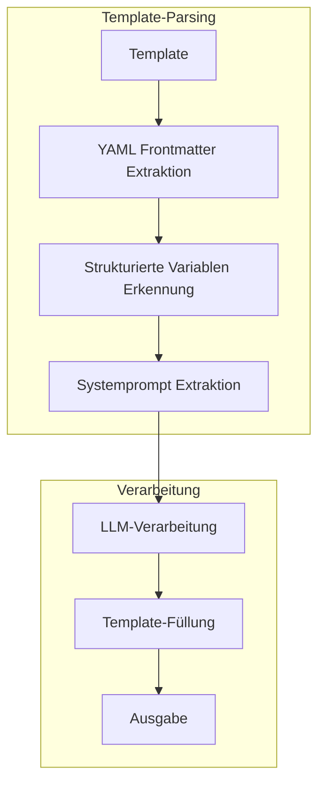

# Template-System

## Überblick

Das Template-System, implementiert in `src/utils/transcription_utils.py`, ermöglicht die strukturierte Ausgabe von verarbeiteten Daten basierend auf Markdown-Templates mit YAML Frontmatter, strukturierten Variablen und Systemprompts.

## Architektur



## Template-Struktur

Templates bestehen aus drei Hauptbereichen:

### 1. YAML Frontmatter
```yaml
---
tags: {{tags|What are the 10 most important keywords from the text?}}
title: {{title|an appropriate title for the session - max. 70 characters}}
speaker: {{speakers|Which speakers are mentioned in the text?}}
date: {{day|Display the date in the format yyyy-mm-dd.}}
place: {{ort|Which location is mentioned or shown in the text?}}
---
```

### 2. Markdown-Inhalt mit Variablen
```markdown
# {{title|an appropriate title for the session}}

## Summary & Highlights:

{{summary|Please analyze the texts of the video transcript, the web text and the slide texts. First a short summary. Below that, I would like to structure the text into meaningful sections.}}

## Importance for an eco-social transformation

{{ecosocial|What is the importance for an eco-social transformation? Which sustainable, social or ethical issues are relevant?}}
```

### 3. Systemprompt
```markdown
--- systemprompt
You are a specialized journalist who researches topics for environmental and social organizations and presents them in an understandable and applicable way. Your task is to present complex developments in open source, software development, infrastructure, networks, security and hardware in such a way that their significance for sustainable, social and community-oriented transformation processes becomes clear.
Communicate clearly, concisely and thoughtfully.
Avoid technical jargon or explain it briefly if necessary.
Always emphasize the connection to the eco-social transformation.
Focus on practical applications, especially for Eco-Social Designers.
Consider ethical, social and ecological issues.
---
```

## Variablen-System

### Strukturierte Variablen
```python
@dataclass(frozen=True)
class TemplateField:
    """Definiert die Felder eines Templates"""
    description: str          # Beschreibung für das LLM
    max_length: int = 5000    # Maximale Länge des Feldes
    isFrontmatter: bool = False  # Ob es sich um YAML Frontmatter handelt
    default: Optional[str] = None  # Standardwert
```

### Variablen-Syntax

#### 1. Strukturierte Variablen mit Beschreibung
```markdown
{{feldname|beschreibung für das LLM}}
```

**Beispiele:**
- `{{title|an appropriate title for the session - max. 70 characters}}`
- `{{summary|Please analyze the texts and provide a structured summary}}`
- `{{tags|What are the 10 most important keywords from the text?}}`

#### 2. Einfache Kontext-Variablen
```markdown
{{feldname}}
```

**Beispiele:**
- `{{text}}` - Wird automatisch mit dem Eingabetext ersetzt
- `{{url}}` - Wird mit der Kontext-URL ersetzt

#### 3. YAML Frontmatter Variablen
```yaml
---
title: {{title|Titel des Dokuments}}
author: {{author|Autor des Dokuments}}
date: {{date|Datum im Format yyyy-mm-dd}}
---
```

## Template-Verarbeitung

### 1. YAML Frontmatter Extraktion
```python
def _extract_structured_variables(self, template_content: str, logger: Optional[ProcessingLogger]) -> TemplateFields:
    """Extrahiert strukturierte Variablen aus dem Template."""
    
    # YAML Frontmatter Pattern
    yaml_pattern = r'^---\n(.*?)\n---'
    yaml_match = re.search(yaml_pattern, template_content, re.DOTALL)
    
    if yaml_match:
        yaml_content = yaml_match.group(1)
        yaml_lines = yaml_content.split('\n')
        for line in yaml_lines:
            if line and ':' in line:
                var_name = line.split(':', 1)[0].strip()
                # Suche nach Beschreibung in Template-Variablen
                desc_pattern = r'\{\{' + re.escape(var_name) + r'\|([^}]+)\}\}'
                desc_match = re.search(desc_pattern, template_content)
                description = desc_match.group(1).strip() if desc_match else "YAML Frontmatter Variable"
                
                field_def = TemplateField(
                    description=description,
                    isFrontmatter=True
                )
```

### 2. Strukturierte Variablen Erkennung
```python
# Pattern für strukturierte Variablen
pattern: str = r'\{\{([a-zA-Z][a-zA-Z0-9_]*)\|([^}]+)\}\}'
matches: list[re.Match[str]] = list(re.finditer(pattern, template_content))

for match in matches:
    var_name: str = match.group(1).strip()
    description: str = match.group(2).strip()
    
    field_def = TemplateField(
        description=description,
        isFrontmatter=False
    )
```

### 3. Systemprompt Extraktion
```python
def _extract_system_prompt(self, template_content: str, logger: Optional[ProcessingLogger] = None) -> Tuple[str, str]:
    """Extrahiert den Systemprompt aus dem Template-Inhalt."""
    
    if "--- systemprompt" in template_content:
        parts = template_content.split("--- systemprompt", 1)
        template_without_prompt = parts[0].strip()
        system_prompt = parts[1].strip()
        
        # Füge Formatierungsanweisung hinzu
        system_prompt += "\n\nIMPORTANT: Your response must be a valid JSON object where each key corresponds to a template variable."
        
        return template_without_prompt, system_prompt
    else:
        # Standard-Systemprompt verwenden
        return template_content, default_system_prompt
```

## Beispiel: Session_en.md Template

### Vollständiges Template
```markdown
---
tags: {{tags|What are the 10 most important keywords from the text? Replace spaces with hyphens so that they are valid tags. Please output them comma-separated.}}
title: {{title|an appropriate title for the session with the main solution name presented in this session - max. 70 characters}}
subtitle: {{subtitle|an appropriate subtitle for the session - only text without special characters, colons, exclamation marks, etc.}}
intro: {{intro|how can we briefly introduce this session in a motivating way?}}
speaker: {{speakers|Which speakers are mentioned in the text? Separate with commas and spaces.}}
date: {{day|Display the date in the format yyyy-mm-dd.}}
place: {{ort|Which location is mentioned or shown in the text?}}
track: {{track}}
topic: {{topic|Which of the following topics is this session most likely to be assigned to: sustainable development, FOSS funding, open research, community building, cultural movement, energy transition, intergovernmental cooperation, inclusive web, open design or open hardware?}}
relevance: {{relevance|How important is this session for an eco-social transformation on a scale of 0-10}}
cacheId: {{cache_key}}
---
# {{title|an appropriate title for the session}}

> [! note]-
> The content of this page is generated by audio/video transcription and text transformation from the content and links of this source.

Source: [{{url}}]({{url}})

{videoplayer}

## Summary & Highlights:

{{summary|Please analyze the texts of the video transcript, the web text and the slide texts. First a short summary. Below that, I would like to structure the text into meaningful sections. Provide a suitable title for each section in bold and summarize each section in detail below, using at least 120 words. Separate paragraphs and titles with \n.}}

## Importance for an eco-social transformation

{{ecosocial|What is the importance for an eco-social transformation? Which sustainable, social or ethical issues are relevant? Also show possible applications for eco-social designers: Which specific tools, platforms or methods can be transferred? And what challenges and open questions are there with regard to technical, social or political hurdles?}}

{slides}
## Links

{{attachment_links|Create a list of all links from attachment_text, formatted as markdown links with a description and separated by a \n}}

--- systemprompt
You are a specialized journalist who researches topics for environmental and social organizations and presents them in an understandable and applicable way. Your task is to present complex developments in open source, software development, infrastructure, networks, security and hardware in such a way that their significance for sustainable, social and community-oriented transformation processes becomes clear.
Communicate clearly, concisely and thoughtfully.
Avoid technical jargon or explain it briefly if necessary.
Always emphasize the connection to the eco-social transformation.
Focus on practical applications, especially for Eco-Social Designers.
Consider ethical, social and ecological issues.
---
```

### Extraktion der Variablen

#### YAML Frontmatter Variablen:
- `tags` - Keywords mit Beschreibung
- `title` - Titel mit Längenbeschränkung
- `subtitle` - Untertitel mit Formatierungsregeln
- `intro` - Einführungstext
- `speaker` - Sprecherliste
- `date` - Datum im spezifischen Format
- `place` - Veranstaltungsort
- `track` - Track-Information
- `topic` - Themenzuordnung mit Auswahlmöglichkeiten
- `relevance` - Relevanz-Skala
- `cacheId` - Cache-Identifikator

#### Markdown-Variablen:
- `{{title}}` - Titel (einfache Variable)
- `{{url}}` - URL (einfache Variable)
- `{{summary}}` - Zusammenfassung mit detaillierten Anweisungen
- `{{ecosocial}}` - Ecosocial-Transformation mit spezifischen Fragen
- `{{attachment_links}}` - Link-Liste mit Formatierungsanweisungen

#### Systemprompt:
Spezialisierte Anweisungen für einen Journalisten mit Fokus auf ecosocial Transformation.

## LLM-Verarbeitung

### 1. Prompt-Erstellung
```python
# Systemprompt mit Zielsprache formatieren
system_prompt = system_prompt.format(target_language=target_language)

# Feldbeschreibungen extrahieren
field_descriptions = {
    name: field.description 
    for name, field in field_definitions.fields.items()
}

# User-Prompt erstellen
user_prompt: str = (
    f"Analyze the following text and extract the information as a JSON object:\n\n"
    f"TEXT:\n{text}\n\n"
    f"CONTEXT:\n{context_str}\n\n"
    f"REQUIRED FIELDS:\n"
    f"{json.dumps(field_descriptions, indent=2, ensure_ascii=False)}\n\n"
    f"INSTRUCTIONS:\n"
    f"1. Extract all required information from the text\n"
    f"2. Return a single JSON object where each key matches a field name\n"
    f"3. Provide all values in language: {target_language}\n"
    f"4. Ensure the response is valid JSON\n"
    f"5. Do not include any text outside the JSON object"
)
```

### 2. Template-Füllung
```python
# Template mit extrahierten Daten füllen
for field_name, field_value in result_json.items():
    pattern: str = r'\{\{' + field_name + r'\|[^}]+\}\}'
    value: str = str(field_value) if field_value is not None else ""
    
    # Prüfe ob es sich um ein Frontmatter-Feld handelt
    field_def: TemplateField | None = field_definitions.fields.get(field_name)
    if field_def and getattr(field_def, 'isFrontmatter', False):
        # Bereinige den Wert für YAML-Kompatibilität
        value = self._clean_yaml_value(value)
        
    template_content = re.sub(pattern, value, template_content)
```

## Template-Management

### Verzeichnisstruktur
```
templates/
├── Session_de.md
├── Session_en.md
├── Track_de.md
├── Track_en.md
├── Gedanken.md
├── Besprechung.md
├── Blogeintrag.md
└── ecosocial.md
```

### Template-Laden
```python
def _read_template_file(self, template: str, logger: Optional[ProcessingLogger]) -> str:
    """Liest den Inhalt einer Template-Datei."""
    template_dir: str = 'templates'
    template_path: str = os.path.join(template_dir, f"{template}.md")
    
    try:
        with open(template_path, 'r', encoding='utf-8') as f:
            return f.read()
    except Exception as e:
        raise ValueError(f"Template '{template}' konnte nicht gelesen werden: {str(e)}")
```

## Neue Template-Content Funktionalität

### Direkte Template-Übergabe
```python
# API-Aufruf mit direktem Template-Inhalt
POST /api/transformer/template
{
    "text": "Max Mustermann ist 30 Jahre alt",
    "template_content": """
---
title: {{title|Titel der Person}}
age: {{age|Alter der Person}}
city: {{city|Wohnort der Person}}
---

# {{title}}

**Alter:** {{age}}
**Wohnort:** {{city}}

## Zusammenfassung
{{summary|Kurze Zusammenfassung der Person}}
""",
    "source_language": "de",
    "target_language": "de"
}
```

### Validierung
- **Fehler**: Wenn weder `template` noch `template_content` angegeben wird
- **Fehler**: Wenn beide Parameter gleichzeitig angegeben werden
- **Erfolg**: Wenn genau einer der beiden Parameter angegeben wird

## Praktische Beispiele

### Beispiel 1: Person-Profile mit Inline-Template

```python
import requests
import json

# API-Endpunkt
api_url = "http://localhost:5001/api/transformer/template"

# Eingabetext
input_text = """
Max Mustermann ist ein 30-jähriger Software-Entwickler aus Berlin. 
Er arbeitet bei der Firma TechCorp und ist spezialisiert auf Python-Entwicklung.
Max hat einen Master-Abschluss in Informatik und ist begeistert von Open Source Software.
"""

# Inline-Template mit YAML Frontmatter
template_content = """
---
name: {{name|Vollständiger Name der Person}}
age: {{age|Alter in Jahren}}
profession: {{profession|Beruf oder Tätigkeit}}
location: {{location|Wohnort oder Standort}}
company: {{company|Firma oder Organisation}}
education: {{education|Ausbildung oder Abschluss}}
interests: {{interests|Hobbys und Interessen}}
---

# {{name}}

**Alter:** {{age}} Jahre  
**Beruf:** {{profession}}  
**Standort:** {{location}}  
**Firma:** {{company}}

## Ausbildung
{{education}}

## Biografie
{{biography|Kurze Biografie oder Beschreibung der Person}}

## Interessen
{{interests}}

## Zusammenfassung
{{summary|Kurze Zusammenfassung der wichtigsten Informationen}}
"""

# API-Request
payload = {
    "text": input_text,
    "template_content": template_content,
    "source_language": "de",
    "target_language": "de",
    "context": {
        "additional_info": "Personenprofil für interne Dokumentation"
    }
}

# Request senden
response = requests.post(api_url, json=payload)

if response.status_code == 200:
    result = response.json()
    print("✅ Template-Transformation erfolgreich!")
    print(f"Transformierter Text: {result['data']['text'][:200]}...")
    print(f"Strukturierte Daten: {json.dumps(result['data']['structured_data'], indent=2, ensure_ascii=False)}")
else:
    print(f"❌ Fehler: {response.status_code}")
    print(response.text)
```

### Beispiel 2: Event-Beschreibung mit URL-Quelle

```python
# URL-basierte Transformation mit Inline-Template
event_url = "https://example.com/event-details"

event_template = """
---
event_name: {{event_name|Name des Events}}
date: {{date|Datum des Events im Format yyyy-mm-dd}}
location: {{location|Veranstaltungsort}}
organizer: {{organizer|Veranstalter oder Organisation}}
duration: {{duration|Dauer des Events}}
capacity: {{capacity|Maximale Teilnehmerzahl}}
---

# {{event_name}}

**Datum:** {{date}}  
**Ort:** {{location}}  
**Veranstalter:** {{organizer}}  
**Dauer:** {{duration}}  
**Kapazität:** {{capacity}} Teilnehmer

## Beschreibung
{{description|Detaillierte Beschreibung des Events}}

## Zielgruppe
{{target_audience|Beschreibung der Zielgruppe}}

## Programm
{{program|Ablauf oder Programm des Events}}

## Anmeldung
{{registration|Informationen zur Anmeldung}}

## Wichtige Hinweise
{{important_notes|Wichtige Hinweise für Teilnehmer}}
"""

# API-Request für URL-basierte Transformation
url_payload = {
    "url": event_url,
    "template_content": event_template,
    "source_language": "de",
    "target_language": "de"
}

response = requests.post(api_url, json=url_payload)
```

### Beispiel 3: Produkt-Review Template

```python
# Produkt-Review mit strukturiertem Template
product_text = """
Das neue Smartphone XYZ Pro von TechCorp bietet beeindruckende Leistung zu einem fairen Preis.
Mit 128GB Speicher, 6GB RAM und einer 48MP Kamera ist es für den Alltag gut gerüstet.
Der Akku hält einen ganzen Tag und lädt in 30 Minuten auf 50%.
Das Design ist modern und ergonomisch, aber das Display könnte heller sein.
Für 499€ ist es ein gutes Preis-Leistungs-Verhältnis.
"""

review_template = """
---
product_name: {{product_name|Name des Produkts}}
brand: {{brand|Marke oder Hersteller}}
price: {{price|Preis in Euro}}
rating: {{rating|Bewertung von 1-5 Sternen}}
category: {{category|Produktkategorie}}
release_date: {{release_date|Veröffentlichungsdatum}}
---

# Review: {{product_name}}

**Marke:** {{brand}}  
**Preis:** {{price}}€  
**Bewertung:** {{rating}}/5 ⭐  
**Kategorie:** {{category}}

## Technische Spezifikationen
{{specifications|Technische Details des Produkts}}

## Zusammenfassung
{{summary|Kurze Zusammenfassung der Bewertung}}

## Pros
{{pros|Positive Aspekte des Produkts}}

## Cons
{{cons|Negative Aspekte oder Verbesserungsvorschläge}}

## Fazit
{{conclusion|Abschließende Bewertung und Empfehlung}}

## Empfehlung
{{recommendation|Für wen ist das Produkt geeignet?}}
"""

# API-Request
review_payload = {
    "text": product_text,
    "template_content": review_template,
    "source_language": "de",
    "target_language": "de"
}

response = requests.post(api_url, json=review_payload)
```

### Beispiel 4: Vergleich: Datei vs. Inline-Template

```python
# Option 1: Datei-basiertes Template (bestehende Funktionalität)
file_based_payload = {
    "text": input_text,
    "template": "Gedanken",  # Verweist auf templates/Gedanken.md
    "source_language": "de",
    "target_language": "de"
}

# Option 2: Inline-Template (neue Funktionalität)
inline_payload = {
    "text": input_text,
    "template_content": """
---
title: {{title|Titel der Gedanken}}
tags: {{tags|Relevante Tags}}
date: {{date|Datum im Format yyyy-mm-dd}}
---

# {{title}}

{{content|Inhalt der Gedanken}}

## Tags
{{tags}}
""",
    "source_language": "de",
    "target_language": "de"
}

# Beide Ansätze funktionieren identisch
response1 = requests.post(api_url, json=file_based_payload)
response2 = requests.post(api_url, json=inline_payload)

print("Datei-basiert:", response1.status_code)
print("Inline:", response2.status_code)
```

### Beispiel 5: Dynamisches Template basierend auf Benutzereingaben

```python
def create_dynamic_template(template_type: str, custom_fields: dict) -> str:
    """Erstellt ein dynamisches Template basierend auf Benutzereingaben."""
    
    base_template = """
---
title: {{title|Titel des Dokuments}}
created_at: {{created_at|Erstellungsdatum}}
"""
    
    # Dynamische Felder hinzufügen
    for field_name, description in custom_fields.items():
        base_template += f"{field_name}: {{{{{field_name}|{description}}}}}\n"
    
    base_template += """---

# {{title}}

**Erstellt:** {{created_at}}

"""
    
    # Dynamische Inhaltsbereiche
    for field_name in custom_fields.keys():
        base_template += f"""## {field_name.title()}
{{{{{field_name}}}}}

"""
    
    return base_template

# Verwendung
custom_fields = {
    "author": "Autor des Dokuments",
    "category": "Kategorie oder Thema",
    "summary": "Kurze Zusammenfassung",
    "details": "Detaillierte Beschreibung"
}

dynamic_template = create_dynamic_template("document", custom_fields)

dynamic_payload = {
    "text": "Ein Beispieltext für das dynamische Template.",
    "template_content": dynamic_template,
    "source_language": "de",
    "target_language": "de"
}

response = requests.post(api_url, json=dynamic_payload)
```

## Fehlerbehandlung

### Template-Fehler
```python
class TemplateError(Exception):
    """Basis-Klasse für Template-Fehler."""
    pass

class TemplateNotFoundError(TemplateError):
    """Template wurde nicht gefunden."""
    pass

class VariableError(TemplateError):
    """Fehler bei der Variablen-Verarbeitung."""
    pass
```

### Validierung
```python
def validate_template(template: str, data: Dict[str, Any]):
    """Validiert ein Template und seine Daten."""
    required_vars = extract_variables(template)
    missing_vars = required_vars - set(data.keys())
    if missing_vars:
        raise VariableError(f"Fehlende Variablen: {missing_vars}")
```

## Integration

### API-Endpunkt
```http
POST /api/transformer/template
Content-Type: application/json

{
    "text": "Eingabetext für die Transformation",
    "template": "Session_en",  # ODER
    "template_content": "Direkter Template-Inhalt",
    "source_language": "de",
    "target_language": "en",
    "context": {
        "url": "https://example.com",
        "additional_info": "..."
    }
}
```

### Response-Format
```json
{
    "status": "success",
    "data": {
        "text": "Transformierter Text mit ersetzten Variablen",
        "language": "en",
        "format": "TEXT",
        "structured_data": {
            "title": "Extrahierter Titel",
            "summary": "Extrahierte Zusammenfassung",
            "tags": "tag1, tag2, tag3"
        }
    },
    "process": {
        "id": "uuid",
        "duration_ms": 1500,
        "is_from_cache": false
    }
}
```

## Monitoring

### Metriken
- Template-Nutzung (Datei vs. Inline)
- Rendering-Zeit
- Fehlerrate
- Cache-Trefferquote
- LLM-Token-Verbrauch

### Logging
```python
logger.info(f"Template geladen: {template_name}")
logger.debug(f"Variablen erkannt: {variables}")
logger.info(f"Systemprompt extrahiert: {prompt_length} Zeichen")
logger.error(f"Template-Fehler: {error}")
```

## Best Practices

### 1. YAML Frontmatter
- Verwende klare, beschreibende Feldnamen
- Gib detaillierte Anweisungen für das LLM
- Berücksichtige Formatierungsanforderungen

### 2. Variablen-Beschreibungen
- Sei spezifisch in den Anweisungen
- Gib Beispiele wenn möglich
- Definiere Längenbeschränkungen

### 3. Systemprompts
- Definiere die Rolle des LLM klar
- Gib spezifische Anweisungen für den Kontext
- Berücksichtige Zielgruppe und Zweck

### 4. Template-Design
- Halte Templates modular und wiederverwendbar
- Verwende konsistente Namenskonventionen
- Dokumentiere komplexe Variablen-Logik 