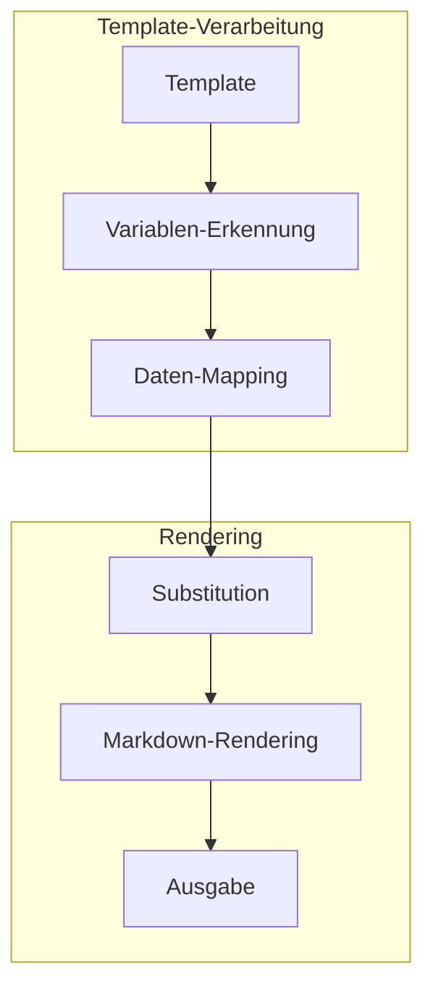

# Template-System

## Überblick

Das Template-System, implementiert in `src/processors/template_processor.py`, ermöglicht die strukturierte Ausgabe von verarbeiteten Daten in verschiedenen Formaten basierend auf Markdown-Templates.

## Architektur



## Template-Typen

### Besprechung
```markdown
# {{title}}

## Metadaten
- Datum: {{date}}
- Dauer: {{duration}}
- Sprache: {{language}}

## Inhalt
{{content}}

## Zusammenfassung
{{summary}}

## Aktionspunkte
{{action_items}}
```

### YouTube
```markdown
# {{title}}

## Video-Informationen
- Kanal: {{uploader}}
- Datum: {{upload_date}}
- Dauer: {{duration}}
- Aufrufe: {{view_count}}

## Beschreibung
{{description}}

## Kapitel
{{#each chapters}}
### {{title}}
{{content}}
{{/each}}

## Transkript
{{transcript}}
```

### Notizen
```markdown
# {{title}}

## Metadaten
- Erstellt: {{created_at}}
- Kategorie: {{category}}

## Notizen
{{content}}

## Tags
{{#each tags}}
- {{this}}
{{/each}}
```

## Variablen-System

### Basis-Variablen
```python
class TemplateVariables(BaseModel):
    """Basis-Variablen für Templates."""
    title: str
    date: datetime
    language: str
    content: str
    summary: Optional[str] = None
```

### Spezielle Variablen
```python
class YoutubeVariables(TemplateVariables):
    """YouTube-spezifische Variablen."""
    uploader: str
    upload_date: str
    view_count: int
    description: str
    chapters: List[Chapter]
```

## Template-Verarbeitung

### Variablen-Erkennung
```python
def extract_variables(template: str) -> Set[str]:
    """Extrahiert Variablen aus einem Template."""
    pattern = r"{{([^}]+)}}"
    return {match.group(1) for match in re.finditer(pattern, template)}
```

### Daten-Mapping
```python
def map_data(variables: Set[str], data: Dict[str, Any]) -> Dict[str, Any]:
    """Mappt Daten auf Template-Variablen."""
    return {var: data.get(var) for var in variables}
```

### Substitution
```python
def substitute_variables(template: str, data: Dict[str, Any]) -> str:
    """Ersetzt Variablen im Template mit Daten."""
    env = Environment(autoescape=True)
    template = env.from_string(template)
    return template.render(**data)
```

## Formatierung

### Markdown-Erweiterungen
```python
class MarkdownExtensions(BaseModel):
    """Markdown-Erweiterungskonfiguration."""
    tables: bool = True
    fenced_code: bool = True
    footnotes: bool = True
    toc: bool = True
```

### Rendering-Optionen
```yaml
markdown:
  extensions:
    - tables
    - fenced_code
    - footnotes
    - toc
  output_format: html
  highlight_style: github
```

## Template-Management

### Verzeichnisstruktur
```
templates/
├── Besprechung.md
├── Youtube.md
├── Notizen.md
└── partials/
    ├── header.md
    ├── footer.md
    └── metadata.md
```

### Template-Laden
```python
def load_template(name: str) -> str:
    """Lädt ein Template aus dem Dateisystem."""
    template_path = Path(f"templates/{name}.md")
    if not template_path.exists():
        raise TemplateNotFoundError(f"Template {name} nicht gefunden")
    return template_path.read_text()
```

## Fehlerbehandlung

### Template-Fehler
```python
class TemplateError(Exception):
    """Basis-Klasse für Template-Fehler."""
    pass

class TemplateNotFoundError(TemplateError):
    """Template wurde nicht gefunden."""
    pass

class VariableError(TemplateError):
    """Fehler bei der Variablen-Verarbeitung."""
    pass
```

### Validierung
```python
def validate_template(template: str, data: Dict[str, Any]):
    """Validiert ein Template und seine Daten."""
    required_vars = extract_variables(template)
    missing_vars = required_vars - set(data.keys())
    if missing_vars:
        raise VariableError(f"Fehlende Variablen: {missing_vars}")
```

## Integration

### API-Endpunkt
```http
POST /api/v1/template/render
Content-Type: application/json

{
    "template": "Besprechung",
    "data": {
        "title": "Meeting Protokoll",
        "date": "2024-01-22T10:00:00",
        "content": "..."
    }
}
```

### Template-Auswahl
```python
def select_template(source_type: str, metadata: Dict[str, Any]) -> str:
    """Wählt ein passendes Template basierend auf Metadaten."""
    if source_type == "youtube":
        return "Youtube"
    elif metadata.get("type") == "meeting":
        return "Besprechung"
    return "Notizen"
```

## Erweiterbarkeit

### Neue Templates
1. Template-Datei erstellen
2. Variablen definieren
3. In Konfiguration registrieren

### Partials
```markdown
{{> header}}
# {{title}}
{{> content}}
{{> footer}}
```

## Monitoring

### Metriken
- Template-Nutzung
- Rendering-Zeit
- Fehlerrate
- Cache-Trefferquote

### Logging
```python
logger.info(f"Template geladen: {template_name}")
logger.debug(f"Variablen erkannt: {variables}")
logger.error(f"Template-Fehler: {error}")
``` 