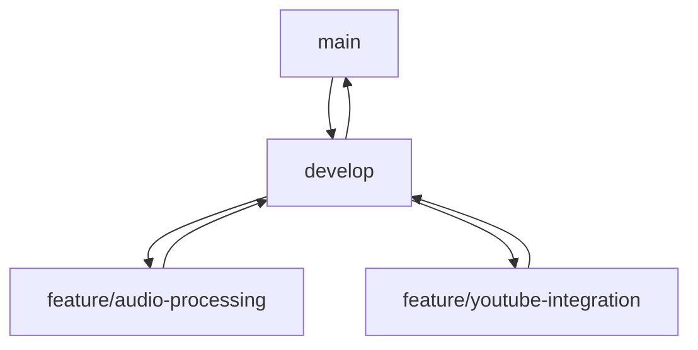

# Entwicklungs-Guidelines

## Überblick

Diese Guidelines definieren die Standards und Best Practices für die Entwicklung am Common Secretary Services Projekt. Sie sollen die Code-Qualität, Wartbarkeit und Konsistenz sicherstellen.

## Code-Style

### Python-Standards
- Befolgen des PEP 8 Style Guide
- Zeilenlänge maximal 100 Zeichen
- Verwendung von Type Hints
- Docstrings im Google-Format

```python
def process_audio(
    file_path: Path,
    options: Dict[str, Any] = None
) -> AudioProcessingResult:
    """Verarbeitet eine Audiodatei mit den angegebenen Optionen.

    Args:
        file_path: Pfad zur Audiodatei
        options: Optionale Verarbeitungseinstellungen

    Returns:
        AudioProcessingResult mit Verarbeitungsergebnissen

    Raises:
        AudioProcessingError: Bei Fehlern in der Verarbeitung
    """
    pass
```

### Namenskonventionen
```python
# Module und Packages
module_name.py
package_name/

# Klassen
class AudioProcessor:
    pass

# Funktionen und Variablen
def process_file():
    temp_result = None

# Konstanten
MAX_FILE_SIZE = 100 * 1024 * 1024
DEFAULT_SETTINGS = {
    'format': 'mp3',
    'quality': 'high'
}
```

# Async/Sync Regeln

## Immer async
- Alle externen API-Aufrufe (OpenAI, etc.)
- Alle Datei-I/O Operationen
- Alle Prozessor-Hauptmethoden
  - extract_metadata()
  - transform()
  - transform_by_template()
  - extract_content_metadata()
  - extract_technical_metadata()
  - process()
  - transcribe()

## Immer sync
- Hilfsfunktionen ohne I/O
- Validierungen
- Datenkonvertierungen
- Interne Berechnungen
  - validate_input()
  - convert_format()
  - get_last_operation_time()
  - _clean_metadata_dict()
  - _prepare_technical_context()

## Allgemeine Regeln
1. Wenn eine Methode I/O-Operationen durchführt (Datei, Netzwerk, API) -> async
2. Wenn eine Methode nur Daten verarbeitet -> sync
3. Wenn eine Methode eine async Methode aufruft -> async
4. Wenn eine Methode nur sync Methoden aufruft -> sync

## Tests
- Tests für async Methoden müssen mit @pytest.mark.asyncio dekoriert werden
- In async Tests muss await für async Methoden verwendet werden
- Mocks für async Methoden müssen auch async sein

## Projektstruktur

### Verzeichnisorganisation
```
src/
├── api/              # API-Implementierung
│   ├── routes/
│   ├── middleware/
│   └── validators/
├── core/             # Kernfunktionalität
│   ├── base/
│   └── utils/
├── processors/       # Medienverarbeitung
│   ├── audio/
│   └── youtube/
└── utils/           # Hilfsfunktionen
```

### Import-Ordnung
```python
# Standard Library
import os
import sys
from pathlib import Path

# Third Party
import flask
import pydantic
import openai

# Local
from core.base import BaseProcessor
from utils.helpers import create_temp_dir
```

## Dokumentation

### Docstrings
```python
class AudioSegment:
    """Repräsentiert ein Audiosegment mit Metadaten.
    
    Diese Klasse kapselt die Audiodaten und zugehörige Metadaten
    für die Verarbeitung durch den AudioProcessor.
    
    Attributes:
        duration: Länge des Segments in Sekunden
        sample_rate: Abtastrate in Hz
        channels: Anzahl der Audiokanäle
    """

    def normalize(self) -> "AudioSegment":
        """Normalisiert die Lautstärke des Audiosegments.
        
        Returns:
            Ein neues AudioSegment mit normalisierter Lautstärke
        """
        pass
```

### Code-Kommentare
```python
# Komplexe Algorithmen dokumentieren
def process_chunks(chunks: List[bytes]) -> bytes:
    # Verarbeite Chunks in 1MB Blöcken für optimale Performance
    block_size = 1024 * 1024
    
    # Initialisiere Ausgabepuffer
    output = bytearray()
    
    for chunk in chunks:
        # Überspringe leere Chunks
        if not chunk:
            continue
        # Füge verarbeiteten Chunk hinzu
        output.extend(process_single_chunk(chunk))
```

## Tests

### Test-Organisation
```python
# test_audio_processor.py
class TestAudioProcessor:
    """Tests für die AudioProcessor-Klasse."""
    
    def setup_method(self):
        """Test-Setup vor jeder Methode."""
        self.processor = AudioProcessor()
        self.test_file = create_test_file()
    
    def test_process_valid_file(self):
        """Test der Verarbeitung einer gültigen Datei."""
        result = self.processor.process(self.test_file)
        assert result.status == "success"
```

### Test-Abdeckung
```python
# Verwende pytest-cov für Coverage-Reports
def test_error_handling():
    """Test der Fehlerbehandlung."""
    with pytest.raises(AudioProcessingError):
        process_invalid_file()
```

## Fehlerbehandlung

### Exception-Hierarchie
```python
class CommonSecretaryError(Exception):
    """Basis-Exception für alle projektspezifischen Fehler."""
    pass

class ProcessingError(CommonSecretaryError):
    """Fehler während der Verarbeitung."""
    pass

class ValidationError(CommonSecretaryError):
    """Fehler bei der Eingabevalidierung."""
    pass
```

### Error-Logging
```python
def handle_error(error: Exception):
    """Zentrale Fehlerbehandlung."""
    logger.error(
        "Fehler aufgetreten",
        extra={
            'error_type': type(error).__name__,
            'details': str(error),
            'stack_trace': traceback.format_exc()
        }
    )
```

## Performance

### Optimierungen
```python
# Verwende Generatoren für große Datenmengen
def process_large_file(file_path: Path):
    with open(file_path, 'rb') as f:
        # Verarbeite Datei in Chunks
        for chunk in iter(lambda: f.read(8192), b''):
            yield process_chunk(chunk)

# Caching für teure Operationen
@lru_cache(maxsize=100)
def expensive_operation(data: bytes) -> str:
    return perform_expensive_calculation(data)
```

### Async/Await
```python
async def process_multiple_files(
    files: List[Path]
) -> List[ProcessingResult]:
    """Verarbeitet mehrere Dateien parallel."""
    tasks = [process_single_file(f) for f in files]
    return await asyncio.gather(*tasks)
```

## Git-Workflow

### Commit-Konventionen
```
feat: Neue Funktion hinzugefügt
fix: Bugfix implementiert
docs: Dokumentation aktualisiert
refactor: Code-Refactoring ohne Funktionsänderung
test: Tests hinzugefügt oder aktualisiert
```

### Branch-Strategie


## Code-Review

### Review-Checkliste
1. Code-Style-Konformität
2. Test-Abdeckung
3. Dokumentation vollständig
4. Fehlerbehandlung implementiert
5. Performance-Aspekte beachtet

### Review-Kommentare
```python
# TODO: Fehlerbehandlung hinzufügen
# FIXME: Performance-Problem bei großen Dateien
# NOTE: Könnte in separate Funktion ausgelagert werden
# SECURITY: API-Key validieren
```

## Monitoring

### Logging-Standards
```python
# Logging-Levels korrekt verwenden
logger.debug("Verarbeitung gestartet")
logger.info("Datei erfolgreich verarbeitet")
logger.warning("Unerwartetes Format")
logger.error("Verarbeitung fehlgeschlagen")
```

### Metriken
```python
def track_processing_time(func):
    """Decorator für Performance-Tracking."""
    @wraps(func)
    def wrapper(*args, **kwargs):
        start = time.time()
        result = func(*args, **kwargs)
        duration = time.time() - start
        metrics.timing(f"{func.__name__}.duration", duration)
        return result
    return wrapper
``` 