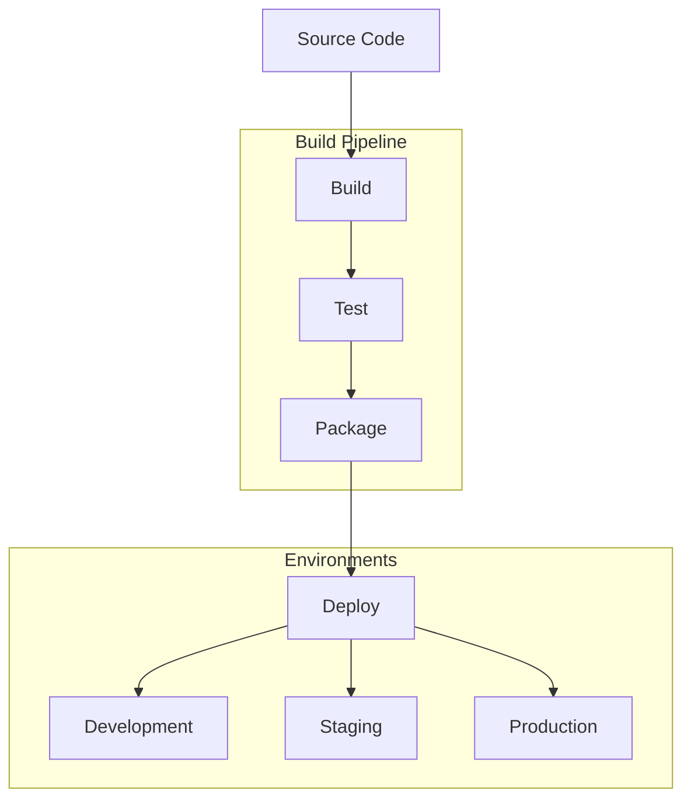

# Deployment

## Überblick

Diese Dokumentation beschreibt den Deployment-Prozess des Common Secretary Services Systems. Es werden sowohl traditionelle als auch Container-basierte Deployment-Optionen unterstützt.

## Deployment-Architektur



## Voraussetzungen

### System-Requirements
```yaml
hardware:
  cpu: "2+ Cores"
  ram: "4+ GB"
  storage: "20+ GB SSD"

software:
  python: "3.8+"
  ffmpeg: "Latest"
  git: "Latest"
  docker: "Optional"
```

### Externe Dienste
```yaml
services:
  openai:
    api_key: required
    models: ["gpt-4"]
  
  youtube:
    api_key: required
    quota: "10000 units/day"
```

## Deployment-Methoden

### Traditionelles Deployment

1. System-Setup
```bash
# Systemabhängigkeiten installieren
sudo apt-get update
sudo apt-get install -y python3.8 python3.8-venv ffmpeg

# Repository klonen
git clone https://github.com/user/CommonSecretaryServices.git
cd CommonSecretaryServices

# Virtuelle Umgebung erstellen
python3.8 -m venv venv
source venv/bin/activate

# Abhängigkeiten installieren
pip install -r requirements.txt
```

2. Konfiguration
```bash
# Umgebungsvariablen setzen
cat > .env << EOL
OPENAI_API_KEY=your_key_here
YOUTUBE_API_KEY=your_key_here
DEBUG=False
EOL

# Konfigurationsdatei anpassen
cp config/config.example.yaml config/config.yaml
```

3. Service-Setup
```ini
# /etc/systemd/system/secretary.service
[Unit]
Description=Common Secretary Services
After=network.target

[Service]
User=secretary
Group=secretary
WorkingDirectory=/opt/secretary
Environment=PATH=/opt/secretary/venv/bin
ExecStart=/opt/secretary/venv/bin/gunicorn -w 4 -b 0.0.0.0:5000 src.main:app
Restart=always

[Install]
WantedBy=multi-user.target
```

### Docker Deployment

1. Docker Build
```dockerfile
# Dockerfile
FROM python:3.8-slim

# FFmpeg installieren
RUN apt-get update && apt-get install -y ffmpeg

# Arbeitsverzeichnis erstellen
WORKDIR /app

# Abhängigkeiten installieren
COPY requirements.txt .
RUN pip install -r requirements.txt

# Code kopieren
COPY . .

# Port freigeben
EXPOSE 5000

# Start-Command
CMD ["gunicorn", "-w", "4", "-b", "0.0.0.0:5000", "src.main:app"]
```

2. Docker Compose
```yaml
# docker-compose.yml
version: '3.8'

services:
  web:
    build: .
    ports:
      - "5000:5000"
    volumes:
      - ./config:/app/config
      - ./temp-processing:/app/temp-processing
    env_file:
      - .env
    restart: always
```

## Umgebungskonfiguration

### Development
```yaml
# config/config.dev.yaml
server:
  host: "127.0.0.1"
  port: 5000
  debug: true

logging:
  level: DEBUG
  file: logs/dev.log
```

### Production
```yaml
# config/config.prod.yaml
server:
  host: "0.0.0.0"
  port: 5000
  debug: false

logging:
  level: INFO
  file: /var/log/secretary/prod.log
```

## Deployment-Prozess

### Continuous Integration
```yaml
# .github/workflows/ci.yml
name: CI/CD Pipeline

on:
  push:
    branches: [ main, develop ]
  pull_request:
    branches: [ main ]

jobs:
  test:
    runs-on: ubuntu-latest
    steps:
      - uses: actions/checkout@v2
      - name: Run Tests
        run: |
          python -m pytest
          
  deploy:
    needs: test
    runs-on: ubuntu-latest
    if: github.ref == 'refs/heads/main'
    steps:
      - name: Deploy to Production
        run: |
          # Deployment-Schritte
```

### Rollback-Strategie
```python
def rollback_deployment():
    """Führt ein Rollback der letzten Deployment durch."""
    try:
        # Vorherige Version wiederherstellen
        restore_previous_version()
        # Services neustarten
        restart_services()
    except Exception as e:
        alert_admin(f"Rollback fehlgeschlagen: {e}")
```

## Monitoring & Wartung

### Health Checks
```python
@app.route('/health')
def health_check():
    """Überprüft den System-Status."""
    return {
        'status': 'healthy',
        'version': get_version(),
        'uptime': get_uptime(),
        'memory_usage': get_memory_usage()
    }
```

### Backup-Strategie
```bash
#!/bin/bash
# backup.sh

# Konfiguration sichern
tar -czf config_backup.tar.gz config/

# Logs archivieren
find logs/ -name "*.log" -mtime +7 -exec gzip {} \;
```

## Skalierung

### Horizontale Skalierung
```yaml
# docker-compose.scale.yml
version: '3.8'

services:
  web:
    build: .
    deploy:
      replicas: 4
      resources:
        limits:
          cpus: '0.5'
          memory: 512M
```

### Load Balancing
```nginx
# nginx.conf
upstream secretary {
    server web1:5000;
    server web2:5000;
    server web3:5000;
    server web4:5000;
}

server {
    listen 80;
    server_name api.secretary.com;

    location / {
        proxy_pass http://secretary;
    }
}
```

## Sicherheit

### SSL/TLS-Konfiguration
```nginx
# Nginx SSL-Konfiguration
server {
    listen 443 ssl;
    server_name api.secretary.com;

    ssl_certificate /etc/letsencrypt/live/api.secretary.com/fullchain.pem;
    ssl_certificate_key /etc/letsencrypt/live/api.secretary.com/privkey.pem;
    
    ssl_protocols TLSv1.2 TLSv1.3;
    ssl_ciphers HIGH:!aNULL:!MD5;
}
```

### Firewall-Regeln
```bash
# UFW-Regeln
sudo ufw allow 80/tcp
sudo ufw allow 443/tcp
sudo ufw allow 5000/tcp
sudo ufw enable
``` 