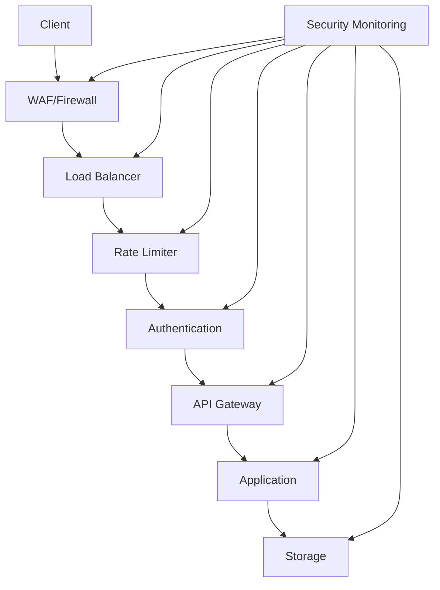

# Sicherheit & Datenschutz

## Sicherheitsarchitektur



## Authentifizierung

### API-Key Management
```python
class APIKeyManager:
    """Verwaltet API-Keys und deren Berechtigungen."""
    def validate_key(self, key: str) -> bool:
        return check_key_validity(key)
    
    def get_permissions(self, key: str) -> List[str]:
        return fetch_key_permissions(key)
```

### OAuth2 Integration
```python
oauth = OAuth2Provider(
    client_id=config.OAUTH_CLIENT_ID,
    client_secret=config.OAUTH_CLIENT_SECRET,
    authorize_url=config.OAUTH_AUTHORIZE_URL,
    token_url=config.OAUTH_TOKEN_URL
)
```

## Datenschutz (DSGVO)

### Verarbeitete Daten
1. **Mediendateien**
   - Temporäre Speicherung während Verarbeitung
   - Automatische Löschung nach Abschluss
   - Verschlüsselte Übertragung

2. **Nutzerdaten**
   - API-Keys
   - IP-Adressen (für Rate Limiting)
   - Verarbeitungsprotokoll

### Datenspeicherung
```python
class SecureStorage:
    """Sicherer Dateispeicher mit Verschlüsselung."""
    def store_file(self, file: BinaryIO, encryption_key: bytes):
        encrypted = encrypt_file(file, encryption_key)
        return self._store_encrypted(encrypted)
```

### Löschrichtlinien
```python
class DataRetentionPolicy:
    """Implementiert Datenlöschrichtlinien."""
    RETENTION_PERIODS = {
        'media_files': timedelta(hours=24),
        'logs': timedelta(days=30),
        'metrics': timedelta(days=90)
    }
```

## API-Sicherheit

### Request Validation
```python
def validate_request(request: Request) -> bool:
    """Validiert eingehende Anfragen."""
    validate_headers(request.headers)
    validate_content_type(request.content_type)
    validate_payload_size(request.content_length)
    return True
```

### Security Headers
```python
SECURITY_HEADERS = {
    'X-Frame-Options': 'DENY',
    'X-Content-Type-Options': 'nosniff',
    'X-XSS-Protection': '1; mode=block',
    'Strict-Transport-Security': 'max-age=31536000',
    'Content-Security-Policy': "default-src 'self'"
}
```

## Audit-Logging

### Security Events
```python
class SecurityAuditLog:
    """Protokolliert sicherheitsrelevante Events."""
    def log_event(self, event_type: str, details: Dict):
        log_entry = {
            'timestamp': datetime.now(),
            'event_type': event_type,
            'details': details,
            'source_ip': request.remote_addr
        }
        self.store_log(log_entry)
```

### Access Logs
```python
@app.after_request
def log_request(response):
    """Protokolliert API-Zugriffe."""
    log.info({
        'method': request.method,
        'path': request.path,
        'status': response.status_code,
        'ip': request.remote_addr,
        'api_key': request.headers.get('X-API-Key')
    })
    return response
```

## Datenspeicherung

### Verschlüsselung
```python
class DataEncryption:
    """Implementiert Datenverschlüsselung."""
    def encrypt_file(self, file_data: bytes) -> bytes:
        key = get_encryption_key()
        return encrypt(file_data, key)
    
    def decrypt_file(self, encrypted_data: bytes) -> bytes:
        key = get_encryption_key()
        return decrypt(encrypted_data, key)
```

### Sichere Temporäre Dateien
```python
class SecureTempFile:
    """Verwaltet sichere temporäre Dateien."""
    def __init__(self):
        self.path = create_secure_temp_path()
    
    def __enter__(self):
        return self
    
    def __exit__(self, *args):
        self.secure_delete()
```

## Externe Dienste

### OpenAI Integration
```python
class OpenAISecurityConfig:
    """Sicherheitskonfiguration für OpenAI."""
    API_KEY_ENV = 'OPENAI_API_KEY'
    MAX_TOKENS = 4000
    ALLOWED_MODELS = ['gpt-4', 'gpt-3.5-turbo']
```

### YouTube API
```python
class YouTubeSecurityConfig:
    """Sicherheitskonfiguration für YouTube."""
    API_KEY_ENV = 'YOUTUBE_API_KEY'
    QUOTA_LIMIT = 10000
    DOWNLOAD_SIZE_LIMIT = 100 * 1024 * 1024  # 100MB
```

## Betroffenenrechte

### Auskunftsrecht
```python
class DataAccessRequest:
    """Verarbeitet Auskunftsanfragen."""
    def get_user_data(self, user_id: str) -> Dict:
        return {
            'stored_data': get_stored_data(user_id),
            'processing_logs': get_processing_logs(user_id),
            'api_usage': get_api_usage(user_id)
        }
```

### Löschung
```python
class DataDeletionRequest:
    """Verarbeitet Löschanfragen."""
    def delete_user_data(self, user_id: str):
        delete_stored_files(user_id)
        delete_processing_logs(user_id)
        delete_api_logs(user_id)
```

## Incident Response

### Security Incidents
```python
class SecurityIncident:
    """Verwaltet Sicherheitsvorfälle."""
    def report_incident(self, incident_type: str, severity: str):
        notify_security_team(incident_type, severity)
        log_incident(incident_type, severity)
        take_immediate_action(incident_type)
```

### Recovery Procedures
```python
class DisasterRecovery:
    """Implementiert Disaster Recovery."""
    def initiate_recovery(self, incident: SecurityIncident):
        backup_data = load_latest_backup()
        verify_backup_integrity(backup_data)
        restore_system(backup_data)
``` 