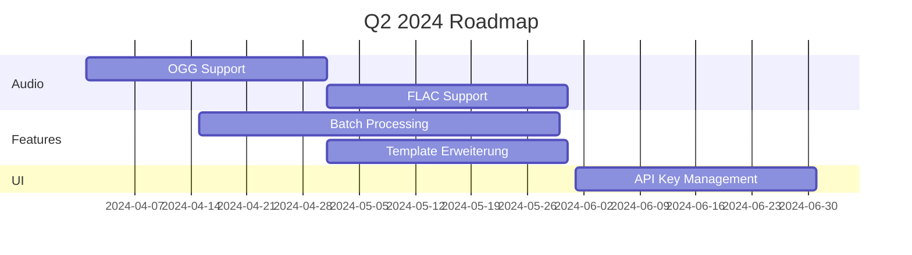
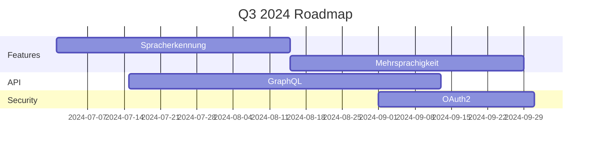
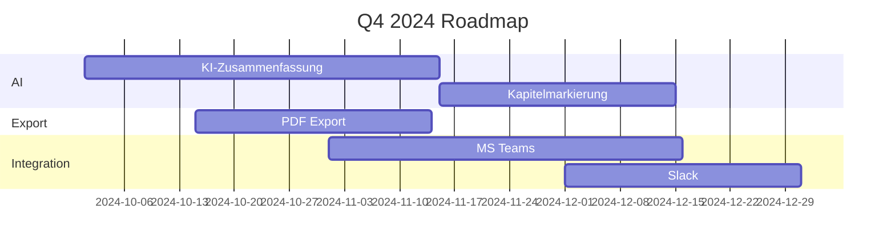

# Changelog & Roadmap

## Aktuelle Version (1.0.0)

### Kernfunktionen
- Audio-Verarbeitung (MP3, WAV, M4A)
- YouTube-Integration
- Template-System
- RESTful API
- Web-Interface

### Unterstützte Sprachen
- Deutsch
- Englisch

## Changelog

### Version 1.0.0 (2024-01-22)

#### Neue Features
- Audio-Verarbeitung für MP3, WAV und M4A
- YouTube Video Download und Verarbeitung
- Template-basierte Ausgabe
- RESTful API mit Swagger UI
- Web-Interface für Verwaltung
- Automatische Segmentierung
- GPT-4 Integration

#### Verbesserungen
- Performance-Optimierung
- Fehlerbehandlung
- Logging-System

#### Technische Updates
- Python 3.11 Kompatibilität
- Dependency Updates
- Docker Support

### Version 0.9.0 (2023-12-15)

#### Features
- YouTube API Integration
- Automatische Kapitelmarkierung
- Webhook-System

#### Verbesserungen
- Transkriptionsgeschwindigkeit
- Logging-System

### Version 0.8.0 (2023-11-30)

#### Features
- Basis Audio-Prozessor
- API Grundfunktionen
- Template-System v1

## Roadmap

### Q2 2024



#### Neue Funktionen
- Unterstützung für OGG und FLAC
- Batch-Verarbeitung
- Erweiterte Templates
- API-Key Management UI

#### Verbesserungen
- Performance-Optimierung
- Fehlerbehandlung
- Logging

#### Technische Updates
- Python 3.12 Migration
- Dependency Updates
- Docker-Compose Setup

### Q3 2024



#### Neue Funktionen
- Automatische Spracherkennung
- Mehrsprachige Transkription
- Echtzeit-Status
- Webhooks

#### API-Erweiterungen
- GraphQL-Endpoint
- Erweiterte Filter
- Bulk-Operations

#### Sicherheit
- OAuth2-Integration
- Rate-Limiting
- Security Audit

### Q4 2024



#### Neue Funktionen
- KI-Zusammenfassungen
- Automatische Kapitel
- PDF-Export
- Archivierung

#### Integration
- MS Teams Connector
- Slack Integration
- E-Mail Notifications

#### Performance
- Caching-System
- Load Balancing
- Horizontale Skalierung

### 2025

#### Q1 2025
- Mobile App (iOS/Android)
- Offline-Modus
- Custom AI-Models

#### Q2 2025
- Enterprise Features
- Multi-Tenant
- Advanced Analytics

#### Q3 2025
- Blockchain Integration
- KI-Optimierung
- Predictive Scaling

#### Q4 2025
- Edge Computing
- Globales CDN
- Plugin-System

## Migration

### 1.0.0 zu 2.0.0
```python
# Beispiel für API-Migration
class APIv2Migrator:
    """Migriert API v1 zu v2 Aufrufe."""
    def migrate_request(self, v1_request):
        return transform_to_v2(v1_request)
```

### Breaking Changes
- API-Endpunkt-Struktur
- Response-Formate
- Authentifizierung

## Feedback & Priorisierung

### Feature Requests
- GitHub Issues
- Feedback-Formulare
- Community Voting

### Entwickler-Beteiligung
- Open Source Beiträge
- Plugin-Entwicklung
- Dokumentation

## Release-Prozess

### Versionierung
- Semantic Versioning
- LTS Releases
- Hotfixes

### Release-Zyklus
- Monatliche Minor Updates
- Quartalsweise Major Releases
- Hotfixes nach Bedarf 