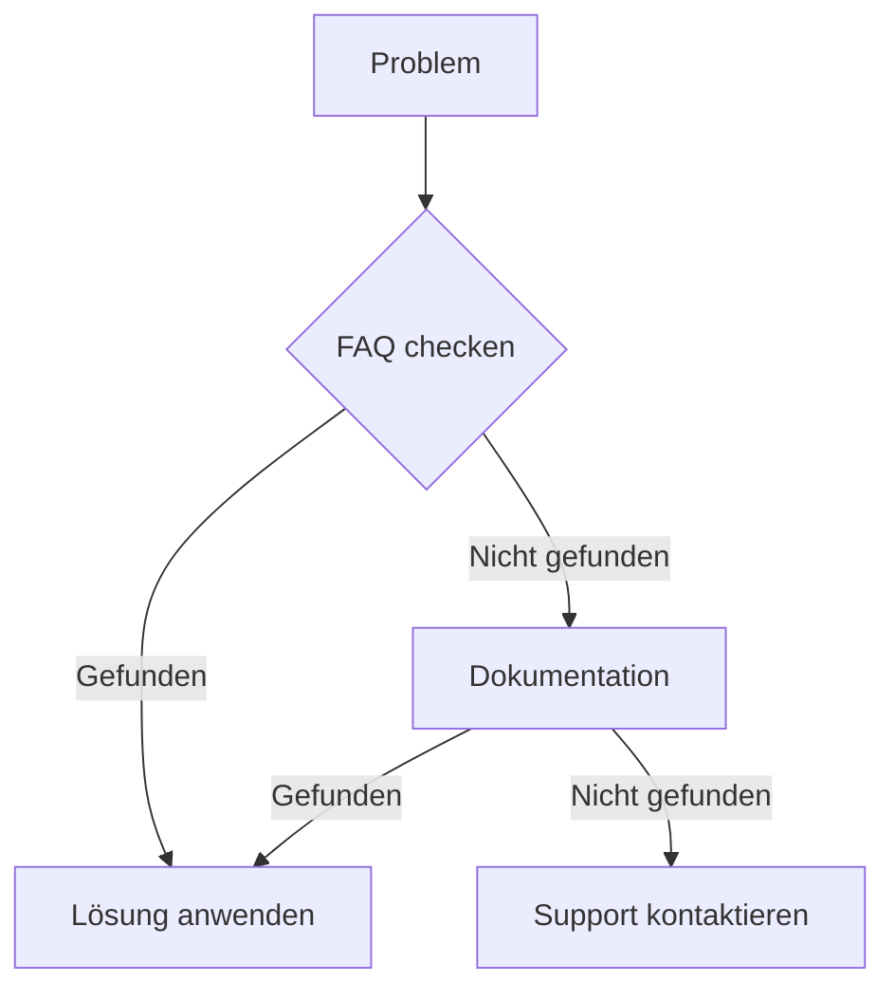

# Kontakt, Support & Lizenz

## Kontakt

### Entwickler & Betreiber
Peter Aichner
[Kontaktdaten]

### Support-Team
E-Mail: support@common-secretary.com
Reaktionszeit: 24-48 Stunden

## Support-Kanäle

### 1. GitHub Issues
- Bug Reports
- Feature Requests
- Dokumentationsverbesserungen
- Link zum Repository: [GitHub]

### 2. E-Mail Support
- Technische Fragen
- API-Zugang
- Lizenzierung
- Datenschutzanfragen

### 3. Notfall-Kontakt
- Kritische Systemausfälle
- Sicherheitsvorfälle
- 24/7 Erreichbarkeit für Premium-Kunden

## Support-Prozess

### 1. Erste Schritte


### 2. Bug-Report erstellen
```markdown
**Beschreibung des Problems**
[Detaillierte Beschreibung]

**Reproduzierbare Schritte**
1. [Erster Schritt]
2. [Zweiter Schritt]
3. [...]

**Erwartetes Verhalten**
[Beschreibung]

**Tatsächliches Verhalten**
[Beschreibung]

**Systemumgebung**
- OS: [Betriebssystem]
- Python Version: [Version]
- API Version: [Version]
```

### 3. Feature-Request erstellen
```markdown
**Funktionsbeschreibung**
[Detaillierte Beschreibung]

**Anwendungsfall**
[Use-Case Beschreibung]

**Vorgeschlagene Implementierung**
[Optional: Technische Details]
```

## Service Level Agreement (SLA)

### Response-Zeiten
- Kritische Probleme: < 4 Stunden
- Wichtige Probleme: < 24 Stunden
- Allgemeine Anfragen: < 48 Stunden

### Verfügbarkeit
- API-Dienst: 99.9% Uptime
- Support-Zeiten: Mo-Fr 9:00-17:00 (CET)
- Notfall-Support: 24/7 für kritische Systeme

## Lizenzinformationen

### Common Secretary Services
Copyright (c) 2024 Peter Aichner
Alle Rechte vorbehalten.

### Verwendete Software und Lizenzen

#### Python-Pakete
- Flask (BSD-3-Clause)
- Flask-RESTX (BSD-3-Clause)
- PyYAML (MIT)
- OpenAI (MIT)
- yt-dlp (Unlicense)
- pydub (MIT)

#### Externe Software
- FFmpeg (LGPL 2.1+)

### Nutzungsbedingungen

#### API-Nutzung
- Kommerzielle und nicht-kommerzielle Nutzung erlaubt
- API-Key erforderlich
- Rate-Limiting Beschränkungen beachten
- Keine Weitergabe von API-Keys an Dritte

#### Datenverarbeitung
- Temporäre Speicherung von Mediendateien während der Verarbeitung
- Keine dauerhafte Speicherung von Nutzerinhalten
- Datenschutzrichtlinien gemäß DSGVO

### Haftungsausschluss

Die Software wird "wie sie ist" zur Verfügung gestellt, ohne jegliche ausdrückliche oder implizierte Garantie. In keinem Fall sind die Autoren oder Copyrightinhaber für jeglichen Schaden oder sonstige Ansprüche haftbar.

### Externe Dienste

#### OpenAI API
- Separate Lizenzvereinbarung mit OpenAI erforderlich
- Nutzung gemäß OpenAI-Nutzungsbedingungen
- API-Key muss vom Nutzer bereitgestellt werden

#### YouTube API
- Nutzung gemäß YouTube Terms of Service
- API-Key muss vom Nutzer bereitgestellt werden
- Quotenbeschränkungen beachten

## Community

### Ressourcen
- Wiki
- Beispiel-Code
- Best Practices
- Community Guidelines

### Beiträge
- Code Contributions
- Dokumentation
- Übersetzungen
- Bug Reports

## Status-Monitoring

### System-Status
- Status-Seite: [URL]
- Service-Metriken
- Incident-Historie

### Benachrichtigungen
- E-Mail Alerts
- RSS Feed
- Status API

## Feedback

### Verbesserungsvorschläge
- Feature Requests
- UI/UX Feedback
- Dokumentationsvorschläge

### Zufriedenheitsumfragen
- Quartalsweise Erhebungen
- Support-Ticket Feedback
- Feature-Nutzungsanalyse 