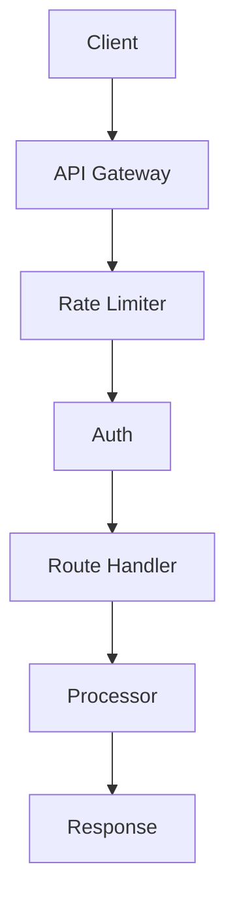

# API und Server

## Überblick

Die API ist als RESTful Service mit Flask und Flask-RESTX implementiert. Sie bietet Endpunkte für die Verarbeitung von Audio-, Video- und anderen Mediendateien.

## API-Architektur

## Endpunkte (historisch /api/v1)

Beispiele in dieser Seite nutzen das alte Präfix `/api/v1/*` und sind veraltet. Aktuelles Präfix: `/api/*`.
