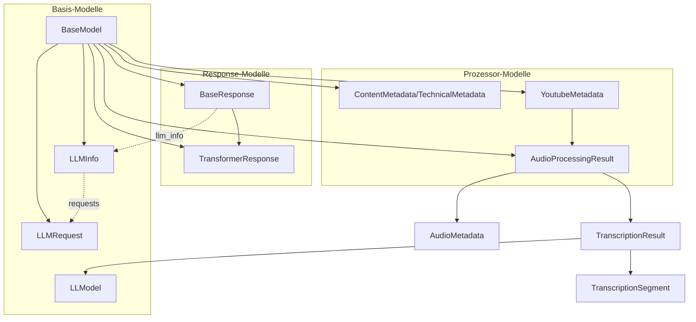

# Datenmodelle

## Übersicht

Das System verwendet eine hierarchische Struktur von Datenmodellen, die auf der `BaseModel`-Klasse aufbauen. Alle Modelle sind als unveränderliche (frozen) Dataclasses implementiert.

## Basis-Modelle

### BaseModel
Basis-Klasse für alle Datenmodelle.

**Methoden:**
- `to_dict() -> Dict[str, Any]`: Konvertiert das Modell in ein Dictionary

### LLModel
Informationen über die Nutzung eines Language Models.

**Felder:**
- `model: str` - Name des verwendeten Modells (z.B. 'gpt-4')
- `duration: float` - Verarbeitungsdauer in Millisekunden
- `tokens: int` - Anzahl der verarbeiteten Tokens
- `timestamp: str` - Zeitstempel der LLM-Nutzung (ISO 8601)

### LLMRequest
Informationen über einen einzelnen LLM-Request.

**Felder:**
- `model: str` - Name des verwendeten Modells
- `purpose: str` - Zweck der Anfrage (z.B. 'transcription', 'translation')
- `tokens: int` - Anzahl der verwendeten Tokens
- `duration: int` - Verarbeitungsdauer in Millisekunden
- `timestamp: str` - Zeitstempel der Anfrage (ISO 8601)

### LLMInfo
Aggregierte Informationen über LLM-Nutzung.

**Felder:**
- `model: str` - Name des hauptsächlich verwendeten Modells
- `purpose: str` - Hauptzweck der LLM-Nutzung
- `tokens: int` - Gesamtanzahl der verwendeten Tokens
- `duration: float` - Gesamtdauer der Verarbeitung in Millisekunden
- `requests: List[LLMRequest]` - Liste aller LLM-Requests
- `requests_count: int` - Anzahl der Requests
- `total_tokens: int` - Summe aller Tokens
- `total_duration: float` - Summe aller Verarbeitungszeiten

**Methoden:**
- `add_request(request: LLMRequest) -> None` - Fügt einen neuen Request hinzu und aktualisiert die Gesamtwerte

### ErrorInfo
Fehlerinformationen für API-Responses.

**Felder:**
- `code: int | str` - Fehlercode
- `message: str` - Fehlermeldung
- `details: Optional[Dict[str, Any]]` - Zusätzliche Fehlerdetails

### RequestInfo
Informationen über einen API-Request.

**Felder:**
- `processor: str` - Name des verwendeten Prozessors
- `timestamp: datetime` - Zeitpunkt des Requests
- `parameters: Optional[Dict[str, Any]]` - Request-Parameter

### ProcessInfo
Informationen über einen Verarbeitungsprozess.

**Felder:**
- `id: str` - Eindeutige Prozess-ID
- `processors: List[str]` - Liste der beteiligten Prozessoren
- `duration: float` - Gesamtdauer der Verarbeitung
- `started: datetime` - Startzeitpunkt
- `completed: Optional[datetime]` - Endzeitpunkt

## Response-Modelle

### BaseResponse
Basis-Response für alle API-Antworten.

**Felder:**
- `status: str` - Status der Antwort ('success' oder 'error')
- `request: RequestInfo` - Request-Informationen
- `process: ProcessInfo` - Prozess-Informationen
- `data: Optional[Dict[str, Any]]` - Response-Daten
- `error: Optional[ErrorInfo]` - Fehlerinformationen
- `llm_info: LLMInfo` - LLM-Nutzungsinformationen

### TransformerResponse
Response für Transformer-Operationen.

**Felder:**
- `input: Optional[TransformerInput]` - Eingabedaten
- `output: Optional[TransformerOutput]` - Ausgabedaten
- `transform: Optional[TransformerInfo]` - Transformations-Informationen

## Audio-Modelle

### AudioSegmentInfo
Information über ein Audio-Segment.

**Felder:**
- `file_path: Path` - Pfad zur Segment-Datei
- `title: Optional[str]` - Titel des Segments
- `binary_data: Optional[bytes]` - Binärdaten des Segments

### Chapter
Ein Kapitel mit Start- und Endzeit.

**Felder:**
- `title: str` - Titel des Kapitels
- `start_time: float` - Startzeit in Sekunden
- `end_time: float` - Endzeit in Sekunden

### AudioMetadata
Audio-spezifische Metadaten.

**Felder:**
- `duration: float` - Dauer in Sekunden
- `process_dir: str` - Verarbeitungsverzeichnis
- `args: Dict[str, Any]` - Zusätzliche Argumente

### AudioProcessingResult
Ergebnis der Audio-Verarbeitung.

**Felder:**
- `transcription: TranscriptionResult` - Transkriptionsergebnis
- `metadata: AudioMetadata` - Audio-Metadaten
- `process_id: str` - Prozess-ID

## Metadaten-Modelle

### ContentMetadata
Inhaltliche Metadaten für verschiedene Medientypen.

**Felder:**
- `type: Optional[str]` - Medientyp
- `created: Optional[str]` - Erstellungsdatum
- `modified: Optional[str]` - Änderungsdatum
- `title: Optional[str]` - Titel
- `subtitle: Optional[str]` - Untertitel
- `authors: Optional[str]` - Autoren
- `publisher: Optional[str]` - Herausgeber
- `publication_date: Optional[str]` - Veröffentlichungsdatum
- `isbn: Optional[str]` - ISBN
- `doi: Optional[str]` - DOI
- `edition: Optional[str]` - Edition
- `language: Optional[str]` - Sprache (ISO 639-1)
- `subject_areas: Optional[str]` - Fachgebiete
- `keywords: Optional[str]` - Schlüsselwörter
- `abstract: Optional[str]` - Zusammenfassung
- `temporal_start: Optional[str]` - Zeitlicher Beginn
- `temporal_end: Optional[str]` - Zeitliches Ende
- `temporal_period: Optional[str]` - Zeitperiode
- `spatial_location: Optional[str]` - Ort
- `spatial_latitude: Optional[float]` - Breitengrad
- `spatial_longitude: Optional[float]` - Längengrad
- `spatial_habitat: Optional[str]` - Habitat
- `spatial_region: Optional[str]` - Region
- `rights_holder: Optional[str]` - Rechteinhaber
- `rights_license: Optional[str]` - Lizenz
- `rights_access: Optional[str]` - Zugriffsrechte
- `rights_usage: Optional[str]` - Nutzungsrechte
- `rights_attribution: Optional[str]` - Attribution
- `rights_commercial: Optional[bool]` - Kommerzielle Nutzung erlaubt
- `rights_modifications: Optional[bool]` - Modifikationen erlaubt

### TechnicalMetadata
Technische Metadaten einer Datei.

**Felder:**
- `file_name: str` - Dateiname
- `file_mime: str` - MIME-Typ
- `file_size: int` - Dateigröße in Bytes
- `created: str` - Erstellungsdatum (ISO 8601)
- `modified: str` - Änderungsdatum (ISO 8601)
- `doc_pages: Optional[int]` - Seitenanzahl (Dokumente)
- `media_duration: Optional[float]` - Mediendauer
- `media_bitrate: Optional[int]` - Bitrate
- `media_codec: Optional[str]` - Codec
- `media_channels: Optional[int]` - Audiokanäle
- `media_sample_rate: Optional[int]` - Sample Rate

## YouTube-Modelle

### YoutubeMetadata
Metadaten eines YouTube-Videos.

**Felder:**
- `title: str` - Video-Titel
- `url: str` - YouTube-URL
- `video_id: str` - Video-ID
- `duration: int` - Dauer in Sekunden
- `duration_formatted: str` - Formatierte Dauer
- `process_dir: str` - Verarbeitungsverzeichnis

### YoutubeProcessingResult
Ergebnis der YouTube-Verarbeitung.

**Felder:**
- `metadata: YoutubeMetadata` - Video-Metadaten
- `audio_result: Optional[AudioProcessingResult]` - Audio-Verarbeitungsergebnis
- `process_id: str` - Prozess-ID 
