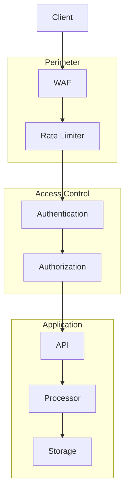

# Sicherheit

## Überblick

Die Sicherheitsarchitektur des Systems basiert auf mehreren Schichten und folgt dem Prinzip der Defense in Depth. Besonderer Fokus liegt auf dem Schutz sensibler Daten und der sicheren Verarbeitung von Mediendateien.

## Sicherheitsarchitektur



## Authentifizierung & Autorisierung

### API-Schlüssel
```python
def validate_api_key(api_key: str) -> bool:
    """Validiert einen API-Schlüssel."""
    if not api_key:
        raise AuthenticationError("API-Schlüssel fehlt")
    return secrets.compare_digest(api_key, config.API_KEY)
```

### Rate-Limiting
```python
class RateLimiter:
    """Implementiert Rate-Limiting pro API-Schlüssel."""
    def __init__(self, requests_per_minute: int = 60):
        self.limit = requests_per_minute
        self.window = 60  # Sekunden
        self.requests = defaultdict(list)

    def is_allowed(self, api_key: str) -> bool:
        now = time.time()
        self.cleanup(api_key, now)
        return len(self.requests[api_key]) < self.limit
```

## Datensicherheit

### Temporäre Dateien
```python
class SecureFileHandler:
    """Sicherer Umgang mit temporären Dateien."""
    def __init__(self, base_dir: Path):
        self.base_dir = base_dir

    def create_temp_dir(self) -> Path:
        """Erstellt ein sicheres temporäres Verzeichnis."""
        temp_dir = self.base_dir / secrets.token_hex(16)
        temp_dir.mkdir(parents=True, mode=0o700)
        return temp_dir

    def cleanup(self, older_than: int = 3600):
        """Bereinigt alte temporäre Dateien."""
        for path in self.base_dir.glob("*"):
            if time.time() - path.stat().st_mtime > older_than:
                shutil.rmtree(path, ignore_errors=True)
```

### Datenverschlüsselung
```python
class DataEncryption:
    """Verschlüsselung sensibler Daten."""
    def __init__(self, key: bytes):
        self.fernet = Fernet(key)

    def encrypt(self, data: bytes) -> bytes:
        """Verschlüsselt Daten."""
        return self.fernet.encrypt(data)

    def decrypt(self, data: bytes) -> bytes:
        """Entschlüsselt Daten."""
        return self.fernet.decrypt(data)
```

## API-Sicherheit

### Request-Validierung
```python
def validate_request(request: Request):
    """Validiert eingehende Requests."""
    validate_content_type(request)
    validate_file_size(request)
    validate_file_type(request)
    sanitize_input(request)
```

### Sicherheits-Header
```python
SECURITY_HEADERS = {
    'Strict-Transport-Security': 'max-age=31536000; includeSubDomains',
    'X-Content-Type-Options': 'nosniff',
    'X-Frame-Options': 'DENY',
    'Content-Security-Policy': "default-src 'self'",
    'X-XSS-Protection': '1; mode=block',
    'Referrer-Policy': 'strict-origin-when-cross-origin'
}
```

## Dateisystem-Sicherheit

### Pfad-Validierung
```python
def validate_path(path: Path) -> bool:
    """Validiert Dateipfade gegen Path Traversal."""
    try:
        path.resolve().relative_to(BASE_DIR)
        return True
    except ValueError:
        raise SecurityError("Ungültiger Pfad")
```

### Berechtigungen
```python
def set_secure_permissions(path: Path):
    """Setzt sichere Dateiberechtigungen."""
    path.chmod(0o600)  # Nur Besitzer darf lesen/schreiben
    path.parent.chmod(0o700)  # Nur Besitzer darf auf Verzeichnis zugreifen
```

## Audit-Logging

### Sicherheits-Events
```python
def log_security_event(
    event_type: str,
    user: str,
    action: str,
    status: str,
    details: Dict[str, Any]
):
    """Protokolliert Sicherheitsereignisse."""
    logger.security({
        'timestamp': datetime.now().isoformat(),
        'event_type': event_type,
        'user': user,
        'action': action,
        'status': status,
        'details': details
    })
```

### Audit-Trail
```python
class AuditTrail:
    """Implementiert Audit-Trail für wichtige Aktionen."""
    def log_access(self, user: str, resource: str):
        """Protokolliert Ressourcenzugriffe."""
        pass

    def log_modification(self, user: str, resource: str, changes: Dict):
        """Protokolliert Änderungen."""
        pass

    def log_deletion(self, user: str, resource: str):
        """Protokolliert Löschungen."""
        pass
```

## Fehlerbehandlung

### Sicherheitsfehler
```python
class SecurityError(Exception):
    """Basis-Klasse für Sicherheitsfehler."""
    pass

class AuthenticationError(SecurityError):
    """Authentifizierungsfehler."""
    pass

class AuthorizationError(SecurityError):
    """Autorisierungsfehler."""
    pass
```

### Fehler-Logging
```python
def log_security_error(error: SecurityError):
    """Protokolliert Sicherheitsfehler."""
    logger.error(f"Sicherheitsfehler: {str(error)}", extra={
        'error_type': error.__class__.__name__,
        'stack_trace': traceback.format_exc()
    })
```

## Konfiguration

### Sicherheitseinstellungen
```yaml
security:
  rate_limiting:
    enabled: true
    requests_per_minute: 60
    burst: 5
  
  file_uploads:
    max_size: 104857600  # 100MB
    allowed_types:
      - audio/mpeg
      - audio/wav
      - video/mp4
    
  temp_files:
    cleanup_interval: 3600
    max_age: 86400
    
  encryption:
    algorithm: "AES-256-GCM"
    key_rotation: 30  # Tage
```

## Monitoring

### Sicherheits-Metriken
- Fehlgeschlagene Authentifizierungsversuche
- Rate-Limit-Überschreitungen
- Verdächtige Requests
- Dateisystem-Zugriffe

### Alerts
```python
def send_security_alert(
    severity: str,
    message: str,
    details: Dict[str, Any]
):
    """Sendet Sicherheitsalerts."""
    alert = SecurityAlert(
        severity=severity,
        message=message,
        details=details,
        timestamp=datetime.now()
    )
    alert_manager.send(alert)
``` 