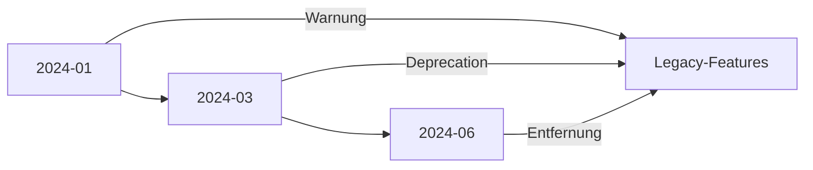

# Changelog

## Überblick

Dieses Dokument führt alle wichtigen Änderungen des Common Secretary Services Systems auf. Die Versionierung folgt dem Format `YYYY-MM-DD` für Release-Versionen.

## Versionen

### 2024-01-22

#### Neue Funktionen
- Audio-Prozessor unterstützt nun M4A und OGG Formate
- Verbesserte Spracherkennung für Dialekte
- Neues Template-System für flexible Ausgabeformatierung

#### Verbesserungen
- Optimierte Performance bei der Audio-Segmentierung
- Erweiterte Fehlerbehandlung mit detaillierten Meldungen
- Verbesserte Speicherverwaltung für große Dateien

#### Fehlerbehebungen
- Behoben: Memory-Leak bei langen Transkriptionen
- Behoben: Fehlerhafte Zeitstempel in Segmenten
- Behoben: Race-Condition im Job-Manager

#### API-Änderungen
```diff
+ POST /api/v1/audio/process unterstützt neue Formate
+ Neue Endpunkte für Template-Management
* Geänderte Response-Struktur für bessere Fehlerdetails
```

### 2023-12-15

#### Neue Funktionen
- Integration der YouTube-API für Video-Downloads
- Automatische Kapitelmarkierung
- Webhook-System für Benachrichtigungen

#### Verbesserungen
- Schnellere Transkription durch Batch-Verarbeitung
- Bessere Qualität der Audio-Normalisierung
- Erweiterte Logging-Funktionalität

#### Fehlerbehebungen
- Behoben: Inkonsistente Status-Updates
- Behoben: UTF-8 Encoding-Probleme
- Behoben: Fehler bei paralleler Verarbeitung

#### API-Änderungen
```diff
+ Neue YouTube-Endpunkte hinzugefügt
+ Webhook-Konfiguration implementiert
* Rate-Limiting-Header angepasst
```

### 2023-11-30

#### Neue Funktionen
- Erste Version des Audio-Prozessors
- Basis-API mit Flask/Flask-RESTX
- Grundlegendes Job-Management

#### Kernfunktionen
- Audio-Datei-Upload und -Verarbeitung
- Einfache Transkription mit OpenAI
- Basis-Template-System

#### Bekannte Einschränkungen
- Nur MP3 und WAV unterstützt
- Keine parallele Verarbeitung
- Begrenzte Fehlerbehandlung

## Migrationsanleitungen

### 2024-01-22 Migration

#### API-Änderungen
```python
# Alte API-Nutzung
api.process_audio(file="audio.mp3")

# Neue API-Nutzung
api.process_audio(
    file="audio.m4a",
    options={
        "normalize": True,
        "detect_language": True
    }
)
```

#### Konfigurationsänderungen
```yaml
# Alte Konfiguration
audio:
  formats: ["mp3", "wav"]

# Neue Konfiguration
audio:
  formats: ["mp3", "wav", "m4a", "ogg"]
  normalization:
    enabled: true
    target_level: -23
```

### 2023-12-15 Migration

#### Webhook-Integration
```python
# Webhook einrichten
api.configure_webhook(
    url="https://your-domain.com/webhook",
    events=["job.completed", "job.failed"]
)

# Webhook-Handler implementieren
@app.route('/webhook', methods=['POST'])
def handle_webhook():
    event = request.json
    process_event(event)
```

#### YouTube-Integration
```python
# YouTube-Video verarbeiten
result = api.process_youtube(
    url="https://youtube.com/watch?v=...",
    options={
        "extract_chapters": True,
        "quality": "high"
    }
)
```

## Deprecation-Hinweise

### Geplante Änderungen

#### Version 2024-03
- Entfernung der alten Template-Engine
- Deprecation von v1 API-Endpunkten
- Neue OAuth2-Authentifizierung

#### Vorbereitungen
```python
# Alte Template-Engine (wird entfernt)
api.render_template_legacy(template_name, data)

# Neue Template-Engine (bevorzugt)
api.render_template(template_name, data, version="v2")
```

### Übergangszeit

#### Timeline


## Sicherheitsupdates

### 2024-01-22
- Aktualisierung der OpenAI API-Integration
- Verbesserte Input-Validierung
- Neue Sicherheits-Header

### 2023-12-15
- Behebung von CSRF-Schwachstellen
- Verbesserte API-Key-Validierung
- Rate-Limiting-Optimierungen

## Performance-Verbesserungen

### 2024-01-22
```yaml
Verbesserungen:
  - "50% schnellere Audio-Segmentierung"
  - "Reduzierter Speicherverbrauch"
  - "Optimierte Datenbankabfragen"

Benchmarks:
  audio_processing:
    before: "45s"
    after: "22s"
  memory_usage:
    before: "1.2GB"
    after: "800MB"
```

### 2023-12-15
```yaml
Verbesserungen:
  - "Parallele Verarbeitung eingeführt"
  - "Caching-System implementiert"
  - "Optimierte File-I/O"

Benchmarks:
  throughput:
    before: "10 jobs/min"
    after: "25 jobs/min"
  response_time:
    before: "2.5s"
    after: "0.8s"
``` 