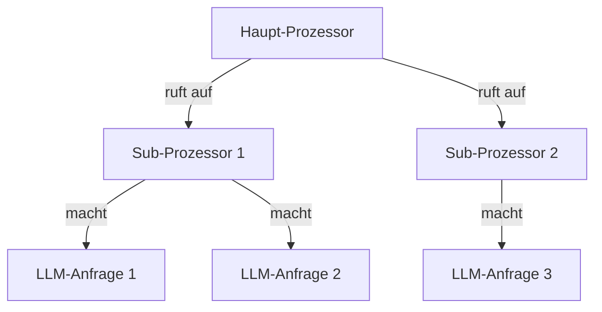
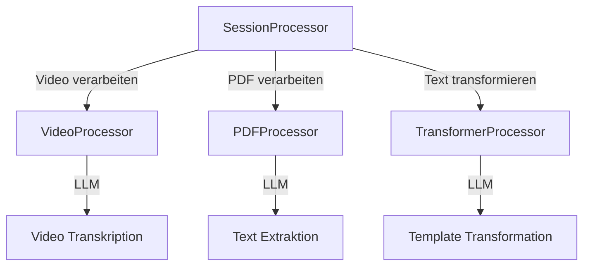
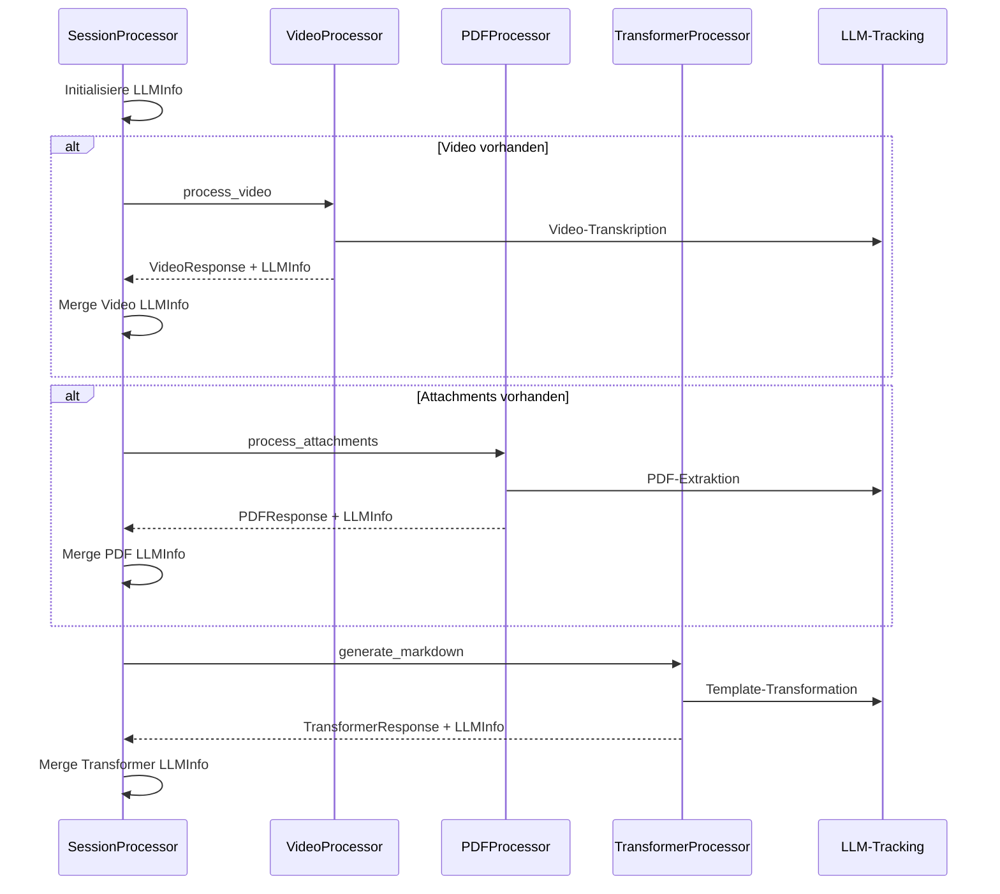
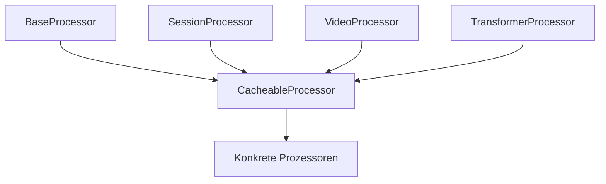
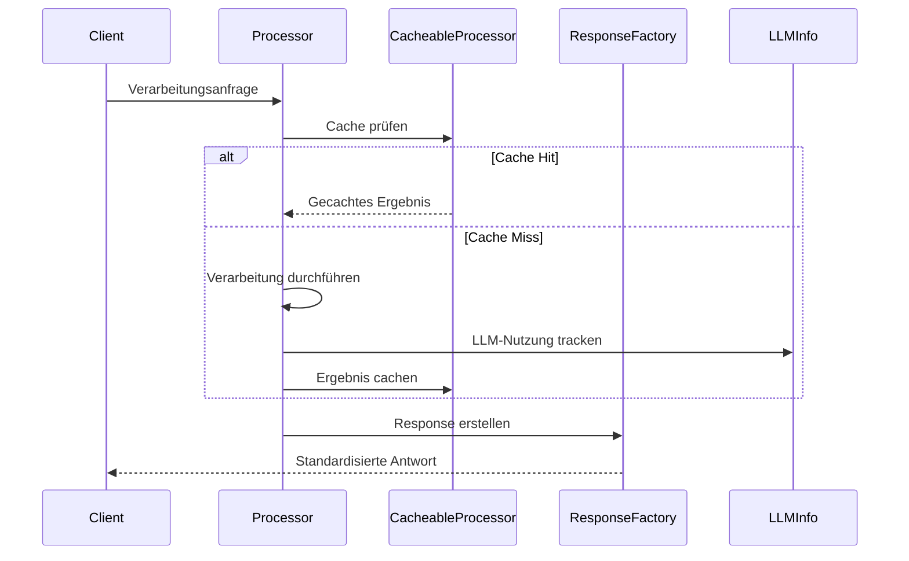

# Prozessor-Architektur

## Übersicht

Die Prozessor-Architektur bildet das Herzstück des Systems und basiert auf einem hierarchischen Design mit drei Hauptkomponenten:

1. BaseProcessor - Die Grundlage aller Prozessoren
2. CacheableProcessor - Erweitert BaseProcessor um Caching-Funktionalität
3. Konkrete Prozessoren - Spezifische Implementierungen (z.B. SessionProcessor, VideoProcessor)

## Komponenten im Detail

### BaseProcessor (`base_processor.py`)

Die Basisklasse stellt grundlegende Funktionalitäten für alle Prozessoren bereit:

```python
class BaseProcessor:
    def __init__(self, resource_calculator: ResourceCalculator, process_id: Optional[str] = None):
        self.process_id = process_id or str(uuid.uuid4())
        self.resource_calculator = resource_calculator
        self.logger = self.init_logger()
```

Hauptfunktionen:
- Logger-Initialisierung
- Temporäre Verzeichnisse
- Validierungsmethoden
- Performance-Tracking
- Konfigurationsmanagement

### CacheableProcessor (`cacheable_processor.py`)

Erweitert BaseProcessor um MongoDB-basiertes Caching:

```python
class CacheableProcessor(BaseProcessor, Generic[T]):
    def __init__(self, resource_calculator: ResourceCalculator, process_id: Optional[str] = None):
        super().__init__(resource_calculator, process_id)
        self.setup_cache()
```

Hauptfunktionen:
- MongoDB Cache-Integration
- Cache-Schlüssel-Generierung
- Cache-Validierung
- Cache-Bereinigung
- Generische Typisierung für verschiedene Ergebnistypen

### ResponseFactory (`response_factory.py`)

Factory für standardisierte API-Antworten:

```python
class ResponseFactory:
    @staticmethod
    def create_response(
        processor_name: str,
        result: Any,
        request_info: Dict[str, Any],
        response_class: Type[T],
        from_cache: bool,
        cache_key: str,
        llm_info: Optional[LLMInfo] = None,
        error: Optional[ErrorInfo] = None
    ) -> T:
```

Funktionen:
- Einheitliche Antwortstruktur
- Integration von Cache-Status
- LLM-Tracking
- Fehlerbehandlung

### LLMInfo (`llm.py`)

Tracking von Language Model Nutzung:

```python
@dataclass(frozen=True)
class LLMInfo:
    model: str
    purpose: str
    requests: List[LLMRequest] = field(default_factory=list)
```

Funktionen:
- Token-Tracking
- Verarbeitungszeiten
- Request-Historie
- Modellnutzung

## Hierarchisches LLM-Tracking

Die Prozessor-Architektur unterstützt hierarchische Aufrufe zwischen Prozessoren, wobei jeder Prozessor LLM-Anfragen durchführen kann. Dies erfordert ein durchdachtes System zum Tracking der LLM-Nutzung:

### Tracking-Hierarchie



### LLM-Tracking Mechanismus

1. **Lokales Tracking**
   ```python
   class BaseProcessor:
       def __init__(self):
           self._current_llm_info = LLMInfo(model="", purpose="")
           
       def track_llm_usage(self, model: str, purpose: str, tokens: int):
           # Tracking der eigenen LLM-Nutzung
           request = LLMRequest(model=model, purpose=purpose, tokens=tokens)
           self._current_llm_info.add_request([request])
   ```

2. **Hierarchische Aggregation**
   ```python
   async def process(self, input_data: InputType) -> CustomResponse:
       # Eigene LLM-Info initialisieren
       self._current_llm_info = LLMInfo(
           model=self.__class__.__name__,
           purpose="main-process"
       )
       
       # Sub-Prozessor aufrufen
       sub_processor = SubProcessor()
       sub_result = await sub_processor.process(some_data)
       
       # LLM-Info des Sub-Prozessors mit eigener zusammenführen
       if sub_result.process.llm_info:
           self._current_llm_info = self._current_llm_info.merge(
               sub_result.process.llm_info
           )
   ```

3. **Response-Integration**
   ```python
   # In der ResponseFactory
   def create_response(..., llm_info: Optional[LLMInfo] = None):
       process_info = ProcessInfo(
           id=processor_name,
           llm_info=llm_info  # Aggregierte LLM-Info
       )
   ```

### Beispiel eines hierarchischen Aufrufs

```python
class MainProcessor(CacheableProcessor[MainResult]):
    async def process(self, data: InputData) -> MainResponse:
        # Initialisiere eigenes LLM-Tracking
        main_llm_info = LLMInfo(model="main-processor", purpose="main")
        
        # Rufe Sub-Prozessor auf
        sub_processor = SubProcessor()
        sub_result = await sub_processor.process(data.sub_part)
        
        # Führe LLM-Infos zusammen
        if sub_result.process.llm_info:
            main_llm_info = main_llm_info.merge(sub_result.process.llm_info)
            
        # Eigene LLM-Nutzung
        await self.use_llm("Eigene Verarbeitung")
        main_llm_info.add_request([
            LLMRequest(model="gpt-4", purpose="main-processing")
        ])
        
        # Erstelle Response mit aggregierter LLM-Info
        return ResponseFactory.create_response(
            processor_name="main",
            result=result,
            llm_info=main_llm_info,
            ...
        )
```

### Best Practices für hierarchisches LLM-Tracking

1. **Klare Zuordnung**
   - Jeder Prozessor trackt nur seine eigenen direkten LLM-Aufrufe
   - Sub-Prozessor-LLM-Infos werden explizit gemerged
   - Verwendung sprechender Purpose-Bezeichner für Nachvollziehbarkeit

2. **Aggregation**
   - Merge-Operationen behalten die Hierarchie-Information bei
   - Modell- und Purpose-Strings reflektieren die Aufrufhierarchie
   - Timestamps ermöglichen chronologische Nachverfolgung

3. **Debugging**
   - Jeder LLM-Request enthält Prozessor-Kontext
   - Hierarchische Struktur bleibt in aggregierten Daten erhalten
   - Performance-Metriken werden pro Hierarchie-Ebene gesammelt

## Beispiel: SessionProcessor Hierarchie

Der SessionProcessor ist ein ausgezeichnetes Beispiel für hierarchisches Prozessor-Management und LLM-Tracking, da er mehrere Subprozessoren verwendet.

### Prozessor-Hierarchie



### Verarbeitungsablauf



### Code-Analyse des SessionProcessors

```python
async def process_session(self, event: str, session: str, ...) -> SessionResponse:
    try:
        # 1. LLM-Tracking initialisieren
        llm_info = LLMInfo(model="session-processor", purpose="process-session")
        
        # 2. Video verarbeiten
        if video_url:
            video_transcript, video_llm_info = await self._process_video(
                video_url=video_url,
                source_language=source_language,
                target_language=source_language
            )
            # Video LLM-Info aggregieren
            if video_llm_info:
                llm_info.requests.extend(video_llm_info.requests)
        
        # 3. Anhänge verarbeiten
        if attachments_url:
            attachment_paths, page_texts, attachment_llm_info = (
                await self._process_attachments(
                    attachments_url=attachments_url,
                    session_data=input_data,
                    target_dir=target_dir
                )
            )
            # PDF LLM-Info aggregieren
            if attachment_llm_info:
                llm_info.requests.extend(attachment_llm_info.requests)
        
        # 4. Markdown generieren
        markdown_file, markdown_content, transformer_llm_info, structured_data = (
            await self._generate_markdown(...)
        )
        # Transformer LLM-Info aggregieren
        if transformer_llm_info:
            llm_info.requests.extend(transformer_llm_info.requests)
        
        # 5. Response erstellen mit aggregierter LLM-Info
        return ResponseFactory.create_response(
            processor_name=ProcessorType.SESSION.value,
            result=SessionData(input=input_data, output=output_data),
            request_info={...},
            response_class=SessionResponse,
            llm_info=llm_info,
            from_cache=False,
            cache_key=cache_key
        )
```

### LLM-Nutzung in Subprozessoren

1. **VideoProcessor**
   - Purpose: "video-transcription"
   - Aufgabe: Transkription des Video-Audios
   - LLM-Nutzung: Whisper API für Transkription

2. **PDFProcessor**
   - Purpose: "pdf-extraction"
   - Aufgabe: Textextraktion und Vorschaubilder
   - LLM-Nutzung: OCR und Textstrukturierung

3. **TransformerProcessor**
   - Purpose: "template-transformation"
   - Aufgabe: Markdown-Generierung aus Template
   - LLM-Nutzung: Textgenerierung und -strukturierung

### Aggregierte LLM-Info Struktur

```python
{
    "model": "session-processor",
    "purpose": "process-session",
    "requests": [
        {
            "model": "whisper-1",
            "purpose": "video-transcription",
            "tokens": 1500,
            "duration": 45000
        },
        {
            "model": "gpt-4",
            "purpose": "pdf-extraction",
            "tokens": 800,
            "duration": 2000
        },
        {
            "model": "gpt-4",
            "purpose": "template-transformation",
            "tokens": 2000,
            "duration": 3000
        }
    ],
    "total_tokens": 4300,
    "total_duration": 50000
}
```

### Analyse eines konkreten Prozess-Outputs

Betrachten wir eine reale Process-Info eines Session-Prozessors:

```json
{
    "id": "session",
    "main_processor": "session",
    "started": "2025-03-16T22:07:07.172904",
    "sub_processors": [],
    "completed": null,
    "duration": null,
    "llm_info": {
        "model": "multi-model",
        "purpose": "multi-purpose",
        "requests": [
            {
                "model": "whisper-1",
                "purpose": "transcription",
                "tokens": 1119,
                "duration": 12107,
                "timestamp": "2025-03-16T22:06:24.793366"
            },
            // ... weitere whisper-1 Requests ...
        ],
        "requests_count": 6,
        "total_tokens": 5999,
        "total_duration": 68584
    },
    "is_from_cache": false,
    "cache_key": "2aa197664148c532cd5e058857640d31ab20942779351ad00a7d38d8e1cd76fd"
}
```

#### Analyse der Komponenten:

1. **Prozess-Identifikation**
   - `id` und `main_processor`: "session" zeigt, dass dies ein SessionProcessor ist
   - Leere `sub_processors` Liste: Die hierarchische Struktur wird hier in der LLM-Info abgebildet

2. **LLM-Nutzungsmuster**
   - Alle Requests nutzen das `whisper-1` Modell
   - Einheitlicher Purpose "transcription"
   - Ähnliche Token-Zahlen (zwischen 843 und 1119 Tokens)
   - Konsistente Verarbeitungszeiten (~11-12 Sekunden pro Request)

3. **Zeitliche Analyse**
   ```mermaid
   sequenceDiagram
       participant T1 as 22:06:23
       participant T2 as 22:06:24
       participant T3 as 22:06:35
       
       Note over T1: 3 parallele Requests
       Note over T2: 2 parallele Requests
       Note over T3: 1 finaler Request
   ```

4. **Performance-Metriken**
   - Gesamtanzahl Tokens: 5999
   - Durchschnittliche Tokens pro Request: ~1000
   - Gesamtdauer: 68.584 Sekunden
   - Effektive Parallelverarbeitung erkennbar

5. **Caching-Status**
   - `is_from_cache: false`: Frische Verarbeitung
   - Generierter `cache_key` für zukünftige Referenz

#### Besonderheiten dieser Ausführung:

1. **Parallele Transkription**
   - Die Timestamps zeigen drei Zeitcluster
   - Deutet auf Chunk-weise Verarbeitung eines Videos hin
   - Effiziente Parallelisierung der Whisper-API-Aufrufe

2. **Konsistente Verarbeitungszeiten**
   - Durchschnittlich ~11.5 Sekunden pro Chunk
   - Geringe Varianz in der Verarbeitungszeit (11083ms - 12107ms)
   - Zeigt stabile API-Performance

3. **Token-Verteilung**
   - Relativ gleichmäßige Token-Verteilung
   - Durchschnittlich 1000 Tokens pro Chunk
   - Effiziente Chunk-Größen für die Whisper-API

4. **Aggregation**
   - Model als "multi-model" gekennzeichnet
   - Purpose als "multi-purpose" markiert
   - Zeigt korrekte Aggregation mehrerer gleichartiger Requests

### Besonderheiten im SessionProcessor

1. **Parallele Verarbeitung**
   - Video- und PDF-Verarbeitung können parallel laufen
   - LLM-Infos werden am Ende zusammengeführt

2. **Bedingte Verarbeitung**
   - Subprozessoren werden nur bei Bedarf aufgerufen
   - LLM-Tracking spiegelt nur tatsächlich genutzte Prozesse wider

3. **Fehlerbehandlung**
   - Jeder Subprozessor kann eigene Fehler melden
   - LLM-Tracking bleibt auch bei Teilfehlern erhalten

4. **Cache-Integration**
   - Gecachte Ergebnisse enthalten vollständige LLM-Historie
   - Bei Cache-Hits werden keine neuen LLM-Requests erzeugt

## Vererbungshierarchie



## Prozessablauf



## Implementierung eines neuen Prozessors

### 1. Vererbung definieren

```python
class NewProcessor(CacheableProcessor[CustomResult]):
    cache_collection_name = "new_processor_cache"
```

### 2. Initialisierung

```python
def __init__(self, resource_calculator: ResourceCalculator, process_id: Optional[str] = None):
    super().__init__(resource_calculator, process_id)
    # Prozessor-spezifische Initialisierung
```

### 3. Cache-Methoden implementieren

```python
def serialize_for_cache(self, result: CustomResult) -> Dict[str, Any]:
    return {
        "data": result.to_dict(),
        "metadata": {...}
    }

def deserialize_cached_data(self, cached_data: Dict[str, Any]) -> CustomResult:
    return CustomResult.from_dict(cached_data["data"])
```

### 4. Hauptverarbeitungsmethode

```python
async def process(self, input_data: InputType) -> CustomResponse:
    try:
        # Cache-Schlüssel generieren
        cache_key = self._create_cache_key(input_data)
        
        # Cache prüfen
        cache_hit, cached_result = self.get_from_cache(cache_key)
        if cache_hit:
            return self._create_response(cached_result, from_cache=True)
            
        # LLM-Tracking initialisieren
        llm_info = LLMInfo(model="new-processor", purpose="process")
        
        # Verarbeitung durchführen
        result = await self._process_internal(input_data)
        
        # Ergebnis cachen
        self.save_to_cache(cache_key, result)
        
        # Response erstellen
        return self._create_response(result, llm_info=llm_info)
        
    except Exception as e:
        return self._create_error_response(e)
```

## Best Practices

1. **Typsicherheit**
   - Verwende generische Typen für Prozessor-Ergebnisse
   - Implementiere strikte Typ-Annotationen
   - Nutze TypeVar für flexible, aber typsichere Implementierungen

2. **Caching**
   - Implementiere sinnvolle Cache-Schlüssel
   - Berücksichtige Cache-Invalidierung
   - Nutze Cache-Statistiken für Optimierung

3. **Fehlerbehandlung**
   - Fange spezifische Ausnahmen
   - Erstelle aussagekräftige Fehlermeldungen
   - Nutze ErrorInfo für strukturierte Fehlerinformationen

4. **LLM-Tracking**
   - Tracke alle LLM-Interaktionen
   - Sammle Performance-Metriken
   - Aggregiere LLM-Nutzungsdaten

5. **Response-Standardisierung**
   - Nutze ResponseFactory für alle Antworten
   - Halte die Antwortstruktur konsistent
   - Inkludiere relevante Metadaten

## Erweiterbarkeit

Die Architektur ist darauf ausgelegt, einfach erweitert zu werden:

1. **Neue Prozessoren**
   - Von CacheableProcessor erben
   - Cache-Methoden implementieren
   - Prozessor-spezifische Logik hinzufügen

2. **Neue Features**
   - Bestehende Klassen erweitern
   - Neue Interfaces definieren
   - Backward-Kompatibilität beachten

3. **Monitoring & Logging**
   - Performance-Tracking integrieren
   - Logging-Strategie anpassen
   - Metriken sammeln

## Fazit

Die Prozessor-Architektur bietet:
- Robuste Grundfunktionalität
- Flexibles Caching
- Standardisierte Antworten
- LLM-Tracking
- Typsicherheit
- Einfache Erweiterbarkeit 