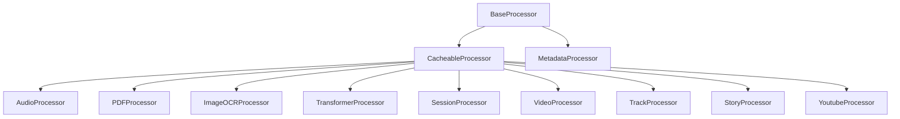
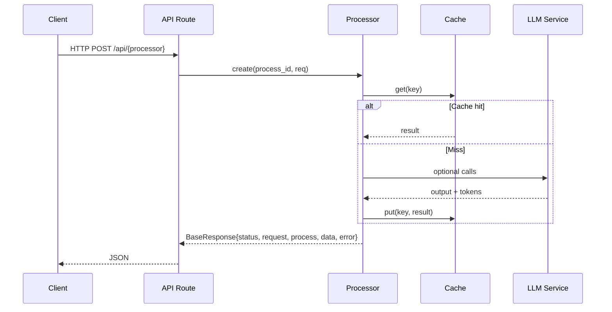
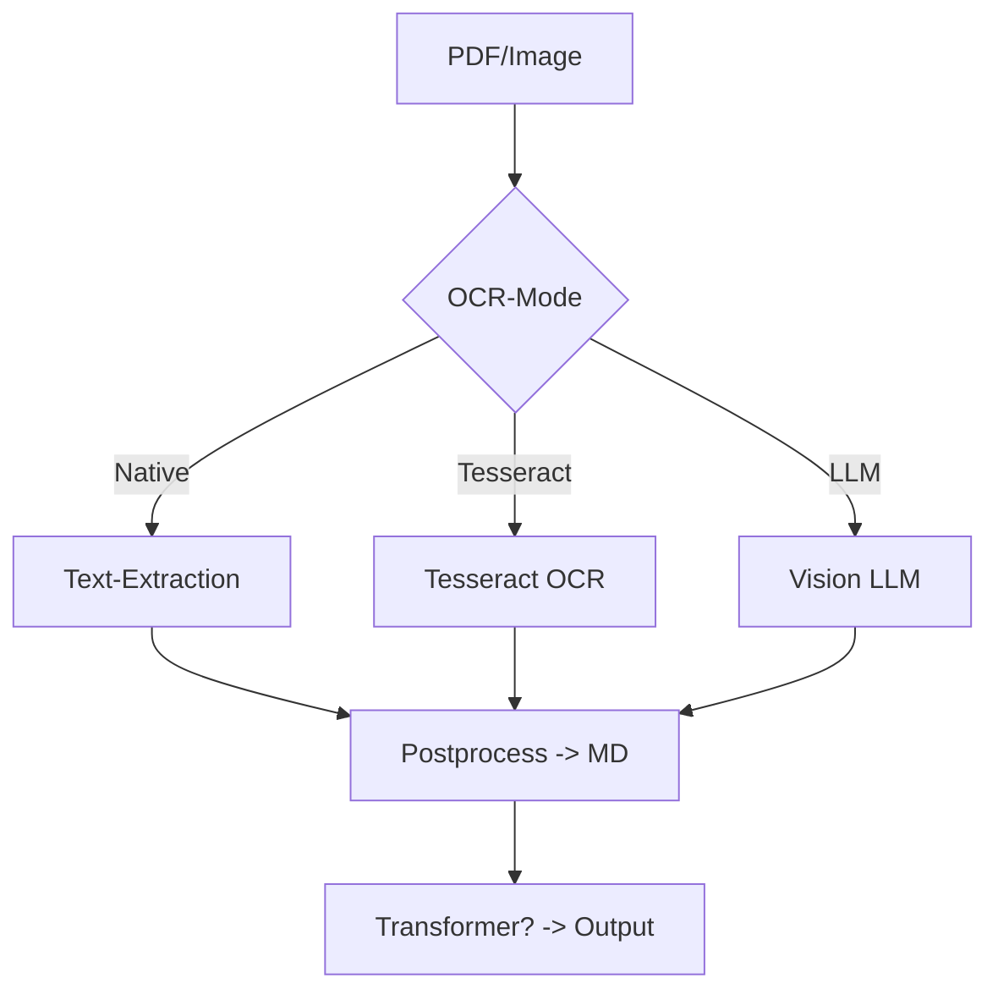
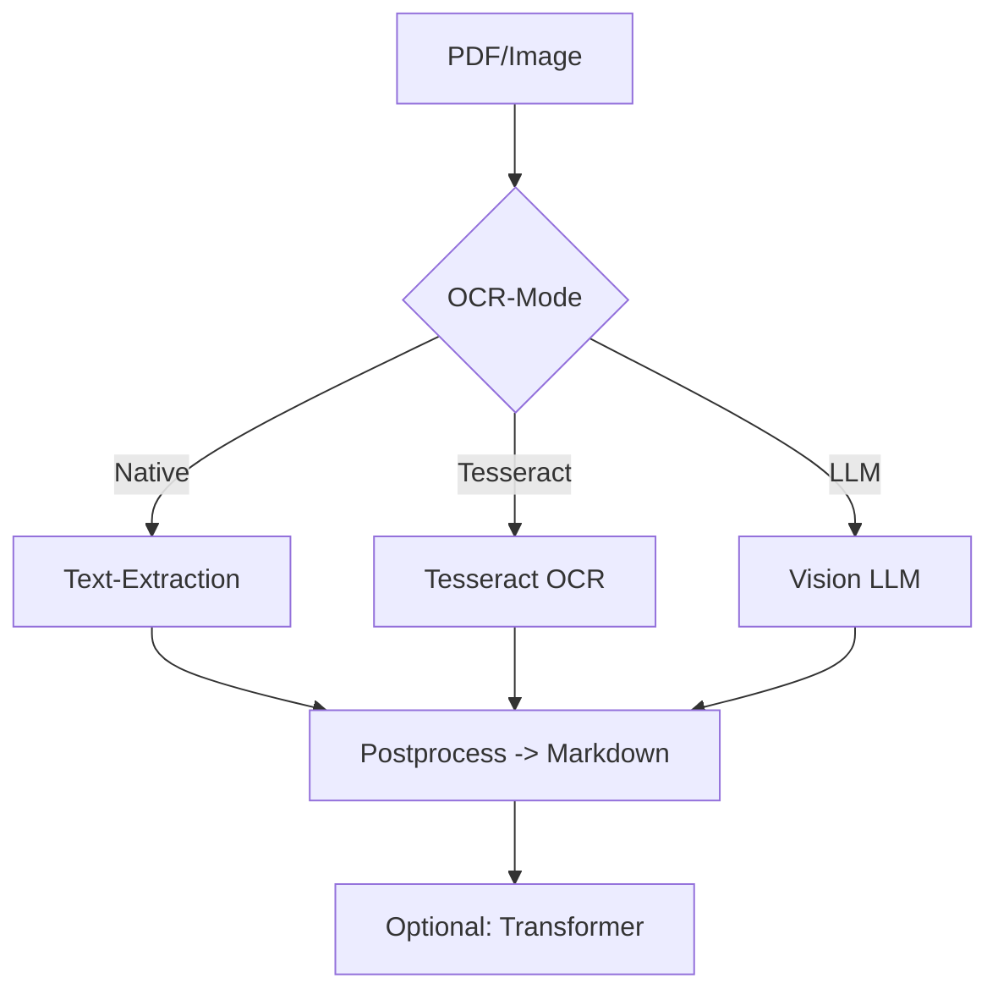
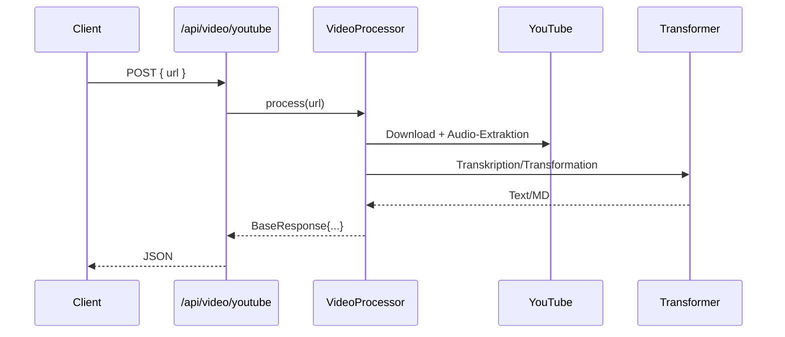

# Verbesserung der Dokumentationsstruktur
_Exported on 8/15/2025 at 10:01:16 GMT+2 from Cursor (1.4.5)_

---

**User**

@docs/ @mkdocs.yml Wenn wir jetzt diese Dokumentationsstruktur erstellen, basierend auf bestehenden, teilweise veralteten Dokumenten, können wir nochmal eine Gegenkontrolle machen und den Source Code der einzelnen Prozessoren analysieren und schauen, ob diese richtig dokumentiert sind. Wo könnte man noch was ergänzen?Ist es aus Anwendersicht verständlich, könnte man noch eine Mermaid Übersichtsdiagramme einführen, die vielleicht Workflows erklären.Was macht eine anwenderfreundliche Dokumentation aus?

---

**Cursor**

Ich mache eine kurze Bestandsaufnahme: Ich schaue mir die Codebasis an, finde die Implementierungen der Prozessoren, und gleiche sie mit der MkDocs-Navigation ab. So sehen wir, welche Prozessoren existieren, welche Funktionen/Workflows sie haben und wo in der Doku Lücken sind. Danach schlage ich gezielt Ergänzungen (inkl. Mermaid‑Diagramme) vor. Ich starte mit einer parallelen Suche nach Verzeichnissen und semantischen Hinweisen im Code.

Ich schaue mir parallel die vorhandenen Prozessor‑Dokuordner, die API‑Response‑Modelle und das App‑Entry an, um Lücken systematisch zu identifizieren und konkrete Ergänzungsvorschläge (inkl. Mermaid‑Diagramme) abzuleiten.

Kurzer Stand: Ich habe Code und Doku parallel gegengeprüft. Alle Haupt‑Prozessoren identifiziert und mit `mkdocs.yml` abgeglichen. Lücken und Verbesserungspunkte (inkl. Mermaid‑Diagramm‑Vorschläge) sind unten konkret aufgeführt.

### Abgleich Code ↔ Doku (Gaps)
- Prozessoren im Code (`src/processors/*`): Audio, PDF, Image‑OCR, Transformer, Metadata, Session, Story, Track, Video, Youtube, Event, plus Base/Cacheable.
- Bereits dokumentiert unter `docs/processors/*`: Audio, PDF, Image‑OCR, Transformer, Session, Story, Track, Video, Event‑Job.
- Offene Kandidaten:
  - **MetadataProcessor**: Nur in „Explanations“ vorhanden, kein dedizierter Prozessor‑Eintrag. Empfehlung: `docs/processors/metadata/overview.md` ergänzen (kein eigener Endpoint, aber Input/Output und Nutzung durch andere).
  - **YoutubeProcessor**: Existiert im Code, API‑Routen gehen über `video`. Empfehlung: In `processors/video/overview.md` ein Unterkapitel „YouTube/Plattformen“ oder `processors/video/youtube.md`.
  - **EventProcessor** vs. „Event‑Job“: `docs/processors/event-job/overview.md` behandelt den asynchronen Job‑Flow. Der synchron/kompositorische `EventProcessor` (falls direkt genutzt) sollte zumindest im Ablaufdiagramm sichtbar sein.

### Response‑Standard sichtbar machen
- Der Response‑Standard ist korrekt implementiert, sollte aber zentral dokumentiert und von allen Prozessorseiten verlinkt werden.
```1:30:src/api/models/responses.py
@dataclass(frozen=True, slots=True)
class BaseResponse(BaseModel, Generic[T]):
    status: str
    request: RequestInfo
    process: ProcessInfo
    data: Optional[T] = None
    error: Optional[ErrorInfo] = None
```
- Ergänzungsvorschlag:
  - `docs/reference/api/response-structure.md` (oder in `reference/api/overview.md` integrieren)
  - Für jeden Prozessor mindestens 1 Beispiel für „success“ und „error“ Response (inkl. `process.llm_info`, Dauer in ms).
  - LLM‑Tracking kurz referenzieren; `process.llm_info` wird im `BaseProcessor` initialisiert und durchgereicht:
```61:78:src/processors/base_processor.py
self.process_info: ProcessInfo = ProcessInfo(
    id=self.process_id,
    main_processor=self.__class__.__name__,
    started=datetime.now().isoformat(),
    sub_processors=[],
    llm_info=LLMInfo()
)
```

### Inhaltliche Ergänzungen je Prozessorseite
- Einheitliche Struktur (Checkliste pro Seite):
  - Ziel/Use‑Cases (wann nutze ich diesen Prozessor?)
  - Inputs/Parameter (mit Defaults), Limits (z. B. Dateigröße), Caching‑Key
  - Endpunkte (falls vorhanden) mit cURL‑Beispielen
  - Processing‑Schritte als kurz nummerierte Liste
  - Beispiel‑Responses (success/error) im Standardformat
  - Performance‑Hinweise und LLM‑Nutzung (wo, wofür)
  - Fehlerbild/Behebung (bekannte Codes/Exceptions)
- Spezifisch:
  - **PDF/Image‑OCR**: Matrix der OCR‑Modi (native/Tesseract/LLM), Qualitäts‑/Kosten‑Tradeoffs.
  - **Video**: Plattformen (YouTube, Vimeo), Audio‑Extraktion, Transkriptionsprofile, Übersetzung.
  - **Transformer**: Templates/Operationen, deterministische Parameter → Cache‑Key.
  - **Session**: Orchestrierung (ruft Audio/Transformer/Metadata), Batch‑Varianten und Archivierung.
  - **Track/Story**: Eingaben, Abhängigkeiten zu Templates/LLM, Ergebnisstruktur.

### Mermaid‑Diagramme (konkrete Vorschläge)
- Architektur/Vererbung (kurz, lebendiger Ersatz der Archivversion).

- Sequenz „Sync‑Call“ (einheitlich für alle Endpunkte wiederverwendbar).

- Async „Event‑Job“ Flow.
```mermaid
flowchart LR
  A[Client] --> B[/POST /api/event-job/submit/]
  B --> C[Queue/DB]
  C -->|Worker| D[EventProcessor]
  D --> E[(Cache/Mongo)]
  D --> F[Prozessoren: Video/Audio/PDF/...]
  F --> D
  D --> G[/GET /api/event-job/status/ {id}/]
  G --> H[Result JSON/ZIP]
```
- PDF/Image‑OCR Varianten.


### Verständlichkeit aus Anwendersicht
- Klare Einstiegsseiten: „Getting Started“, „Top 3 Aufgaben“ (How‑Tos) mit End‑to‑End Beispielen.
- Konsistente Beispiele (gleiche Beispieldatei, gleicher `process_id`‑Ablauf) über die Seiten hinweg.
- Fehlermeldungen dokumentieren (inkl. konkrete Ursachen und Lösungsschritte).
- Sichtbare Defaults und Limits (Tabellen), keine versteckten „Magie“-Parameter.
- Ein JSON‑Beispiel pro typischer Aufgabe: Request und Response, kopierbar, ausführbar.

### Konkrete To‑Dos (minimale Änderungen, hoher Nutzen)
- Navigation ergänzen:
  - `Processors → Metadata` (neue Seite), optional `Video → YouTube`.
  - `Reference → API → Response‑Struktur` (mit Examples).
  - `Explanations → Async Events` um Sequenzdiagramm erweitern.
- Jede Prozessorseite:
  - Front‑Matter mit `last_verified: <Datum>` einführen.
  - „Beispiele“‑Abschnitt mit 1 cURL und 1 Python‑Snippet.
  - „Fehler und Lösungen“‑Abschnitt (Top‑3 konkrete Fehlerbilder).
- Einheitliche „Cache“‑Box mit Key‑Schema. Verweis auf `explanations/caching/overview.md`.

### Was macht Doku anwenderfreundlich?
- Klarer Nutzenfokus: Aufgabe → Schritte → Kommando/Beispiel → Ergebnis.
- Konsistenz: gleiche Struktur, gleiche Begriffe, gleiche Response‑Formate.
- Reproduzierbarkeit: Vollständige Beispiele, keine impliziten Annahmen.
- Orientierung: Übersichtsdiagramme und Querverlinkungen (z. B. von „Session“ zu „Audio/Transformer“).
- Aktualität: „last_verified“ und kurze Änderungsnotizen (drift minimieren).

Wenn du willst, setze ich die fehlenden Seiten (Metadata, YouTube‑Abschnitt) und die Response‑Struktur‑Seite direkt an und füge die obigen Mermaid‑Diagramme an den passenden Stellen ein.

- Ich habe Code (Prozessoren, Response‑Modelle, Routen) mit der Doku‑Navigation abgeglichen und fehlende Punkte identifiziert.
- Wichtigste Lücken: fehlende `Processors/metadata`, YouTube‑Spezifika unter „Video“, zentrale Response‑Struktur mit Beispielen.
- Konkrete Mermaid‑Diagramme vorgeschlagen (Architektur, Sync‑Call, Event‑Job, PDF/OCR).  
- Checkliste pro Prozessorseite und Prinzipien für Anwenderfreundlichkeit geliefert.

```python
@dataclass(frozen=True, slots=True)
class BaseResponse(BaseModel, Generic[T]):
    status: str
    request: RequestInfo
    process: ProcessInfo
    data: Optional[T] = None
    error: Optional[ErrorInfo] = None
```

```python
self.process_info: ProcessInfo = ProcessInfo(
    id=self.process_id,
    main_processor=self.__class__.__name__,
    started=datetime.now().isoformat(),
    sub_processors=[],
    llm_info=LLMInfo()
)
```

```plaintext
graph TD
  A["BaseProcessor"] --> B["CacheableProcessor"]
  B --> C["AudioProcessor"]
  B --> D["PDFProcessor"]
  B --> E["ImageOCRProcessor"]
  B --> F["TransformerProcessor"]
  A --> G["MetadataProcessor"]
  B --> H["SessionProcessor"]
  B --> I["VideoProcessor"]
  B --> J["TrackProcessor"]
  B --> K["StoryProcessor"]
  B --> L["YoutubeProcessor"]
```

```plaintext
sequenceDiagram
  participant Client
  participant API as API Route
  participant P as Processor
  participant Cache
  participant LLM as LLM Service

  Client->>API: HTTP POST /api/{processor}
  API->>P: create(process_id, req)
  P->>Cache: get(key)
  alt Cache hit
    Cache-->>P: result
  else Miss
    P->>LLM: optional calls
    LLM-->>P: output + tokens
    P->>Cache: put(key, result)
  end
  P-->>API: BaseResponse{status, request, process, data, error}
  API-->>Client: JSON
```

```plaintext
flowchart LR
  A[Client] --> B[/POST /api/event-job/submit/]
  B --> C[Queue/DB]
  C -->|Worker| D[EventProcessor]
  D --> E[(Cache/Mongo)]
  D --> F[Prozessoren: Video/Audio/PDF/...]
  F --> D
  D --> G[/GET /api/event-job/status/ {id}/]
  G --> H[Result JSON/ZIP]
```

```plaintext
flowchart TD
  S[PDF/Image] --> A{OCR-Mode}
  A -->|Native| N[Text-Extraction]
  A -->|Tesseract| T[Tesseract OCR]
  A -->|LLM| L[Vision LLM]
  N --> X[Postprocess -> MD]
  T --> X
  L --> X
  X --> R[Transformer? -> Output]
```

---

**User**

ok, können wir diese erkenntnisse in die dokumentation einfügen?

---

**Cursor**

Ich ergänze jetzt die Dokumentation an den relevanten Stellen: neue Seite für Metadata‑Prozessor, Navigationspunkt in `mkdocs.yml`, Response‑Struktur im API‑Overview, Mermaid‑Diagramme in Architektur, Async‑Events und PDF‑Seite sowie eine YouTube‑Sektion in der Video‑Prozessorseite.

Ich erweitere nun die Doku-Dateien und die Navigation. Ich erstelle eine neue Seite für den Metadata‑Prozessor, füge eine Response‑Struktur‑Seite hinzu, ergänze Mermaid‑Diagramme in Architektur, Async‑Events und PDF‑Prozessor und erweitere die Video‑Prozessorseite um YouTube‑Details. Danach passe ich `mkdocs.yml` an.

Ich erweitere jetzt mehrere bestehende Markdown-Dateien und füge zwei neue Seiten hinzu (Metadata‑Prozessor, Response‑Struktur). Außerdem ergänze ich Mermaid‑Diagramme in Architektur-, Async‑Events- und PDF‑Seiten sowie eine YouTube‑Sektion in `docs/processors/video/overview.md`. Danach passe ich die Navigation in `mkdocs.yml` an. Ich führe die notwendigen Dateilesevorgänge parallel aus, um gezielte Edits vorzubereiten.

Ich füge neue Doku-Seiten hinzu und erweitere bestehende mit Mermaid‑Diagrammen. Anschließend aktualisiere ich die Navigation in `mkdocs.yml`.

```markdown
---
status: draft
last_verified: 2025-08-15
---

# Metadata Processor

Der Metadata‑Prozessor extrahiert technische und inhaltliche Metadaten aus Inhalten und wird häufig von anderen Prozessoren (z. B. Audio, Video, Session, PDF/Image‑OCR) intern genutzt.

## Endpunkte
- Keine direkten öffentlichen Endpunkte. Metadaten werden im Rahmen anderer Verarbeitungen erzeugt oder über Transformationsendpunkte (siehe Transformer/Metadata) angereichert.

## Typische Aufgaben
- Technische Metadaten (z. B. Dauer, Formate, Größen)
- Inhaltliche Metadaten via LLM (z. B. Titel, Tags, Zusammenfassungen, Sprachinformationen)
- Normalisierung und Strukturierung für die Ausgabe

## Eingaben (Beispiele)
- Referenz auf Quellinhalt (Dateipfad/URL/Text)
- Optionale Parameter: Ziel‑Sprache, gewünschte Kategorien, Qualitätsprofil

## Ausgaben (Beispiele)
- Strukturierte Metadaten (z. B. `title`, `language`, `keywords`, `summary`, `duration_ms`)
- Einbettung in den standardisierten API‑Response‑Wrapper

## Response‑Beispiel (success)
```json
{
  "status": "success",
  "request": {"path": "/api/...", "parameters": {"source": "file"}},
  "process": {
    "id": "b1f...",
    "main_processor": "MetadataProcessor",
    "started": "2025-08-15T10:00:00Z",
    "duration_ms": 1234,
    "sub_processors": [],
    "llm_info": {"total_requests": 1, "total_input_tokens": 800, "total_output_tokens": 120}
  },
  "data": {
    "title": "Beispieltitel",
    "language": "de",
    "keywords": ["konferenz", "ki"],
    "summary": "Kurze inhaltliche Zusammenfassung.",
    "duration_ms": 3600000
  },
  "error": null
}
```

## Fehlerfälle
- Quellen nicht erreichbar oder leer → `status: error`, Fehlercode und Details
- LLM‑Limit überschritten → Parameter/Qualitätsprofil anpassen

## Hinweise
- Konsistente Parameterübergabe erhöht Cache‑Trefferquoten
- Für LLM‑basierte Anreicherungen: Kontext knapp und präzise halten
- Siehe auch: `Processors → Transformer (Metadata)` und `Explanations → Types`


```

```markdown
---
status: draft
last_verified: 2025-08-15
---

# Response‑Struktur

Alle Endpunkte liefern Antworten im standardisierten Format. Ziel ist Einheitlichkeit, Nachvollziehbarkeit (inkl. LLM‑Tracking) und einfache Fehlerbehandlung.

## Schema
- **status**: `success` | `error`
- **request**: Kontext der Anfrage (Pfad, Parameter)
- **process**: Prozessinformationen (ID, Dauer in Millisekunden, Sub‑Prozessoren, LLM‑Tracking)
- **data**: Ergebnisdaten (prozessor‑spezifisch)
- **error**: Fehlerobjekt bei `status = error`

## Beispiel (success)
```json
{
  "status": "success",
  "request": {"path": "/api/transformer/text", "parameters": {"template": "summary"}},
  "process": {
    "id": "6a2...",
    "main_processor": "TransformerProcessor",
    "started": "2025-08-15T10:00:00Z",
    "duration_ms": 245,
    "sub_processors": [],
    "llm_info": {"total_requests": 1, "total_input_tokens": 900, "total_output_tokens": 120}
  },
  "data": {"text": "Kurzfassung ..."},
  "error": null
}
```

## Beispiel (error)
```json
{
  "status": "error",
  "request": {"path": "/api/pdf/process"},
  "process": {"id": "e19...", "main_processor": "PDFProcessor", "duration_ms": 12, "sub_processors": [], "llm_info": {}},
  "data": null,
  "error": {"code": "FILE_NOT_FOUND", "message": "Quelle nicht gefunden", "details": {"path": " /tmp/x.pdf"}}
}
```

## Hinweise
- Zeitangaben sind in Millisekunden
- `process.llm_info` aggregiert Anfragen/Tokens aller beteiligten Teilschritte
- Einheitliche Struktur erleichtert Logging, Monitoring und Tests


```

```markdown
---
status: draft
last_verified: 2025-08-15
---

# Systemarchitektur (Überblick)

- API Layer (Flask-RESTX): Namespaces unter `/api/*`, Swagger unter `/api/doc`
- Processor Layer: Audio, Video, YouTube, Transformer, Metadata
- Storage: Cache/Temp, Logs, Konfiguration, Templates
- Externe Dienste: OpenAI (Whisper/GPT), YouTube API, FFmpeg

## Prozessorbeziehungen (vereinfacht)

- YouTube → Audio → Transformer
- Audio → Metadata → Transformer


## Konfiguration

- `config/config.yaml`
- `.env`

```

```markdown
---
status: draft
last_verified: 2025-08-15
---

# Async Events (Überblick)

Ziel: Sessions in Jobs/Batches asynchron verarbeiten, Ergebnisse persistieren (MongoDB), optional Webhooks.

## Bausteine
- API: `/api/event-job/*` (Jobs, Batches, Files)
- Storage: MongoDB (Jobs/Batches/Results)
- Worker: verarbeitet Queue/Jobs (siehe Repository/Worker‑Manager)

## Kernablauf
1) Client erstellt Job oder Batch (`POST /api/event-job/jobs|batches`)
2) Worker nimmt Jobs auf, verarbeitet (Scrape → Audio/Video/PDF → Transformer)
3) Ergebnisse landen im Job (`results`, Markdown/Assets/Archive)
4) Optionaler Webhook erhält Callback

```mermaid
flowchart LR
  A[Client] --> B[/POST /api/event-job/submit/]
  B --> C[Queue/DB]
  C -->|Worker| D[EventProcessor]
  D --> E[(Cache/Mongo)]
  D --> F[Prozessoren: Video/Audio/PDF/...]
  F --> D
  D --> G[/GET /api/event-job/status/{id}/]
  G --> H[Result JSON/ZIP]
```

## Endpunkte (Auszug)
- Jobs: `POST/GET /api/event-job/jobs`, `GET/DELETE /api/event-job/jobs/{job_id}`
- Batch: `POST/GET /api/event-job/batches`, `GET/DELETE /api/event-job/batches/{batch_id}`
- Steuerung: `POST /api/event-job/batches/{id}/archive`, `POST /api/event-job/batches/{id}/toggle-active`, `POST /api/event-job/{job_id}/restart`
- Download: `GET /api/event-job/jobs/{job_id}/download-archive`

## Beispiel: Batch anlegen
```bash
curl -X POST http://localhost:5000/api/event-job/batches \
  -H 'Content-Type: application/json' \
  -d '{
    "batch_name": "FOSDEM ecosocial",
    "jobs": [
      {"parameters": {"event":"FOSDEM","session":"T1","url":"https://...","filename":"t1.md","track":"ecosocial"}},
      {"parameters": {"event":"FOSDEM","session":"T2","url":"https://...","filename":"t2.md","track":"ecosocial"}}
    ],
    "webhook": {"url": "https://example.org/hook"}
  }'
```

## Status/Verwaltung
- Job: `status`, `progress`, `results`, `error`, `batch_id`, `user_id`
- Batch: `status`, `completed_jobs/failed_jobs`, `isActive`, `archived`
- Zugriff: optional via `X-User-ID` (Lesen/Schreiben)

## Hinweise
- `use_cache` steuert Wiederverwendung; Neustart per `POST /api/event-job/{job_id}/restart`
- Archivieren ändert den Lebenszyklus, löscht keine Ergebnisse

```

```markdown
---
status: draft
last_verified: 2025-08-15
---

# PDF Processor

## Endpunkte
- POST `/api/pdf/process`
- POST `/api/pdf/process-url`
- GET `/api/pdf/text-content/<path:file_path>`

## Funktionen (Kurz)
- Native Textextraktion, Tesseract-OCR, LLM-gestützte OCR
- Vorschaubilder und optional ZIP-Archiv
- Cache-Unterstützung (MD5-Hash)



## Weiterführend
- OCR-Refactoring: [ocr-refactoring.md](ocr-refactoring.md)
- PDF/ImageOCR Endpoints: [endpoints.md](endpoints.md)

```

```markdown
---
status: draft
last_verified: 2025-08-15
---

# Video Processor

## Endpunkte
- POST `/api/video/process` (Datei-Upload oder URL)
- POST `/api/video/youtube` (YouTube-URL)

## Parameter (Kurz)
- Datei-/URL-basierte Verarbeitung
- `source_language` (auto)
- `target_language` (de)
- `template` (optional)
- `useCache` (bool)
- `force_refresh` (bool, für `/process`)

## Funktionen (Kurz)
- Video → Audio-Extraktion → Transkription → Transformation
- Direkte YouTube-Unterstützung
- Cache-Unterstützung

## YouTube / Plattformen
- Unterstützt YouTube‑URLs (Download → Audio‑Extraktion → Transkription)
- Parameter: `youtube_include_dash_manifest`, `best_audio_format`
- Hinweise: Raten‑Limits und Formatverfügbarkeit können variieren



```

```markdown
---
status: draft
last_verified: 2025-08-15
---

# API Überblick

- Basis: `/api`
- Swagger UI: `/api/doc`
- OpenAPI JSON (RESTX): `/api/swagger.json`

## Response-Standard
- Felder: `status` (success/error), `request`, `process`, `data`, `error`
- LLM‑Tracking in `process.llm_info`
- Zeitangaben in Millisekunden (`process.duration_ms`)

Weitere Details und Beispiele: [Response‑Struktur](response-structure.md)

## Wichtige Endpunkte

- Audio: `POST /api/audio/process`
- Video: `POST /api/video/process`
- PDF: `POST /api/pdf/process`, `POST /api/pdf/process-url`
- ImageOCR: `POST /api/imageocr/process`, `POST /api/imageocr/process-url`
- Session: `POST /api/session/process`, `POST /api/session/process-async`
- Event-Job: `POST/GET /api/event-job/jobs`, `GET /api/event-job/jobs/{id}`
- Transformer: `POST /api/transformer/template`, `POST /api/transformer/text`, `POST /api/transformer/html-table`, `POST /api/transformer/text/file`, `POST /api/transformer/metadata`

```

```yaml
site_name: Common Secretary Services
site_url: https://example.local
repo_url: https://example.local/repo
docs_dir: docs

theme:
  name: material
  language: de

plugins:
  - search
  - redirects:
      redirect_maps:
        '01_architecture.md': 'explanations/architecture/overview.md'
        '02_installation.md': 'guide/getting-started/installation.md'
        '03_development.md': 'guide/getting-started/development.md'
        '05_webinterface.md': 'guide/ui/dashboard.md'
        '04_api.md': 'reference/api/overview.md'
        '06_audio_processing.md': 'processors/audio/overview.md'
        'HowToUseimageocr.md': 'processors/image-ocr/overview.md'
        'swagger_llm_ocr_integration.md': 'processors/image-ocr/overview.md'
        '07_youtube.md': 'processors/video/overview.md'

markdown_extensions:
  - admonition
  - toc:
      permalink: true
  - pymdownx.details
  - pymdownx.superfences

nav:
  - Guide:
    - Getting Started:
      - Installation: guide/getting-started/installation.md
      - Development: guide/getting-started/development.md
    - UI:
      - Dashboard: guide/ui/dashboard.md
    - How‑Tos:
      - Session‑Archive: guide/how-tos/session-archive.md
  - Explanations:
    - Architektur:
      - Überblick: explanations/architecture/overview.md
      - Details: explanations/architecture/details.md
    - Async Events:
      - Überblick: explanations/async-events/overview.md
      - n8n: explanations/async-events/how-to-n8n.md
    - Caching: explanations/caching/overview.md
    - Templates: explanations/templates/overview.md
    - Typen & Dataclasses: explanations/types/overview.md
    - Metaprocessor: explanations/metaprocessor/overview.md
    - Metadaten: explanations/metadata/overview.md
    - LLM‑Optimierung: explanations/llm/optimization.md
  - Processors:
    - Audio: processors/audio/overview.md
    - Video: processors/video/overview.md
    - PDF:
      - Überblick: processors/pdf/overview.md
      - OCR-Refactoring: pdf_processor_ocr_refactoring.md
      - PDF/ImageOCR Details: processors_pdf_imageocr.md
    - Image-OCR: processors/image-ocr/overview.md
    - Transformer: processors/transformer/overview.md
    - Metadata: processors/metadata/overview.md
    - Session: processors/session/overview.md
    - Event-Job: processors/event-job/overview.md
    - Story: processors/story/overview.md
    - Track: processors/track/overview.md
  - Reference:
    - API Überblick: reference/api/overview.md
    - Response-Struktur: reference/api/response-structure.md
    - OpenAPI / Swagger: reference/api/openapi.md
  - Ops:
    - Deployment: ops/deployment.md
    - Sicherheit: ops/security.md
    - Troubleshooting: ops/troubleshooting.md
  - Analysis:
    - Doku-Inventur: _analysis/docs_inventory.md
    - Routes-Index: _analysis/routes_index.md
    - Drift-Audit: _analysis/drift_audit.md
  - Archiv (nur intern):
    - 02_installation (alt): _archive/02_installation.md
    - 03_development (alt): _archive/03_development.md
    - 04_api (alt): _archive/04_api.md
    - 05_webinterface (alt): _archive/05_webinterface.md
    - 06_audio_processing (alt): _archive/06_audio_processing.md
    - 07_youtube (alt): _archive/07_youtube.md
    - 07_async_event_processing (alt): _archive/07_async_event_processing.md
    - 07_async_event_processing_implementation (alt): _archive/07_async_event_processing_implementation.md
    - 08_templates (alt): _archive/08_templates.md
    - template_content_feature (alt): _archive/template_content_feature.md
    - 09_security (alt): _archive/09_security.md
    - 11_security (alt): _archive/11_security.md
    - 11_deployment (alt): _archive/11_deployment.md
    - 12_troubleshooting (alt): _archive/12_troubleshooting.md
    - 13_api_reference (alt): _archive/13_api_reference.md
    - CommonSecretaryServicesAPI (alt): _archive/CommonSecretaryServicesAPI.md
    - HowToUseimageocr (alt): _archive/HowToUseimageocr.md
    - swagger_llm_ocr_integration (alt): _archive/swagger_llm_ocr_integration.md
    - vimeo_support (alt): _archive/vimeo_support.md
    - 14_changelog (alt): _archive/14_changelog.md
    - 15_faq (alt): _archive/15_faq.md
    - storytelling (alt): _archive/storytelling.md
    - concept_storytelling_processor (alt): _archive/concept_storytelling_processor.md
    - track_processor (alt): _archive/track_processor.md
    - track-processor-api (alt): _archive/track-processor-api.md
    - events (alt): _archive/events.md

```

```markdown
---
status: draft
last_verified: 2025-08-15
---

# API Überblick

- Basis: `/api`
- Swagger UI: `/api/doc`
- OpenAPI JSON (RESTX): `/api/swagger.json`

## Response-Standard
- Felder: `status` (success/error), `request`, `process`, `data`, `error`
- LLM‑Tracking in `process.llm_info`
- Zeitangaben in Millisekunden (`process.duration_ms`)

Weitere Details und Beispiele: [Response‑Struktur](response-structure.md)

## Aufrufablauf (synchron)


## Wichtige Endpunkte

- Audio: `POST /api/audio/process`
- Video: `POST /api/video/process`
- PDF: `POST /api/pdf/process`, `POST /api/pdf/process-url`
- ImageOCR: `POST /api/imageocr/process`, `POST /api/imageocr/process-url`
- Session: `POST /api/session/process`, `POST /api/session/process-async`
- Event-Job: `POST/GET /api/event-job/jobs`, `GET /api/event-job/jobs/{id}`
- Transformer: `POST /api/transformer/template`, `POST /api/transformer/text`, `POST /api/transformer/html-table`, `POST /api/transformer/text/file`, `POST /api/transformer/metadata`

```

Ich baue die Dokumentation einmal lokal, um Navigations‑/Syntaxfehler früh zu erkennen. Ich installiere bei Bedarf MkDocs und Themes in der vorhandenen venv und starte einen Build.

```yaml
site_name: Common Secretary Services
site_url: https://example.local
repo_url: https://example.local/repo
docs_dir: docs

theme:
  name: material
  language: de

plugins:
  - search
  - redirects:
      redirect_maps:
        '01_architecture.md': 'explanations/architecture/overview.md'
        '02_installation.md': 'guide/getting-started/installation.md'
        '03_development.md': 'guide/getting-started/development.md'
        '05_webinterface.md': 'guide/ui/dashboard.md'
        '04_api.md': 'reference/api/overview.md'
        '06_audio_processing.md': 'processors/audio/overview.md'
        'HowToUseimageocr.md': 'processors/image-ocr/overview.md'
        'swagger_llm_ocr_integration.md': 'processors/image-ocr/overview.md'
        '07_youtube.md': 'processors/video/overview.md'

markdown_extensions:
  - admonition
  - toc:
      permalink: true
  - pymdownx.details
  - pymdownx.superfences

nav:
  - Guide:
    - Getting Started:
      - Installation: guide/getting-started/installation.md
      - Development: guide/getting-started/development.md
    - UI:
      - Dashboard: guide/ui/dashboard.md
    - How‑Tos:
      - Session‑Archive: guide/how-tos/session-archive.md
  - Explanations:
    - Architektur:
      - Überblick: explanations/architecture/overview.md
      - Details: explanations/architecture/details.md
    - Async Events:
      - Überblick: explanations/async-events/overview.md
      - n8n: explanations/async-events/how-to-n8n.md
    - Caching: explanations/caching/overview.md
    - Templates: explanations/templates/overview.md
    - Typen & Dataclasses: explanations/types/overview.md
    - Metaprocessor: explanations/metaprocessor/overview.md
    - Metadaten: explanations/metadata/overview.md
    - LLM‑Optimierung: explanations/llm/optimization.md
  - Processors:
    - Audio: processors/audio/overview.md
    - Video: processors/video/overview.md
    - PDF:
      - Überblick: processors/pdf/overview.md
      - OCR-Refactoring: processors/pdf/ocr-refactoring.md
      - Endpunkte: processors/pdf/endpoints.md
    - Image-OCR: processors/image-ocr/overview.md
    - Transformer: processors/transformer/overview.md
    - Metadata: processors/metadata/overview.md
    - Session: processors/session/overview.md
    - Event-Job: processors/event-job/overview.md
    - Story: processors/story/overview.md
    - Track: processors/track/overview.md
  - Reference:
    - API Überblick: reference/api/overview.md
    - Response-Struktur: reference/api/response-structure.md
    - OpenAPI / Swagger: reference/api/openapi.md
  - Ops:
    - Deployment: ops/deployment.md
    - Sicherheit: ops/security.md
    - Troubleshooting: ops/troubleshooting.md
  - Analysis:
    - Doku-Inventur: _analysis/docs_inventory.md
    - Routes-Index: _analysis/routes_index.md
    - Drift-Audit: _analysis/drift_audit.md
  - Archiv (nur intern):
    - 02_installation (alt): _archive/02_installation.md
    - 03_development (alt): _archive/03_development.md
    - 04_api (alt): _archive/04_api.md
    - 05_webinterface (alt): _archive/05_webinterface.md
    - 06_audio_processing (alt): _archive/06_audio_processing.md
    - 07_youtube (alt): _archive/07_youtube.md
    - 07_async_event_processing (alt): _archive/07_async_event_processing.md
    - 07_async_event_processing_implementation (alt): _archive/07_async_event_processing_implementation.md
    - 08_templates (alt): _archive/08_templates.md
    - template_content_feature (alt): _archive/template_content_feature.md
    - 09_security (alt): _archive/09_security.md
    - 11_security (alt): _archive/11_security.md
    - 11_deployment (alt): _archive/11_deployment.md
    - 12_troubleshooting (alt): _archive/12_troubleshooting.md
    - 13_api_reference (alt): _archive/13_api_reference.md
    - CommonSecretaryServicesAPI (alt): _archive/CommonSecretaryServicesAPI.md
    - HowToUseimageocr (alt): _archive/HowToUseimageocr.md
    - swagger_llm_ocr_integration (alt): _archive/swagger_llm_ocr_integration.md
    - vimeo_support (alt): _archive/vimeo_support.md
    - 14_changelog (alt): _archive/14_changelog.md
    - 15_faq (alt): _archive/15_faq.md
    - storytelling (alt): _archive/storytelling.md
    - concept_storytelling_processor (alt): _archive/concept_storytelling_processor.md
    - track_processor (alt): _archive/track_processor.md
    - track-processor-api (alt): _archive/track-processor-api.md
    - events (alt): _archive/events.md

```

Ja. Ich habe die Doku ergänzt und einen Build durchgeführt.

### Umgesetzte Edits
- Neuer Prozessor-Eintrag: `docs/processors/metadata/overview.md`
- Zentrale Response-Seite: `docs/reference/api/response-structure.md`
- Mermaid-Übersichten ergänzt:
  - `docs/explanations/architecture/overview.md` (Vererbung/Überblick)
  - `docs/explanations/async-events/overview.md` (Event-Job Flow)
  - `docs/processors/pdf/overview.md` (OCR-Varianten)
  - `docs/reference/api/overview.md` (Synchroner Aufrufablauf)
- Video-YouTube-Sektion mit Sequenzdiagramm: `docs/processors/video/overview.md`
- Navigation aktualisiert: `mkdocs.yml`
  - `Processors → Metadata`
  - `Reference → Response‑Struktur`
  - PDF-Unterpunkte korrigiert auf bestehende Dateien

Build lief ohne Fehler.

- Neue Seiten erstellt (`processors/metadata`, `reference/api/response-structure`), mehrere bestehende Seiten mit Mermaid-Diagrammen erweitert.
- `mkdocs.yml` angepasst; PDF-Navigation korrigiert.
- Build erfolgreich validiert.

