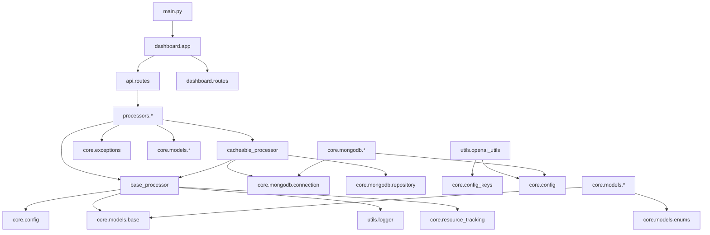

# Module Hierarchy

Overview of the architecture and module structure of Common Secretary Services.

## Architecture Overview

```
Common Secretary Services
├── Entry Points
│   ├── src/main.py - Server entry point
│   ├── src/api/__init__.py - Alternative API app factory
│   └── src/dashboard/app.py - Main Flask application
├── Core Layer
│   ├── Configuration
│   │   ├── src/core/config.py - Central configuration management
│   │   ├── src/core/config_keys.py - API key management
│   │   └── src/core/config_utils.py - Configuration utilities
│   ├── Models
│   │   ├── src/core/models/base.py - Base models (BaseResponse, ErrorInfo, etc.)
│   │   ├── src/core/models/enums.py - Enum definitions
│   │   ├── src/core/models/protocols.py - Protocol definitions
│   │   └── src/core/models/*.py - Specific models (audio, video, pdf, etc.)
│   ├── MongoDB
│   │   ├── src/core/mongodb/connection.py - MongoDB connection
│   │   ├── src/core/mongodb/repository.py - Repository pattern
│   │   ├── src/core/mongodb/cache_setup.py - Cache setup
│   │   └── src/core/mongodb/*_repository.py - Specific repositories
│   ├── Processing
│   │   ├── src/core/processing/handlers/ - Job handlers
│   │   └── src/core/processing/registry.py - Processor registry
│   ├── Services
│   │   └── src/core/services/translator_service.py - Translation service
│   └── Utilities
│       ├── src/core/exceptions.py - Exception definitions
│       ├── src/core/validation.py - Validation utilities
│       ├── src/core/resource_tracking.py - Resource tracking
│       └── src/core/rate_limiting.py - Rate limiting
├── Processor Layer
│   ├── Base Classes
│   │   ├── src/processors/base_processor.py - Base class for all processors
│   │   └── src/processors/cacheable_processor.py - Cacheable base class
│   └── Implementations
│       ├── src/processors/audio_processor.py - Audio processing
│       ├── src/processors/video_processor.py - Video processing
│       ├── src/processors/pdf_processor.py - PDF processing
│       ├── src/processors/imageocr_processor.py - Image OCR
│       ├── src/processors/youtube_processor.py - YouTube processing
│       ├── src/processors/transformer_processor.py - Text transformation
│       ├── src/processors/session_processor.py - Session processing
│       ├── src/processors/event_processor.py - Event processing
│       ├── src/processors/track_processor.py - Track processing
│       ├── src/processors/story_processor.py - Story processing
│       └── src/processors/metadata_processor.py - Metadata extraction
├── API Layer
│   └── Routes
│       ├── src/api/routes/__init__.py - Route registration and auth
│       ├── src/api/routes/audio_routes.py - Audio API
│       ├── src/api/routes/video_routes.py - Video API
│       ├── src/api/routes/pdf_routes.py - PDF API
│       ├── src/api/routes/imageocr_routes.py - ImageOCR API
│       ├── src/api/routes/youtube_routes.py - YouTube API
│       ├── src/api/routes/transformer_routes.py - Transformer API
│       ├── src/api/routes/session_routes.py - Session API
│       ├── src/api/routes/event_routes.py - Event API
│       ├── src/api/routes/track_routes.py - Track API
│       ├── src/api/routes/story_routes.py - Story API
│       └── src/api/routes/secretary_job_routes.py - Secretary Job API
├── Dashboard Layer
│   └── Routes & Templates
│       ├── src/dashboard/routes/main_routes.py - Main routes
│       ├── src/dashboard/routes/config_routes.py - Configuration routes
│       ├── src/dashboard/routes/docs_routes.py - Documentation routes
│       └── src/dashboard/routes/log_routes.py - Log routes
└── Utilities
    ├── Logging
    │   └── src/utils/logger.py - Logging system
    ├── OpenAI
    │   ├── src/utils/openai_utils.py - OpenAI integration
    │   └── src/utils/openai_types.py - OpenAI types
    ├── Processing Utils
    │   ├── src/utils/transcription_utils.py - Transcription utils
    │   ├── src/utils/audio_utils.py - Audio utilities
    │   └── src/utils/image2text_utils.py - Image-to-text utilities
    └── Performance
        ├── src/utils/performance_tracker.py - Performance tracking
        ├── src/utils/processor_cache.py - Processor cache
        └── src/utils/video_cache.py - Video cache
```

## Dependency Graph



## Data Flow

### Request Processing

1. **Entry Point** (`main.py` or `dashboard/app.py`)
   - Starts Flask app
   - Registers blueprints

2. **API Layer** (`api/routes/*`)
   - Receives HTTP requests
   - Validates authentication
   - Calls processors

3. **Processor Layer** (`processors/*`)
   - Processes request
   - Uses cache (if enabled)
   - Calls LLM services
   - Creates response

4. **Response**
   - Standardized format (BaseResponse)
   - Contains ProcessInfo with LLM tracking
   - Returned as JSON

### Cache Flow

1. **CacheableProcessor** checks cache
2. On cache hit: Return result from MongoDB
3. On cache miss: Perform processing
4. Store result in MongoDB
5. Return result

## Module Descriptions

### Entry Points

- **main.py**: Server entry point, loads .env, starts Flask app
- **dashboard/app.py**: Main Flask application, manages lifecycle, worker managers
- **api/__init__.py**: Alternative app factory for API-only deployments

### Core Layer

- **Configuration**: Central configuration management from config.yaml
- **Models**: Dataclass definitions for all data structures
- **MongoDB**: Database connection, repositories, cache management
- **Processing**: Job handlers for asynchronous processing
- **Services**: Business logic services (e.g., Translator)
- **Utilities**: Base functionality (exceptions, validation, etc.)

### Processor Layer

- **Base Classes**: Common functionality for all processors
- **Implementations**: Specific processors for various media types

### API Layer

- **Routes**: Flask-RESTX routes for all API endpoints
- **Auth**: Authentication and authorization

### Dashboard Layer

- **Routes**: Web interface routes
- **Templates**: HTML templates for dashboard

### Utilities

- **Logging**: Central logging system
- **OpenAI**: Integration with OpenAI APIs
- **Processing Utils**: Helper functions for processing
- **Performance**: Performance tracking and caching

## Cyclic Dependencies

Currently no known cyclic dependencies. The architecture follows a clear hierarchy principle:

- Entry Points → API/Dashboard → Processors → Core → Utilities
