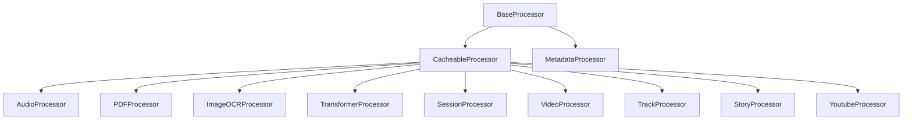

# Systemarchitektur (Überblick)

- API Layer (Flask-RESTX): Namespaces unter `/api/*`, Swagger unter `/api/doc`
- Processor Layer: Audio, Video, YouTube, Transformer, Metadata
- Storage: Cache/Temp, Logs, Konfiguration, Templates
- Externe Dienste: OpenAI (Whisper/GPT), YouTube API, FFmpeg

## Prozessorbeziehungen (vereinfacht)

- YouTube → Audio → Transformer
- Audio → Metadata → Transformer

## Konfiguration

- `config/config.yaml`
- `.env`
