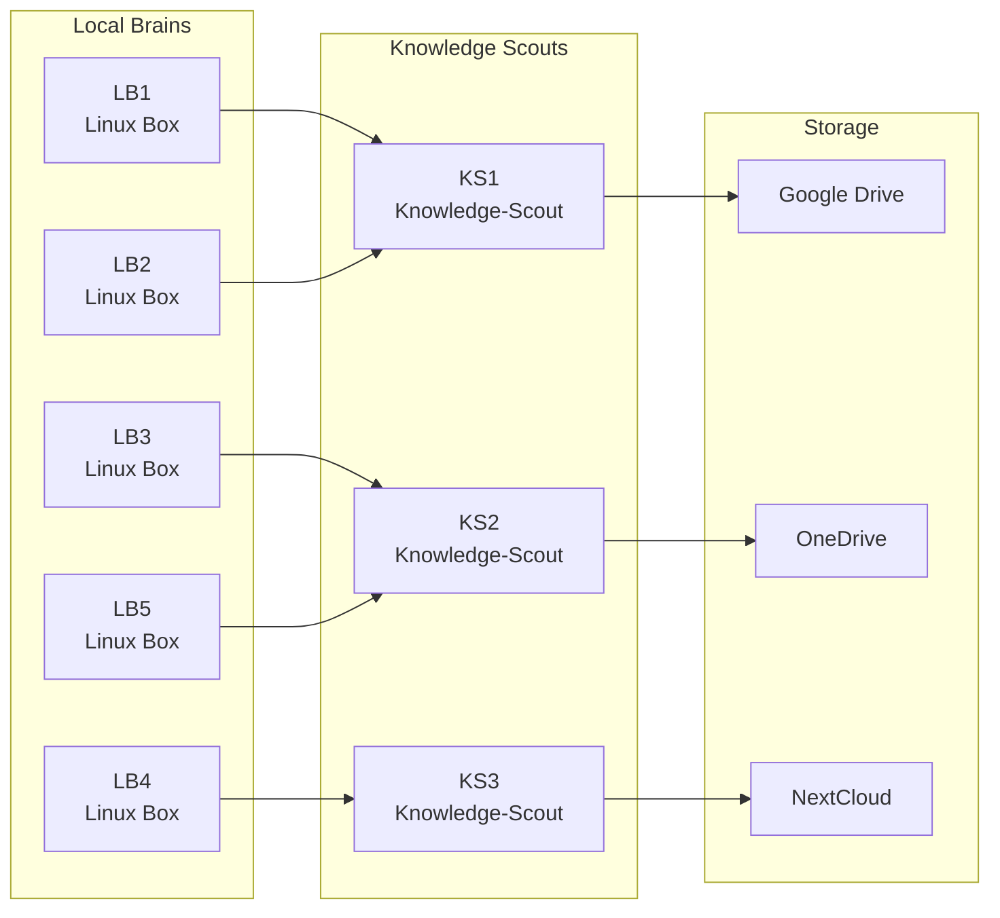

# Local Brain Architecture

## Systemübersicht

Das Local Brain System besteht aus drei Hauptkomponenten:
- **Local Brains**: Linux-basierte Verarbeitungseinheiten
- **Knowledge Scouts**: Intelligente Wissensvermittler
- **Storage**: Verschiedene Cloud-Speicherlösungen

## Architektur-Diagramm

## Komponenten-Beschreibung

### Local Brains (LB1-LB5)
- Linux-basierte Verarbeitungseinheiten
- Lokale Datenverarbeitung und Analyse
- Dezentrale Intelligenz

### Knowledge Scouts (KS1-KS3)
- Intelligente Wissensvermittler
- Koordinieren die Datenflüsse
- Optimieren Speicherzuweisungen

### Storage-Systeme
- **Google Drive**: Cloud-Speicher für KS1
- **OneDrive**: Cloud-Speicher für KS2  
- **NextCloud**: Cloud-Speicher für KS3

## Datenfluss

1. Local Brains verarbeiten lokale Daten
2. Knowledge Scouts sammeln und strukturieren die Informationen
3. Daten werden in entsprechende Cloud-Speicher übertragen
4. Zentrale Koordination durch Knowledge Scouts