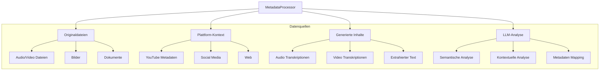

# MetaProcessor Konzept

## Überblick

Dieses Dokument beschreibt die Integration einer LLM-basierten Metadaten-Extraktion in die bestehende Prozessor-Architektur des Common Secretary Services Systems. Der MetadataProcessor ist als spezialisierter Prozessor konzipiert, der verschiedene Datenquellen kombiniert und analysiert.

## Metadaten-Struktur

Die Metadaten-Extraktion basiert auf dem in [metadata-concept.md](./metadata-concept.md) definierten Schema. Dieses umfasst:

### Basis-Metadaten (BaseMetadata)
```typescript
interface BaseMetadata {
  type: string;    // Art der Metadaten
  created: string; // Erstellungszeitpunkt
  modified: string; // Letzter Änderungszeitpunkt
}
```

### Wesentliche Metadaten-Kategorien

1. **Technische Metadaten**
   - Dateiinformationen (Größe, Format, MIME-Type)
   - Medienspezifische Details (Dauer, Bitrate, Codec)
   - Qualitätsmerkmale (Auflösung, Samplerate)

2. **Inhaltliche Metadaten**
   - Bibliographische Daten (Titel, Autoren, Datum)
   - Wissenschaftliche Klassifikation (Fachgebiete, Keywords)
   - Räumliche und zeitliche Einordnung
   - Rechte und Lizenzen

3. **Plattform-spezifische Metadaten**
   - Digitale Publikationsdetails
   - Event-spezifische Informationen
   - Social Media Metriken
   - Community und Engagement

4. **Qualitätssicherung**
   - Review-Status
   - Fact-Checking
   - Verifizierungsinformationen

Der MetadataProcessor ist darauf ausgelegt, diese strukturierten Metadaten automatisch zu extrahieren und in das standardisierte Format zu überführen.

## Anforderungen

- Extraktion technischer und inhaltlicher Metadaten aus verschiedenen Quellen
- Integration mit bestehendem LLM-Service
- Flexible Erweiterbarkeit für neue Metadaten-Typen
- Einfache Integration in bestehende Prozessoren
- Standardisierte Ausgabe gemäß Metadaten-Schema
- Verarbeitung von Transkriptionen und Kontextinformationen

## Architektur des MetadataProcessors

### Datenquellen und Verarbeitungsfluss



### Verarbeitungsphasen

1. **Technische Analyse**
   - Extraktion von Datei-Metadaten (Format, Größe, Dauer)
   - Plattform-spezifische Informationen
   - Medien-spezifische Details (Bitrate, Auflösung)

2. **Kontext-Aggregation**
   - Zusammenführung von Plattform-Metadaten
   - Integration von Transkriptionen
   - Verknüpfung zusammengehöriger Informationen

3. **LLM-basierte Analyse**
   - Semantische Analyse der Inhalte
   - Kontextuelle Interpretation
   - Mapping auf das Metadaten-Schema

### Implementierung

```python
class MetadataProcessor(BaseProcessor):
    """
    Spezialisierter Prozessor für Metadaten-Extraktion und -Verarbeitung.
    """
    def __init__(self, process_id: Optional[str] = None):
        super().__init__(process_id)
        self.llm_service = OpenAIService()
        
    async def extract_metadata(self, 
                             content: str, 
                             context: Dict[str, Any] = None, 
                             metadata_types: List[str] = None) -> Dict[str, Any]:
        """
        Extrahiert Metadaten aus Content und Context.
        
        Args:
            content: Primärer Inhalt (z.B. Video-Beschreibung)
            context: Zusätzliche Kontextinformationen, inkl:
                    - file_info: Technische Dateiinformationen
                    - platform_data: Plattform-spezifische Metadaten
                    - transcription: Transkription des Audio/Video-Inhalts
            metadata_types: Gewünschte Metadaten-Typen
            
        Returns:
            Dict[str, Any]: Strukturierte Metadaten nach dem Schema aus metadata-concept.md:
            {
                "type": "youtube_video",
                "created": "2024-03-20T10:00:00Z",
                "modified": "2024-03-20T10:00:00Z",
                
                # Technische Metadaten
                "file_size": 1234567,
                "file_mime": "video/mp4",
                "media_duration": 600,
                "media_bitrate": 2000000,
                
                # Inhaltliche Metadaten
                "title": "Beispiel Video",
                "authors": ["Max Mustermann"],
                "subject_areas": ["Informatik", "KI"],
                "keywords": ["Metadaten", "Automatisierung"],
                
                # Plattform-spezifische Metadaten
                "platform_type": "youtube",
                "platform_url": "https://youtube.com/...",
                "social_metrics_views": 1000,
                
                # Qualitätssicherung
                "quality_review_status": "verified",
                "quality_fact_checked": true
            }
        """
        metadata = {}
        
        # Kontext aufbereiten
        enriched_context = await self._prepare_context(content, context)
        
        if "technical" in (metadata_types or ["technical"]):
            metadata.update(await self._extract_technical_metadata(enriched_context))
            
        if "content" in (metadata_types or ["content"]):
            metadata.update(await self._extract_content_metadata(enriched_context))
            
        # Basis-Metadaten hinzufügen
        metadata.update({
            "type": context.get('type', 'unknown'),
            "created": datetime.utcnow().isoformat() + "Z",
            "modified": datetime.utcnow().isoformat() + "Z"
        })
            
        return metadata
        
    async def _prepare_context(self,
                             content: str,
                             context: Dict[str, Any]) -> Dict[str, Any]:
        """
        Bereitet den Kontext für die Analyse vor.
        Kombiniert verschiedene Informationsquellen intelligent.
        """
        enriched_context = {
            'primary_content': content,
            'technical_info': {},
            'platform_info': {},
            'transcription_info': {}
        }
        
        if context:
            # Technische Informationen
            if 'file_info' in context:
                enriched_context['technical_info'] = context['file_info']
            
            # Plattform-Daten
            if 'platform_data' in context:
                enriched_context['platform_info'] = context['platform_data']
            
            # Transkriptionen (wenn vorhanden)
            if 'transcription' in context:
                enriched_context['transcription_info'] = {
                    'text': context['transcription'],
                    'confidence': context.get('transcription_confidence', 1.0)
                }
        
        return enriched_context
        
    async def _extract_content_metadata(self, 
                                      context: Dict[str, Any]) -> Dict[str, Any]:
        """
        Extrahiert inhaltliche Metadaten via LLM.
        Berücksichtigt alle verfügbaren Kontextinformationen.
        """
        # Kombiniere relevante Informationen für die Analyse
        analysis_text = self._build_analysis_text(context)
        
        # Erstelle spezifischen Prompt für Metadaten-Extraktion
        prompt = self._build_metadata_prompt(analysis_text)
        
        # LLM-Analyse durchführen
        response = await self.llm_service.analyze(prompt)
        
        return self._parse_llm_response(response)
```

### Verwendung im YouTubeProcessor

```python
async def process_video(self, video_url: str) -> Dict[str, Any]:
    # Video-Informationen und Transkription
    video_info = await self._fetch_video_info(video_url)
    audio_transcription = await self._transcribe_audio_stream(video_info.audio_stream)
    
    # Metadaten extrahieren mit allen verfügbaren Informationen
    metadata_processor = MetadataProcessor(self.process_id)
    metadata = await metadata_processor.extract_metadata(
        content=video_info.description,
        context={
            'type': 'youtube',
            'platform_data': video_info.metadata,
            'file_info': {
                'duration': video_info.duration,
                'format': video_info.format,
                'quality': video_info.quality
            },
            'transcription': audio_transcription.text,
            'transcription_confidence': audio_transcription.confidence
        }
    )
    
    return {
        'video_info': video_info,
        'transcription': audio_transcription,
        'metadata': metadata
    }
```

## Vorteile dieser Architektur

1. **Ganzheitliche Analyse**
   - Berücksichtigung aller verfügbaren Informationsquellen
   - Intelligente Kombination von Metadaten
   - Kontextbasierte Interpretation

2. **Flexible Verarbeitung**
   - Modulare Struktur für verschiedene Datenquellen
   - Anpassbare Analysestrategie
   - Erweiterbare Metadaten-Schemata

3. **Qualitätssicherung**
   - Validierung durch multiple Datenquellen
   - Konfidenz-basierte Gewichtung von Informationen
   - Konsistenzprüfung der Metadaten

4. **Zentrale Verwaltung**
   - Einheitliche Metadaten-Extraktion
   - Konsistente Ausgabeformate
   - Zentrale Schema-Updates

Die Nutzung der Audio-Transkription als zusätzlicher Kontext ist dabei besonders wertvoll, da sie:
- Zusätzliche semantische Informationen liefert
- Die Qualität der Metadaten-Extraktion verbessert
- Eine Validierung der aus anderen Quellen extrahierten Metadaten ermöglicht 