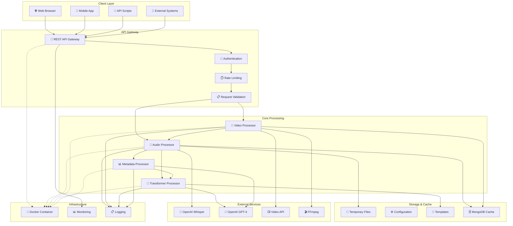
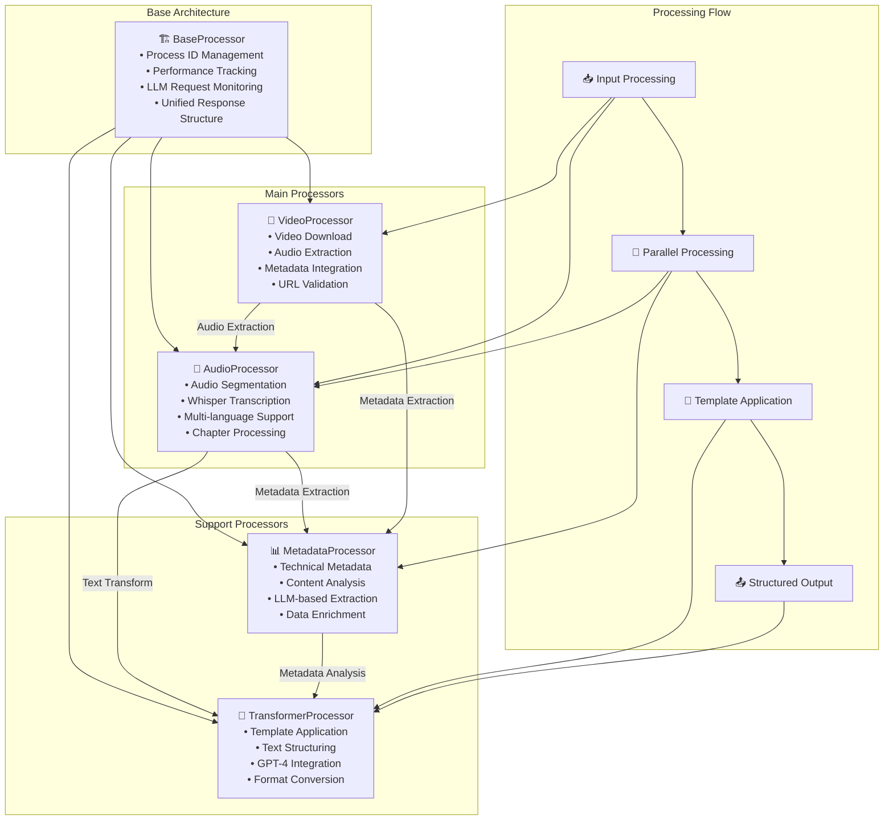
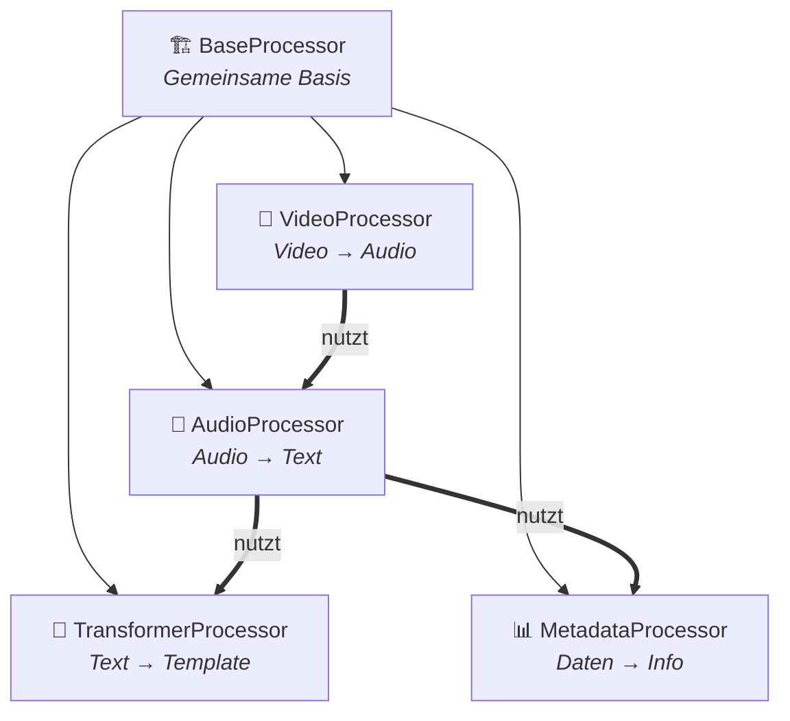
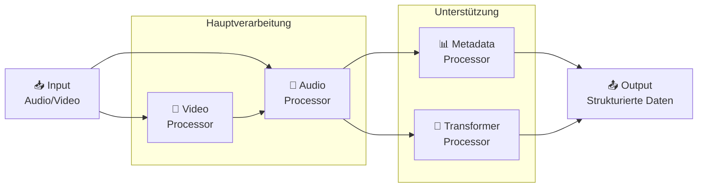
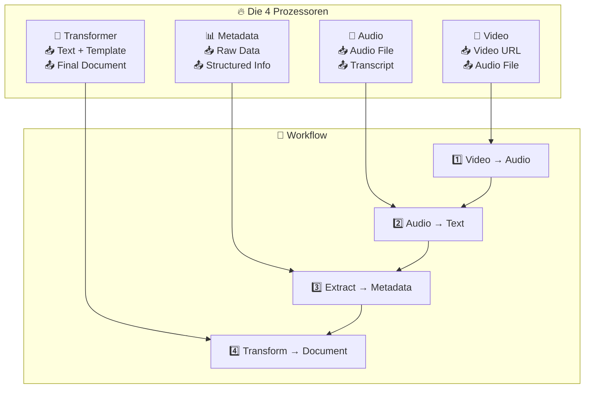
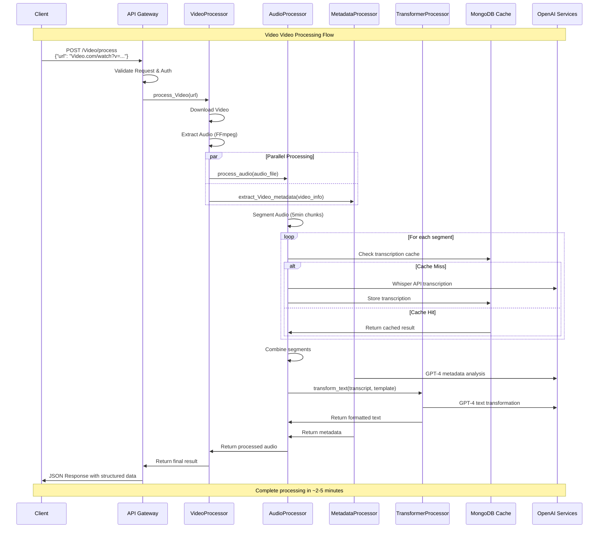
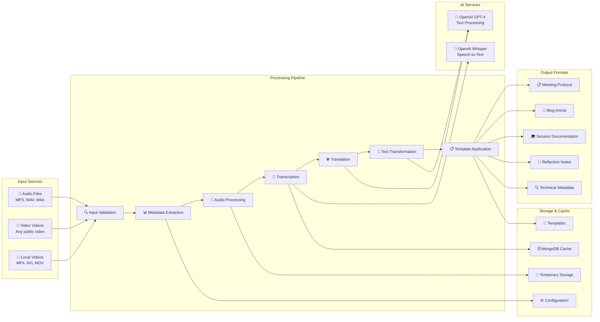

# Secretary Services - Automatisierte Medienverarbeitung mit KI
## PowerPoint-Präsentation

---

## Folie 1: Titel & Überblick
### Common Secretary Services
**Automatisierte Verarbeitung von Audio-, Video- und Mediendateien**

- 🎵 **Audio-Verarbeitung** mit KI-Transkription
- 🎥 **Video-Integration** für Videos
- 📝 **Template-basierte Ausgabe** 
- 🚀 **RESTful API** mit Web-Dashboard
- 🤖 **OpenAI-Integration** (Whisper + GPT-4)

*Ein professionelles Python-System für die intelligente Medienverarbeitung*

---

## Folie 2: Das Problem & Die Lösung
### Herausforderung
- Manuelle Transkription ist zeitaufwändig
- Video-/Audio-Inhalte sind schwer durchsuchbar
- Strukturierte Dokumentation fehlt
- Unterschiedliche Medienformate

### Unsere Lösung
- **Automatische Transkription** mit Whisper AI
- **Intelligente Strukturierung** mit GPT-4
- **Template-basierte Ausgabe** für verschiedene Zwecke
- **Einheitliche API** für alle Medientypen

---

## Folie 3: Kernfeatures im Überblick
### 🎵 Audio-Verarbeitung
- Unterstützung: MP3, WAV, M4A
- Automatische Segmentierung
- KI-Transkription mit Whisper
- Übersetzung in mehrere Sprachen

### 🎥 Video & Video
- Video-Videos direkt verarbeiten
- Audio-Extraktion aus Videos
- Metadaten-Integration
- Automatische Untertitel

### 📝 Template-System
- Markdown-basierte Vorlagen
- Flexible Ausgabeformate
- Mehrsprachige Templates
- Strukturierte Dokumentation

---

## Folie 4: Systemarchitektur - Überblick



---

## Folie 5: Prozessor-Hierarchie



### Kernkonzepte
- **BaseProcessor**: Gemeinsame Basis mit einheitlichen Interfaces
- **Hauptprozessoren**: Audio & Video für Medieneingabe
- **Support-Prozessoren**: Transformation & Metadaten für Ausgabe
- **Parallele Verarbeitung**: Optimierte Performance durch Multitasking

---

## Folie 6: Vereinfachte Prozessor-Übersicht

### Variante 1: Hierarchie & Abhängigkeiten


### Variante 2: Linearer Datenfluss


### Variante 3: Workflow-Schritte


---

## Folie 7: Datenfluss am Beispiel Video



### Wichtige Optimierungen
- **Parallele Verarbeitung** für bessere Performance
- **Intelligentes Caching** reduziert API-Kosten
- **Segment-basierte Verarbeitung** für große Dateien
- **Fehlerbehandlung** auf jeder Ebene

---

## Folie 8: Processing Pipeline - Von Input zu Output



### Verarbeitungsschritte
1. **Input Validation** - Dateiformate & Größe prüfen
2. **Metadata Extraction** - Technische & Content-Informationen
3. **Audio Processing** - Normalisierung & Segmentierung  
4. **AI-Transcription** - Whisper für höchste Genauigkeit
5. **Smart Transformation** - GPT-4 für strukturierte Ausgabe

---

## Folie 9: KI-Integration - Das Herzstück
### OpenAI Whisper
- **Präzise Transkription** in 57+ Sprachen
- **Automatische Spracherkennung**
- **Segment-basierte Verarbeitung**
- **Hohe Genauigkeit** auch bei schlechter Qualität

### OpenAI GPT-4
- **Intelligente Textstrukturierung**
- **Automatische Zusammenfassungen**
- **Template-basierte Transformation**
- **Metadaten-Analyse und -Extraktion**

---

## Folie 10: Template-System
### Flexible Ausgabeformate
```markdown
# Verfügbare Templates
- 📋 Besprechung.md       → Meeting-Protokolle
- 📰 Blogeintrag.md       → Blog-Artikel
- 🎓 Session_de.md        → Konferenz-Sessions
- 🎬 Video.md           → Video-Dokumentation
- 💭 Gedanken.md          → Reflexionen
- 🔍 Metadata.md          → Technische Details
```

### Mehrsprachige Unterstützung
- Deutsch, Englisch, Französisch, Italienisch, Spanisch
- Automatische Template-Auswahl
- Lokalisierte Ausgabeformate

---

## Folie 11: API & Web-Interface
### RESTful API
```python
# Audio verarbeiten
POST /api/v1/audio/process
FILES: audio.mp3

# Video-Video verarbeiten  
POST /api/v1/Video/process
JSON: {"url": "https://Video.com/watch?v=...", "template": "Video"}

# Ergebnis abrufen
GET /api/v1/process/{process_id}/result
```

### Web-Dashboard
- 📊 **Live-Monitoring** der Verarbeitung
- 🔧 **Konfiguration** über Web-UI
- 📋 **Test-Interface** für APIs
- 📈 **Performance-Übersicht**

---

## Folie 12: Sicherheit & Datenschutz
### Datenschutz
- ✅ **Temporäre Speicherung** - Automatische Bereinigung
- ✅ **Keine persistente Speicherung** von Mediendaten
- ✅ **Verschlüsselte Übertragung** (HTTPS)
- ✅ **Sichere API-Schlüssel-Handhabung**

### API-Sicherheit
- 🔐 **API-Key Authentifizierung**
- ⏱️ **Rate-Limiting** pro Endpunkt
- 📏 **Dateigrößenbeschränkungen**
- ✅ **Umfassende Input-Validierung**

---

## Folie 13: Monitoring & Performance
### Umfassendes Tracking
```yaml
Überwachung:
  ✓ Prozessor-Laufzeiten
  ✓ LLM-Nutzung & Kosten
  ✓ Ressourcenverbrauch
  ✓ API-Request-Statistiken
  ✓ Fehlerüberwachung
  ✓ Performance-Metriken
```

### Live-Dashboard
- 📊 **Echtzeit-Monitoring**
- 📈 **Performance-Diagramme**
- 🚨 **Fehler-Benachrichtigung**
- 📋 **Detaillierte Logs**

---

## Folie 14: Technische Basis
### Technologie-Stack
```yaml
Backend:
  - Python 3.11+
  - Flask + Flask-RESTX
  - MongoDB (Caching)
  - FFmpeg (Audio/Video)

KI & APIs:
  - OpenAI Whisper & GPT-4
  - Video Data API
  - Custom LLM-Integration

Infrastructure:
  - Docker-Containerization
  - GitHub Actions (CI/CD)
  - Dokploy Deployment
  - Nginx Reverse Proxy
```

---

## Folie 15: Deployment & Skalierung
### Automatisiertes Deployment
1. **GitHub Push** → `main` Branch
2. **GitHub Actions** → Docker Build
3. **Container Registry** → GitHub Packages
4. **Dokploy** → Automatisches Deployment
5. **Live-System** → bcommonslab.org

### Skalierbarkeit
- 🐳 **Docker-Container** für einfache Skalierung
- ⚡ **Asynchrone Verarbeitung** für Performance
- 💾 **MongoDB-Caching** für Effizienz
- 🔄 **Modular aufgebaut** für Erweiterungen

---

## Folie 16: Anwendungsfälle & Beispiele
### Konkrete Einsatzgebiete
- 📋 **Meeting-Protokolle** automatisch erstellen
- 🎓 **Konferenz-Sessions** dokumentieren
- 📰 **Blog-Content** aus Videos generieren
- 🔍 **Video-Archive** durchsuchbar machen
- 📚 **Wissensmanagement** verbessern

### Erfolgsbeispiele
- FOSDEM 2025 Konferenz-Dokumentation
- Automatische Blog-Post-Generierung
- Mehrsprachige Session-Dokumentation

---

## Folie 17: Roadmap & Erweiterungen
### Geplante Features
- 🔄 **Batch-Verarbeitung** für große Mengen
- 🌐 **Erweiterte Mehrsprachigkeit**
- 📊 **Analytics & Reporting**
- 🔗 **Integration mit CMS-Systemen**
- 🎯 **Custom Template-Builder**

### Erweiterungsmöglichkeiten
- **Neue Prozessoren** einfach hinzufügbar
- **Custom Templates** für spezielle Anwendungen
- **API-Erweiterungen** für neue Services
- **Plugin-System** für Drittanbieter

---

## Folie 18: Getting Started
### Quick Start
```bash
# 1. Repository klonen
git clone https://github.com/bCommonsLAB/CommonSecretaryServices.git

# 2. Virtual Environment
python -m venv venv
venv\Scripts\activate  # Windows

# 3. Dependencies installieren
pip install -r requirements.txt

# 4. Konfiguration
cp config/config.example.yaml config/config.yaml
# API-Keys eintragen

# 5. Starten
$env:PYTHONPATH = "."
python src/main.py
```

### Erste Schritte
1. **Web-Dashboard** öffnen: `http://localhost:5001`
2. **API-Test** durchführen
3. **Erste Audio-Datei** verarbeiten
4. **Template** auswählen und anpassen

---

## Folie 19: Support & Community
### Unterstützung
- 📚 **Umfassende Dokumentation** (15+ Dokumente)
- 🐛 **GitHub Issues** für Bug Reports
- ✨ **Feature Requests** willkommen
- 📧 **E-Mail Support** verfügbar

### Entwicklung & Beitragen
- 🔧 **Open Source** Mindset
- 📋 **Entwicklungsrichtlinien** definiert
- 🧪 **Test-Framework** integriert
- 🔄 **CI/CD Pipeline** etabliert

### Kontakt
- **GitHub**: [Repository Link]
- **Website**: commonsecretaryservices.bcommonslab.org
- **Support**: support@common-secretary.com

---

## Folie 20: Fazit & Vorteile
### Warum Secretary Services?
✅ **Zeitersparnis** - Automatisierte Transkription  
✅ **Hohe Qualität** - KI-basierte Verarbeitung  
✅ **Flexibilität** - Template-System für alle Bedürfnisse  
✅ **Skalierbarkeit** - Moderne Container-Architektur  
✅ **Sicherheit** - Datenschutz und sichere APIs  
✅ **Erweiterbarkeit** - Modulares System  

### Das Ergebnis
**Ein professionelles, KI-gestütztes System für die automatisierte Medienverarbeitung, das Zeit spart und hochwertige, strukturierte Ausgaben liefert.**

---

## Anhang: Demo-Screenshots
*Hier könnten Screenshots vom Dashboard, API-Interface und Beispiel-Outputs eingefügt werden*

1. Web-Dashboard Übersicht
2. API-Test Interface
3. Template-Auswahl
4. Beispiel-Output (Video → Blog-Post)
5. Performance-Monitoring
6. Konfiguration Interface 