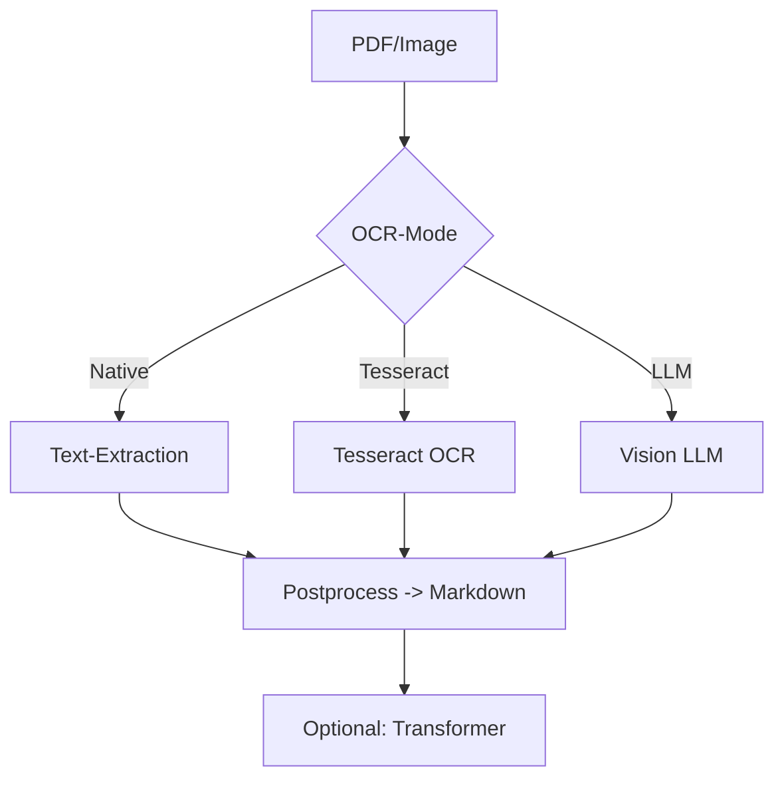

# PDF Processor

## Endpunkte
- POST `/api/pdf/process`
- POST `/api/pdf/process-url`
- GET `/api/pdf/text-content/<path:file_path>`

## Funktionen (Kurz)
- Native Textextraktion, Tesseract-OCR, LLM-gestützte OCR
- Vorschaubilder und optional ZIP-Archiv
- Cache-Unterstützung (MD5-Hash)

## Weiterführend
- OCR-Refactoring: [ocr-refactoring.md](ocr-refactoring.md)
- PDF/ImageOCR Endpoints: [endpoints.md](endpoints.md)
