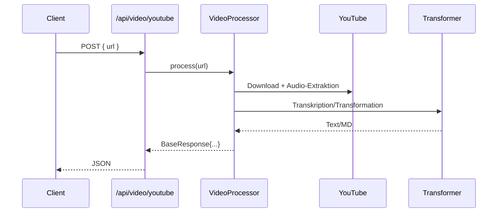

# Video Processor

## Endpunkte
- POST `/api/video/process` (Datei-Upload oder URL)
- POST `/api/video/youtube` (YouTube-URL)

## Parameter (Kurz)
- Datei-/URL-basierte Verarbeitung
- `source_language` (auto)
- `target_language` (de)
- `template` (optional)
- `useCache` (bool)
- `force_refresh` (bool, für `/process`)

## Funktionen (Kurz)
- Video → Audio-Extraktion → Transkription → Transformation
- Direkte YouTube-Unterstützung
- Cache-Unterstützung

## YouTube / Plattformen
- Unterstützt YouTube‑URLs (Download → Audio‑Extraktion → Transkription)
- Parameter: `youtube_include_dash_manifest`, `best_audio_format`
- Hinweise: Raten‑Limits und Formatverfügbarkeit können variieren

