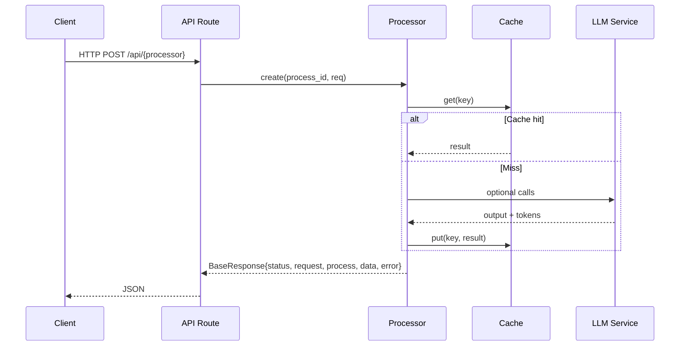

# API Überblick

- Basis: `/api`
- Swagger UI: `/api/doc`
- OpenAPI JSON (RESTX): `/api/swagger.json`

## Response-Standard
- Felder: `status` (success/error), `request`, `process`, `data`, `error`
- LLM‑Tracking in `process.llm_info`
- Zeitangaben in Millisekunden (`process.duration_ms`)

Weitere Details und Beispiele: [Response‑Struktur](response-structure.md)

## Aufrufablauf (synchron)

## Wichtige Endpunkte

- Audio: `POST /api/audio/process`
- Video: `POST /api/video/process`
- PDF: `POST /api/pdf/process`, `POST /api/pdf/process-url`
- ImageOCR: `POST /api/imageocr/process`, `POST /api/imageocr/process-url`
- Session: `POST /api/session/process`, `POST /api/session/process-async`
- Event-Job: `POST/GET /api/event-job/jobs`, `GET /api/event-job/jobs/{id}`
- Transformer: `POST /api/transformer/template`, `POST /api/transformer/text`, `POST /api/transformer/html-table`, `POST /api/transformer/text/file`, `POST /api/transformer/metadata`
