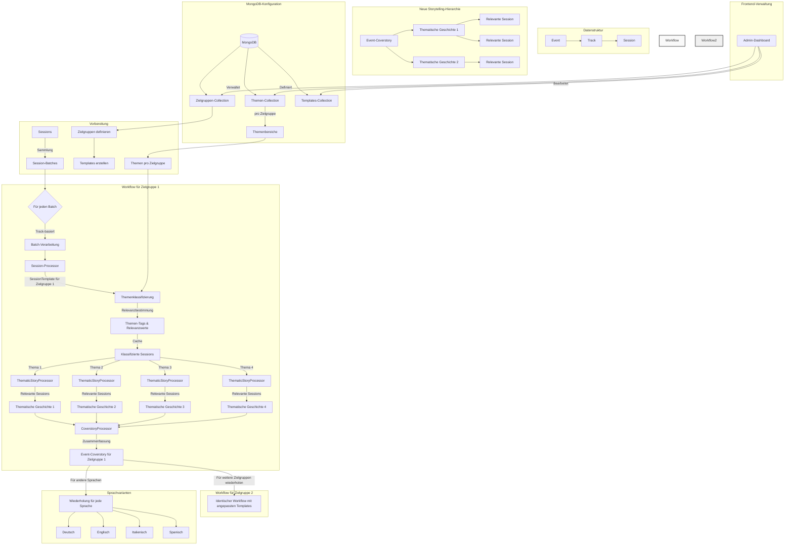

# Konzept: Storytelling mit Event-Daten

## Überblick

Das Storytelling-Feature erweitert die vorhandenen Session- und Track-Prozessoren um die Möglichkeit, aus einer Sammlung von Sessions thematisch zusammenhängende Geschichten zu generieren. Anstatt Sessions ausschließlich nach ihren vordefinierten Tracks zu gruppieren, sollen sie nach inhaltlichen Themen klassifiziert und neu zusammengefasst werden können. Diese Geschichten sollen in verschiedenen Sprachen und für verschiedene Zielgruppen (z.B. Ökosozial, SoftwareEntwickler, Mediendesigner) erzeugt werden können.

## Datenstruktur-Hierarchie

**Bestehende Hierarchie:**
- **Event** (z.B. eine Konferenz wie FOSDEM)
  - **Track** (thematische Gruppierung innerhalb des Events)
    - **Session** (einzelne Vorträge, Präsentationen, mit Medien)

**Neue Storytelling-Hierarchie:**
- **Event-Coverstory** (übergreifende Zusammenfassung)
  - **Thematische Geschichten** (nach Themen, nicht Tracks)
    - **Relevante Sessions** (selektiert nach Thema und Zielgruppenrelevanz)

## Workflow: Zielgruppenorientierte Themen-Geschichten

Der Workflow zur Erzeugung zielgruppenorientierter thematischer Geschichten umfasst folgende Schritte:

1. **Konfiguration in MongoDB & Planungsphase**:
   - Identifikation relevanter Zielgruppen (z.B. "SoftwareEntwickler", "Ökosozial", "Mediendesigner")
   - Definition zielgruppenspezifischer Themenbereiche in der MongoDB-Collection
   - Erstellung spezifischer Templates:
     - Session-Templates für jede Zielgruppe und Sprache (`{target}_session_{language}.md`)
     - Themen-Templates für jede Zielgruppe und Sprache (`{target}_topic_{language}.md`) 
     - Coverstory-Templates für jede Zielgruppe und Sprache (`{target}_coverstory_{language}.md`)

2. **Batch-Verarbeitung & Themenklassifizierung**:
   - Systematische Verarbeitung bestehender Session-Batches (organisiert im TrackProcessor)
   - Anwendung des zielgruppenspezifischen Session-Templates
   - Klassifizierung der Sessions nach den zielgruppenspezifischen Themenbereichen (aus MongoDB)
   - Ermittlung der Relevanz für verschiedene Zielgruppen
   - Speicherung der Ergebnisse im Cache mit Themen- und Relevanz-Metadaten

3. **Themenspezifische Geschichten**:
   - Nach Abschluss der Batch-Verarbeitung: Erzeugung themenspezifischer Geschichten
   - Verwendung des ThematicStoryProcessors
   - Anwendung zielgruppenspezifischer Themen-Templates (`{target}_topic_{language}.md`)
   - Berücksichtigung nur für die Zielgruppe relevanter Sessions
   - Erzeugung kohärenter Geschichten für jedes Thema

4. **Coverstory-Generierung**:
   - Zusammenfassung der themenspezifischen Geschichten in einer übergreifenden Coverstory
   - Verwendung des Coverstory-Templates (`{target}_coverstory_{language}.md`)
   - Schaffung eines Gesamtüberblicks über alle relevanten Themen für die Zielgruppe

Dieser Workflow wird für jede Zielgruppe separat durchgeführt, sodass für "SoftwareEntwickler", "Ökosozial" und "Mediendesigner" jeweils maßgeschneiderte Inhalte entstehen, die deren spezifische Interessen und Perspektiven berücksichtigen.

## Grafische Darstellung des Workflows



## Analyse der bestehenden Implementierung

### Session-Processor (bisher event_processor.py)
- Verarbeitet einzelne Sessions
- Scrappt Web-Inhalte
- Lädt und verarbeitet Videos und Audios
- Extrahiert Metadaten
- Generiert Markdown-Dateien nach Template
- Unterstützt asynchrone Batch-Verarbeitung

### Track-Processor (track_processor.py)
- Fasst Sessions zusammen, die zu einem Track gehören
- Erzeugt eine zusammenhängende Track-Übersicht
- Nutzt ein Template zur Transformation der Inhalte
- Speichert die Track-Zusammenfassung im Cache

## Überarbeiteter Ansatz: Integration in die bestehende Architektur

Nach Analyse der Anforderungen wird das Storytelling-Feature auf die bestehende Infrastruktur aufgesetzt, um eine effiziente und konsistente Implementierung zu gewährleisten.

### Grundprinzip

1. **MongoDB-Collections für dynamische Konfiguration**:
   - **targets_collection**: Definiert die verschiedenen Zielgruppen
   - **themes_collection**: Speichert zielgruppenspezifische Themenbereiche
   - **templates_collection**: Verwaltet Template-Zuordnungen

   Beispiel für einen Eintrag in der themes_collection:
   ```json
   {
     "target_group": "softwareentwickler",
     "themes": [
       {
         "name": "dev_tools",
         "display_name": "Entwicklerwerkzeuge",
         "description": "IDEs, Debugging-Tools und Entwicklungsumgebungen"
       },
       {
         "name": "programming_languages",
         "display_name": "Programmiersprachen",
         "description": "Fokus auf neue Sprachfeatures und Best Practices"
       }
     ]
   }
   ```

2. **Initiale Batch-Verarbeitung (mittels Session-Processor)**:
   - Batch mit Sessions eines Tracks wird verarbeitet
   - Alle Inhalte (Texte, Audios, Videos) werden gescrapt
   - Transkriptionen werden erstellt
   - Das zielgruppenspezifische Session-Template wird angewendet
   - Themenklassifizierung anhand der in MongoDB definierten zielgruppenspezifischen Themenbereiche
   - Bestimmung der Relevanzwerte für jede Zielgruppe
   - **Entscheidend**: Nur die Transkription/Markdown-Ausgabe erhält Themen-Tags und Relevanzwerte
   - Alle Ergebnisse werden im Cache gespeichert

3. **Themenspezifische Geschichten (neuer ThematicStoryProcessor)**:
   - Für jede Zielgruppe und jedes ihrer spezifischen Themen:
     - Laden der Themenstruktur aus MongoDB
     - Filtern relevanter Sessions für die Zielgruppe und das Thema
     - Anwendung des Themen-Templates (`{target}_topic_{language}.md`)
     - Erzeugung einer kohärenten thematischen Geschichte
     - Speicherung im Cache mit Zielgruppen- und Themen-Metadaten

4. **Coverstory-Generierung (neuer CoverstoryProcessor)**:
   - Für jede Zielgruppe:
     - Zusammenführung aller thematischen Geschichten für diese Zielgruppe
     - Anwendung des Coverstory-Templates (`{target}_coverstory_{language}.md`)
     - Erzeugung einer übergreifenden Event-Zusammenfassung
     - Speicherung im Cache mit Zielgruppen-Metadaten

5. **Mehrsprachige Varianten**:
   - Für jede Zielsprache werden die Schritte 2-4 wiederholt
   - Die Themen-Tags und Relevanzwerte bleiben über alle Sprachen hinweg konsistent

### Detaillierter Workflow

#### Phase 1: MongoDB-Konfiguration und Frontend-Verwaltung

- **MongoDB-Collections-Struktur**:

  ```json
  // targets_collection
  {
    "_id": ObjectId("..."),
    "name": "softwareentwickler",
    "display_name": "Software-Entwickler",
    "description": "Fokus auf Entwicklungsthemen und technische Aspekte",
    "relevance_threshold": 7.0,
    "primary_threshold": 8.5
  }

  // themes_collection
  {
    "_id": ObjectId("..."),
    "target_group": "softwareentwickler",
    "themes": [
      {
        "name": "dev_tools",
        "display_name": "Entwicklerwerkzeuge",
        "description": "IDEs, Debugging-Tools und Entwicklungsumgebungen"
      },
      // weitere Themen
    ]
  }

  // templates_collection
  {
    "_id": ObjectId("..."),
    "type": "session",
    "pattern": "{target}_session_{language}.md",
    "defaults": {
      "softwareentwickler": "dev_session_{language}.md",
      "oekosozial": "eco_session_{language}.md"
    }
  }
  ```

- **Frontend-Verwaltungsschnittstelle**:
  - Webinterface zur Verwaltung von Zielgruppen
  - Editor für zielgruppenspezifische Themenbereiche
  - Template-Management-System
  - Dashboard zur Überwachung des Workflow-Status

#### Phase 2: Batch-Verarbeitung und Themenklassifizierung

- Bestehender SessionProcessor (bisher EventProcessor) lädt Zielgruppenkonfiguration und Themenbereiche aus MongoDB
- Für jede Session:
  - Scrapen der Web-Inhalte
  - Download und Verarbeitung von Videos und Audios
  - Extraktion von Metadaten
  - Anwendung des aus MongoDB geladenen zielgruppenspezifischen Session-Templates
  - **Automatische Klassifizierung nach den zielgruppenspezifischen Themenbereichen**
  - **Bestimmung der Relevanzwerte für jede Zielgruppe**
  - Speicherung im Cache mit allen Metadaten
- Der Batch wird im Dashboard als "Initial - [Zielgruppe]" gekennzeichnet

#### Phase 3: Themenspezifische Geschichten

- Der neue ThematicStoryProcessor lädt Themenkonfiguration aus MongoDB
- Für jeden zielgruppenspezifischen Themenbereich:
  - Filter: Nur Sessions mit hoher Relevanz für die Zielgruppe (Schwellenwert aus MongoDB)
  - Anwendung des zielgruppenspezifischen Themen-Templates
  - Erzeugung einer kohärenten thematischen Geschichte
  - Speicherung im Cache
  - Im Dashboard als "Thema - [Themenbereich] - [Zielgruppe]" gekennzeichnet

#### Phase 4: Coverstory-Generierung

- Der neue CoverstoryProcessor wird für jede Zielgruppe ausgeführt
- Zusammenführung aller thematischen Geschichten
- Anwendung des zielgruppenspezifischen Event-Coverstory-Templates
- Erzeugung einer übergreifenden Zusammenfassung
- Speicherung im Cache
- Im Dashboard als "Coverstory - [Event] - [Zielgruppe]" gekennzeichnet

#### Phase 5: Mehrsprachige Varianten

- Für jede Zielsprache werden die Phasen 2-4 mit sprachspezifischen Templates wiederholt
- Die Themen-Tags und Relevanzwerte bleiben über alle Sprachen hinweg konsistent

### Technische Implementierung

#### 1. MongoDB-Anbindung und Konfigurationsmanagement

```python
class StorytellingConfig:
    """
    Klasse zum Laden und Verwalten der Storytelling-Konfiguration aus MongoDB.
    """
    
    def __init__(self, db_client):
        self.db = db_client.get_database("storytelling_config")
        self.targets_collection = self.db.targets
        self.themes_collection = self.db.themes
        self.templates_collection = self.db.templates
    
    def get_target_groups(self) -> List[Dict[str, Any]]:
        """Lädt alle verfügbaren Zielgruppen."""
        return list(self.targets_collection.find({}))
    
    def get_themes_for_target(self, target_group: str) -> List[Dict[str, Any]]:
        """Lädt die Themenbereiche für eine spezifische Zielgruppe."""
        result = self.themes_collection.find_one({"target_group": target_group})
        return result.get("themes", []) if result else []
    
    def get_template_for_target(self, template_type: str, target_group: str, language: str) -> str:
        """Lädt die Template-Zuordnung für eine Zielgruppe und Sprache."""
        result = self.templates_collection.find_one({"type": template_type})
        if not result:
            return f"standard_{template_type}_{language}.md"
        
        pattern = result.get("pattern", "{target}_{type}_{language}.md")
        defaults = result.get("defaults", {})
        
        target_template = defaults.get(target_group)
        if not target_template:
            return pattern.replace("{target}", target_group).replace("{type}", template_type).replace("{language}", language)
        
        return target_template.replace("{language}", language)
```

#### 2. SessionProcessor-Erweiterung (bisher EventProcessor)

Anpassung des bestehenden `event_processor.py` (sollte in `session_processor.py` umbenannt werden):
```python
async def process_session(  # bisher process_event
    self,
    event: str,  # Hier bezeichnet "event" die übergeordnete Veranstaltung
    session: str,
    url: str,
    filename: str,
    track: str,
    # weitere Parameter...
    target_group: str = "standard",  # Neue Parameter für die Zielgruppe
    # weitere Parameter...
) -> SessionResponse:  # bisher EventResponse
    # Bestehende Implementierung...
    
    # Lade zielgruppenspezifische Konfiguration aus MongoDB
    config = StorytellingConfig(self.db_client)
    template_path = config.get_template_for_target("session", target_group, target_language)
    themes = config.get_themes_for_target(target_group)
    
    # Template anwenden
    markdown_content = await self._generate_markdown(
        web_text=web_text,
        video_transcript=video_transcript,
        event_data=event_data,
        target_dir=target_dir,
        context=context,
        template=template_path
    )
    
    # Nach der Markdown-Generierung
    # Extrahiere zugewiesenen Themenbereich und Relevanzwerte aus dem Markdown
    # basierend auf der zielgruppenspezifischen Themenstruktur
    theme = self._extract_theme_from_markdown(markdown_content, themes)
    relevance = self._extract_relevance_from_markdown(markdown_content, target_group)
    
    # Speichere Themenbereich und Relevanz in den Metadaten
    if session_output and hasattr(session_output, 'metadata'):  # bisher event_output
        session_output.metadata['theme'] = theme
        session_output.metadata['relevance'] = relevance
        session_output.metadata['target_group'] = target_group
        session_output.metadata['event'] = event  # Übergeordnete Veranstaltung
    
    # Restliche Implementierung...
```

#### 3. Neuer ThematicStoryProcessor

Implementierung eines neuen Processors für thematische Geschichten:
```python
class ThematicStoryProcessor(BaseProcessor):
    """
    Prozessor für die Erzeugung thematischer Geschichten.
    Gruppiert Sessions nach Themenbereichen und erzeugt zusammenhängende Geschichten.
    """
    
    def __init__(self, resource_calculator: ResourceCalculator, process_id: Optional[str] = None) -> None:
        """Initialisiert den ThematicStoryProcessor."""
        super().__init__(resource_calculator=resource_calculator, process_id=process_id)
        self.config = StorytellingConfig(self.db_client)
    
    async def create_thematic_story(
        self,
        event: str,  # Übergeordnete Veranstaltung
        theme: str,
        target_group: str = "standard",
        target_language: str = "de",
        use_cache: bool = True
    ) -> ThematicStoryResponse:
        # Lade zielgruppenspezifische Konfiguration
        target_info = self.config.targets_collection.find_one({"name": target_group})
        if not target_info:
            raise ValueError(f"Zielgruppe {target_group} nicht gefunden")
        
        relevance_threshold = target_info.get("relevance_threshold", 7.0)
        template_path = self.config.get_template_for_target("topic", target_group, target_language)
        
        # Filterung nach Relevanz für die Zielgruppe
        relevant_sessions = [s for s in sessions 
                           if s.output.metadata.get('theme') == theme
                           and s.output.metadata.get('event') == event
                           and s.output.metadata.get('relevance', 0) >= relevance_threshold]
        
        # Weitere Implementierung zur Erstellung der thematischen Geschichte...
```

#### 4. Neuer CoverstoryProcessor

Implementierung eines neuen Processors für Event-Coverstories:
```python
class CoverstoryProcessor(BaseProcessor):
    """
    Prozessor für die Erzeugung von Event-Coverstories.
    Fasst thematische Geschichten für ein Event zusammen.
    """
    
    def __init__(self, resource_calculator: ResourceCalculator, process_id: Optional[str] = None) -> None:
        """Initialisiert den CoverstoryProcessor."""
        super().__init__(resource_calculator=resource_calculator, process_id=process_id)
        self.config = StorytellingConfig(self.db_client)
    
    async def create_coverstory(
        self,
        event: str,  # Übergeordnete Veranstaltung
        target_group: str = "standard",
        target_language: str = "de",
        use_cache: bool = True
    ) -> CoverstoryResponse:
        # Lade Template aus MongoDB
        template_path = self.config.get_template_for_target("coverstory", target_group, target_language)
        
        # Lade zielgruppenspezifische Themenbereiche
        themes = self.config.get_themes_for_target(target_group)
        
        # Abrufen aller thematischen Geschichten für die Zielgruppe und das Event
        thematic_stories = await self._get_thematic_stories(event, target_group, target_language)
        
        # Weitere Implementierung zur Erstellung der Coverstory...
```

#### 5. Frontend-Administrationsoberfläche

```typescript
// React-Komponente für die Themenverwaltung (vereinfacht)
function ThemeManagement() {
  const [targetGroups, setTargetGroups] = useState([]);
  const [selectedTarget, setSelectedTarget] = useState(null);
  const [themes, setThemes] = useState([]);
  
  useEffect(() => {
    // Lade Zielgruppen aus der API
    fetchTargetGroups().then(setTargetGroups);
  }, []);
  
  useEffect(() => {
    if (selectedTarget) {
      // Lade Themen für die ausgewählte Zielgruppe
      fetchThemesForTarget(selectedTarget).then(setThemes);
    }
  }, [selectedTarget]);
  
  const handleThemeUpdate = (updatedTheme) => {
    // Aktualisiere ein Thema in der Datenbank
    updateTheme(selectedTarget, updatedTheme).then(() => {
      // Lade aktualisierte Themen
      fetchThemesForTarget(selectedTarget).then(setThemes);
    });
  };
  
  // Rendering-Logik...
}
```

### Benötigte Erweiterungen

#### 1. MongoDB Collections

- **targets_collection**: Speichert Informationen zu Zielgruppen
- **themes_collection**: Verwaltet zielgruppenspezifische Themenbereiche
- **templates_collection**: Enthält Template-Zuordnungen für verschiedene Zielgruppen und Verwendungszwecke
- **storytelling_status_collection**: Verfolgt den Status des Storytelling-Workflows

#### 2. Frontend-Management

- Dashboard für die Verwaltung von Zielgruppen
- Editor für zielgruppenspezifische Themenbereiche
- Template-Management-System
- Workflow-Status-Überwachung

#### 3. API-Endpunkte

- `/api/storytelling/targets`: CRUD-Operationen für Zielgruppen
- `/api/storytelling/themes`: Verwaltung von Themenbereichen pro Zielgruppe
- `/api/storytelling/templates`: Template-Zuordnungen
- `/api/storytelling/status`: Workflow-Status-Informationen

#### 4. Sessiondaten-Erweiterung

```python
@dataclass(frozen=True)
class SessionOutput:  # bisher EventOutput
    # Bestehende Felder...
    event: str  # Übergeordnete Veranstaltung
    theme: Optional[str] = None  # Das zugewiesene Thema
    relevance: Optional[Dict[str, float]] = None  # Relevanzwerte für verschiedene Zielgruppen
    target_group: Optional[str] = None  # Die primäre Zielgruppe
```

## Implementierungsplan

### Phase 1: MongoDB-Setup und Datenmodelle
- Einrichtung der MongoDB-Collections für die Storytelling-Konfiguration
- Entwicklung der Basisklassen für den Zugriff auf die Konfiguration
- Erstellung initialer Datensätze für Zielgruppen und Themenbereiche
- Aufbau des API-Layers für den Zugriff auf die Konfiguration

### Phase 2: Frontend-Verwaltungsoberfläche
- Entwicklung der Verwaltungsoberfläche für Zielgruppen
- Implementierung des Themenbereich-Editors
- Erstellung des Template-Management-Systems
- Integration der Workflow-Status-Überwachung

### Phase 3: Prozessor-Anpassungen
- Umbenennung von `event_processor.py` zu `session_processor.py`
- Anpassung aller Prozessoren für die MongoDB-basierte Konfiguration
- Implementierung der Themen-Extraktion basierend auf zielgruppenspezifischen Themenbereichen
- Umsetzung des Relevanz-Berechnungssystems

### Phase 4: Neue Prozessoren
- Entwicklung des ThematicStoryProcessors
- Implementierung des CoverstoryProcessors
- Integration beider Prozessoren in den bestehenden Workflow
- Entwicklung der Cache-Strategie für thematische Geschichten

### Phase 5: Export-Mechanismen
- Anpassung des Export-Systems für thematische Geschichten
- Entwicklung der Obsidian-kompatiblen Struktur
- Integration in das Dashboard
- Finale Tests und Optimierungen

## Schlussfolgerung

Mit diesem erweiterten Ansatz wird das Storytelling-Feature zu einem vollständig konfigurierbaren System, das dynamisch auf unterschiedliche Zielgruppen und deren spezifische Themenbereiche eingehen kann. Die Verlagerung der Konfiguration in MongoDB ermöglicht eine flexible Verwaltung über das Frontend und eine einfache Anpassung an neue Anforderungen ohne Code-Änderungen. Die präzise Unterscheidung zwischen Events, Tracks und Sessions bleibt erhalten, während die zielgruppenspezifische Themenklassifizierung für maßgeschneiderte Inhalte sorgt. Dieser Ansatz schafft die Grundlage für ein skalierbares System, das kontinuierlich erweitert werden kann.